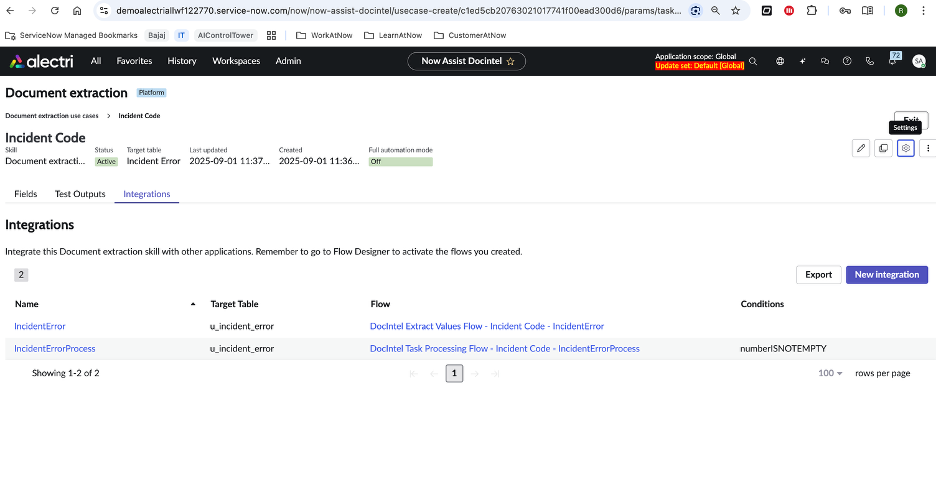

# Now Assist for Document Intelligence
Now Assist for Doc Intel allows you review documents for key information and extract document data for use in your workflows.

# 📑 Use Case: Now Assist for Document Intelligence in ITSM

## 1. What We Are Building
We are building an **intelligent incident enrichment solution** within **ServiceNow ITSM** that leverages **Now Assist for Document Intelligence**.  
The solution demonstrates how AI can **read, understand, and extract structured information from unstructured attachments** (e.g., screenshots, PDFs, images) added to incidents using Now Assist for Document Intelligence.

The lab is designed to enable you with the following:
1. Creation of custom table (extension of task table)
2. Building Document Extraction use cases
3. Using the Document extraction use cases in the custom OOTB Document & Visual Insights AI Agents

## It makes following capabilities available to AI Agents:
- Document Extraction: Agents can extract information from documents and review the information, which then can be stored in mapped tables and fields in the workflow.
- Document Q&A: AI Agents can review documents and can help provide answers to pre-defined questions.
- Attachment Summarization: AI Agents utilized Now Assist for Doc Intel to get a summary of attachment content, along with the record summary for validation or comparison.
- Document Chat: AI Agents can now interact with the document in Now Assist for Virtual Agent and can get chat responses based on Document Content.

# Use Case: 
   - A user raises an incident (e.g., “Unable to connect to DB server”) as part of extended incident table.
   - The user attaches a screenshot of the error message (JPEG/PNG).  
The system automatically extracts key error fields and updates them into the **Incident record**, eliminating manual data entry.

## 2. How We Are Building
1. **Incident Extended Table Creation**  
   - Create a new table extended of incident task table with the relevant new columns (error code, application name and timestamp)

2. **Now Assist for Document Intelligence**  
   - NA for Doc Intel use case creation with individual fields.  
   - It identifies structured fields such as:  
     - **Application**: Microsoft SQL Server Management Studio  
     - **Server**: DB-PROD-02  
     - **Error Code**: 18456  
     - **Timestamp**: 2025-09-01 14:32:08  

3. **Incident Table Update**  
   - AI auto-populates these values into Incident fields or custom columns (e.g., `u_error_code`, `u_application_name` and `timestamp`).  

## 3. Why We Are Building
- **Current Problem**:  
  - Agents spend valuable time **reading unstructured documents/screenshots** and manually copying details into incident fields.  
  - This delays resolution and increases the risk of missing critical information.  

- **Value of Document Intelligence**:  
  - ✅ **Automated Extraction**: Transforms screenshots/logs into structured data.  
  - ✅ **Improved Agent Productivity**: Reduces manual data entry.  
  - ✅ **Faster Resolution**: Error codes and server names are instantly visible.  
  - ✅ **Better Reporting**: Structured error fields can be tracked in **Performance Analytics**.  
  - ✅ **Scalable AI Use Case**: Works for invoices, logs, access forms, and audit evidence.  

## What roles do I need to build Now Assist for Doc Intel Use cases?
- DocIntel Admin
- DocIntel Manager
- DocIntel Extraction Agent

## What plugins do I need to activate Now Assist for Doc Intel?
- Now Assist
- Document Intelligence
- Now Assist for Document Intelligence
- Now Assist Platform

## Building of Now Assist for Doc Intel Use Cases

Document Extraction use cases:
- Use cases where we must extract defined field of information from a document, the format of the document can be pdf, jpg, png.

Especially cases, where the attachment is part of a record (either custom attachment table or the sys_attachment table) and the extracted fields get updated as part of a target table.

## What roles do I need to build Now Assist for Doc Intel Use cases?
- DocIntel Admin
- DocIntel Manager
- DocIntel Extraction Agent

## What plugins do I need to activate Now Assist for Doc Intel?
- Now Assist
- Document Intelligence
- Now Assist for Document Intelligence
- Now Assist Platform

## Building of Now Assist for Doc Intel Use Cases
Document Extraction use cases:
- Use cases where we must extract defined field of information from a document, the format of the document can be pdf, jpg, png.
Especially cases, where the attachment is part of a record (either custom attachment table or the sys_attachment table) and the extracted fields get updated as part of a target table.

## Pre-requisites for Now Assist for Doc Intel
- Custom Table Creation (Extension of Incident task table)
- Incident creation
- Document Extraction Skill Activation

# Let's Get Started!

## Part 1 - Create a custom table that extends Incident Task
Purpose/Why: We want a place to capture extracted fields per artifact, without polluting the base Incident table.

In your demohub instance, go to All - Search `System Definition` > Table

Once you're in the Tables, click the `New` button from top right corner

Provide the `Label`, in this case we are calling it `Incident Error`, with this the `Name` value automatically gets created, `u_incident_error`
We are creating a extended table of Incident tasks, In the `Extends` Search for Incident Task and select from the drop down.
Since this is extended table of `Incident task`, we don't want to create a new module, however we want to make sure it is available in existing module, so we will go to `Add Module to menu` and search for `self-serve`
Next we go to `Controls` Tab

On the same table creation page, In the `Controls` tab, we check `Auto-Number`
Next, we will provide `Prefix`, which in this case will be `INCE`
`Number` will be `1000`
'Number of Digits` we will keep as `6`

Note, this is customizable, you have your own structure of `Auto-Number`

Next, we will move on to `Application Access` for manage access controls

As part of `Application Access` tab, we will check the following
`Can Create`
`Can Read`
`Can Update`

Click `Submit`

✅ With this, we have completed creation of custom extended table for incident task!

Now we have the custom table available as part of the `Tables`
We will search for the table and configure the columns required for the use case.

In the table, go to the `Columns` Tab, Insert new columns, by clicking the `Insert new row` at the bottom
Where we provide the `Label`, `Name` and `Type` of the column.

✅ Great! we now have completed the column creation as part of the custom table.

Next, we go to the `Incident Error` table, Click `New` on the top right corner.

In a the same window, we will have a `New Record` creation for `Incident Error`
As part of the `New Record`, you will be able to see the `Number` being Auto-generated, this is based on the configuration we created as part of the table creation.

Next Click on the `Attachment` icon on top right corner.

You will see `Attachments` window come up, Click Choose file.

Select the `error` screenshot present as part of the exercise.

With this the error screenshot is now part of the new `Incident Error` record.
Provide a `Short Description`, and Click `Submit`

✅ Well Done! We now have completed the pre-requisite for the Now Assist for Document Intelligence

## Part 2 – Activating and Configuring the Document Extraction Use Case
Why/Purpose: To automate the capture of critical information from error images, we will configure Document Intelligence to identify and extract key fields. The extracted values will then be automatically mapped and populated into the custom table columns, reducing manual data entry and ensuring accuracy in incident task management.

To begin, we go to the Admin > Now Assist Admin

As part of Now Assist Admin, we go to `Now Assist Skills`

In Now Assist Skill, from the left pane, select `Platform`

As part of Now Assist Skill for Platform, in the top right, Search for `Document`
You will find two skills:
1. Document Extraction
2. Document Q&A

As part of today's exercise, we will `Activate` Document Extraction Skill.

Once you `Activate` Document Extraction Skill, we will create use case by clicking `New use case`

To create a new use case, we start by defining the use case
Provide the following details:
1. Use Case Name
2. Target Table
3. 

