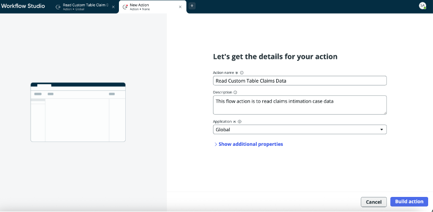
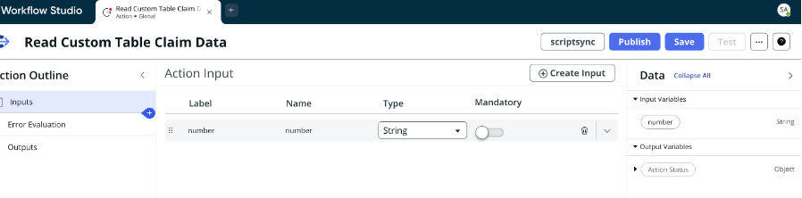
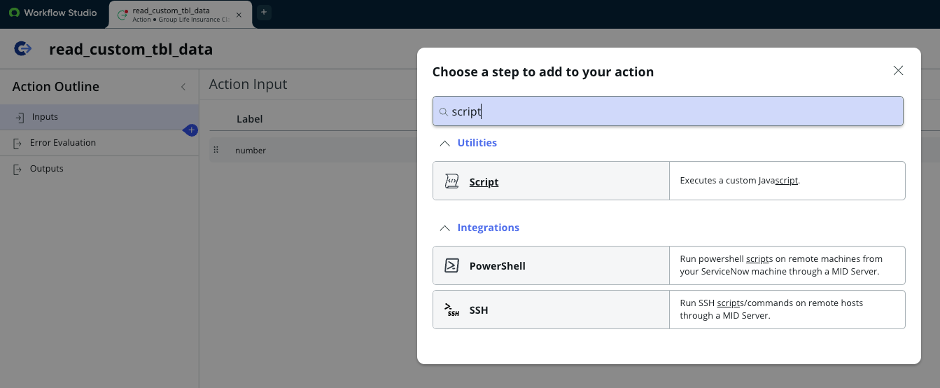
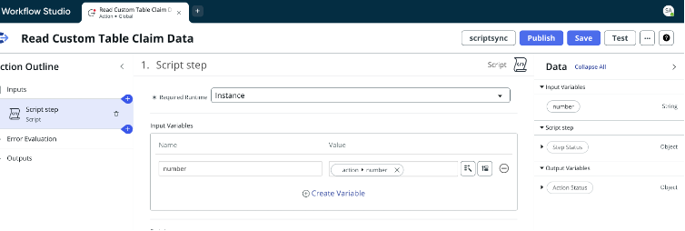
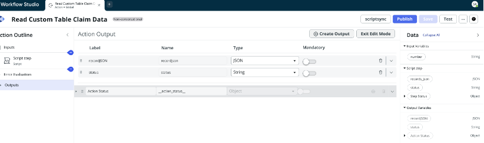
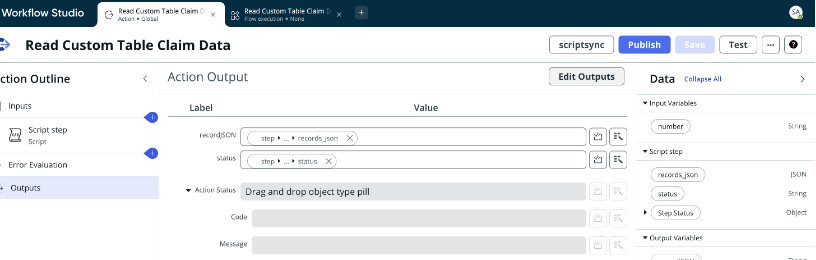
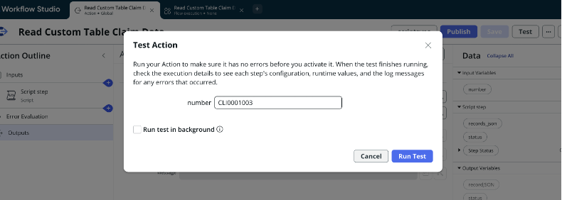
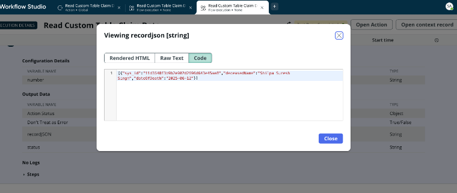

## Reading Claim Record using Flow Action

Go to All > Process Automation - Flow Designer > Click New > Select Action

Creating Flow Action to read the record from custom table

Name: Read Custom Table Claims Data

Description: This flow action is to read claims intimation case data

Keep Application as Global

Next you provide an Input (Identifier/key for the record of custom table)

Now, since we are building it using script in flow action we add script as a step to the action.

Next, we add a number as input variable in the script

Next, we provide the script to read the custom table

(function execute(inputs, outputs) {
  var TABLE = 'u_claim_intimation_case'
  var gr = new GlideRecordSecure(TABLE);
  if (!gr.isValid()) {
    outputs.status = 'error';
    outputs.message = 'Invalid table';
    return;
  }

  if (inputs.number) gr.addQuery('number', inputs.number); //identifier
  gr.setLimit(parseInt(inputs.limit || 25, 10));
  gr.orderByDesc('sys_created_on');
  gr.query();

  var rows = [];
  while (gr.next()) {
    rows.push({
      sys_id: gr.getUniqueValue(),
      deceasedName: gr.getValue('u_name_of_deceased'),  //column that you want to read
      dateOfDeath: gr.getValue('u_date_of_death'),   //column that you want to read
    });
  }

  outputs.status = 'success';
  outputs.records_json = JSON.stringify(rows);
})(inputs, outputs);

Note: Whenever you’re reading more than one variable from a record, you can create JSON as output to validate.

Next, we declare the output variable

Click Exit Edit Mode

Now, select the individual outputs using pill picker and Save then test.

Before we go-ahead and publish this, let’s test the flow action.

With this our test is successful, now we can publish the flow action and we can now use this flow action tool as part of AI Agent.
