# Integration Hub Lab

## Overview

In this lab, you will get to create a real integration with an online service that checks for flight details. You will then give access to this tool to an AI Agent.

>
Use one	

`8a011ffe2a9ee640fcd99d0530829c0c3717685a4d1ff2d332d2b964703ead27`	
OR

`8ba1e3efcb220f73e11ac810871c5bf6c37367d230c16e293044faa6c659dc4b`

### Step 1:

Read this site for integration example:

[https://serpapi.com/google-flights-price-insights](https://serpapi.com/google-flights-price-insights)

Register for an account (optional)


### Step 2:
Navigate to **Workflow Studio** > **New** > **Spoke** > **Enter your own descriptions**

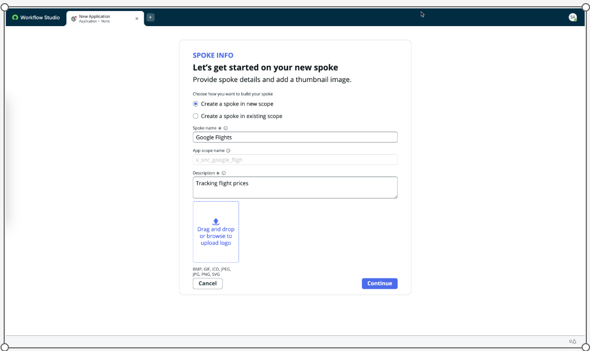

### Step 3:

Use **Action Designer**


### Step 4:

Create Action > Action Designer

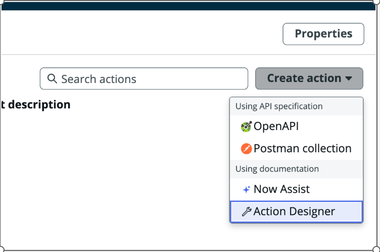

### Step 5:

Name it "Get Flight Prices" > Build Action

### Step 6:


Create inputs for the following (ensure that you copy exactly below)

- departure_id (string)
- arrival_id (string)
- outbound_date (date)
- return_date (date)

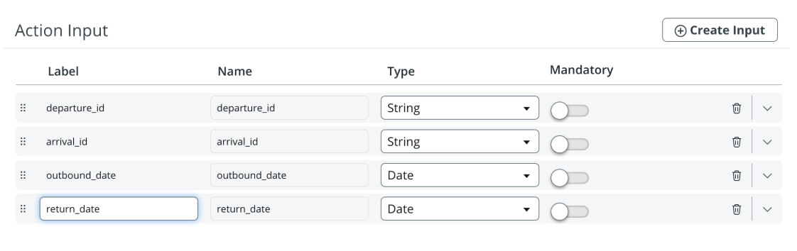

### Step 7:

Add a step: REST step > change connection to "Define Connection Inline" > base url: `https://serpapi.com`

### Step 8:

Resource path: search.json?

### Step 9:

Add the variables as per the image. You will have to drag and drop from the input variables

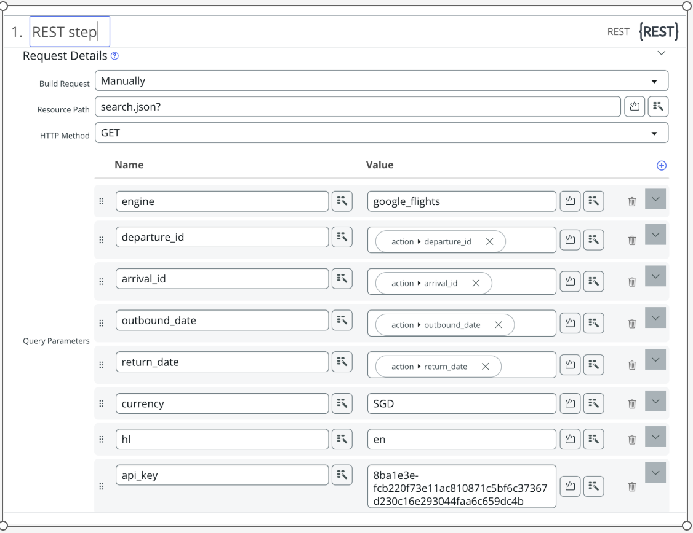

### Step 10:

Save > Test REST Step > Fill in values, e.g SIN, SYD, choose your dates > Click on response_body output > Copy all the values

`https://serpapi.com/search.json?engine=google_flights&departure_id=CDG&arrival_id=AUS&outbound_date=2025-05-05&return_date=2025-05-11&currency=EUR&hl=en`

```
{
  "search_metadata": {
    "id": "689777b0fbbebb1c5e065fba",
    "status": "Success",
    "json_endpoint": "https://serpapi.com/searches/b5da0506315a0a02/689777b0fbbebb1c5e065fba.json",
    "created_at": "2025-08-09 16:30:40 UTC",
    "processed_at": "2025-08-09 16:30:40 UTC",
    "google_flights_url": "https://www.google.com/travel/flights?hl=en&gl=us&curr=EUR&tfs=CBwQAhoeEgoyMDI1LTA4LTA5agcIARIDQ0RHcgcIARIDQVVTGh4SCjIwMjUtMDgtMTVqBwgBEgNBVVNyBwgBEgNDREdCAQFIAXABmAEB&tfu=EgIIAQ",
    "raw_html_file": "https://serpapi.com/searches/b5da0506315a0a02/689777b0fbbebb1c5e065fba.html",
    "prettify_html_file": "https://serpapi.com/searches/b5da0506315a0a02/689777b0fbbebb1c5e065fba.prettify",
    "total_time_taken": 1.21
  },
  "search_parameters": {
    "engine": "google_flights",
    "hl": "en",
    "gl": "us",
    "departure_id": "CDG",
    "arrival_id": "AUS",
    "outbound_date": "2025-08-09",
    "return_date": "2025-08-15",
    "currency": "EUR"
  },
  "best_flights": [
    {
      "flights": [
        {
          "departure_airport": {
            "name": "Paris Charles de Gaulle Airport",
            "id": "CDG",
            "time": "2025-08-09 21:05"
          },
          "arrival_airport": {
            "name": "John F. Kennedy International Airport",
            "id": "JFK",
            "time": "2025-08-09 23:15"
          },
          "duration": 490,
          "airplane": "Boeing 777",
          "airline": "Air France",
          "airline_logo": "https://www.gstatic.com/flights/airline_logos/70px/AF.png",
          "travel_class": "Economy",
          "flight_number": "AF 14",
          "ticket_also_sold_by": [
            "Delta"
          ],
          "legroom": "31 in",
          "extensions": [
            "Average legroom (31 in)",
            "Wi-Fi for a fee",
            "In-seat USB outlet",
            "On-demand video",
            "Carbon emissions estimate: 323 kg"
          ]
        },
        {
          "departure_airport": {
            "name": "John F. Kennedy International Airport",
            "id": "JFK",
            "time": "2025-08-10 08:00"
          },
          "arrival_airport": {
            "name": "Hartsfield-Jackson Atlanta International Airport",
            "id": "ATL",
            "time": "2025-08-10 10:35"
          },
          "duration": 155,
          "airplane": "Boeing 757",
          "airline": "Delta",
          "airline_logo": "https://www.gstatic.com/flights/airline_logos/70px/DL.png",
          "travel_class": "Economy",
          "flight_number": "DL 2227",
          "legroom": "31 in",
          "extensions": [
            "Average legroom (31 in)",
            "Free Wi-Fi",
            "In-seat power & USB outlets",
            "Live TV",
            "Carbon emissions estimate: 161 kg"
          ]
        },
        {
          "departure_airport": {
            "name": "Hartsfield-Jackson Atlanta International Airport",
            "id": "ATL",
            "time": "2025-08-10 12:30"
          },
          "arrival_airport": {
            "name": "Austin-Bergstrom International Airport",
            "id": "AUS",
            "time": "2025-08-10 13:47"
          },
          "duration": 137,
          "airplane": "Airbus A321",
          "airline": "Delta",
          "airline_logo": "https://www.gstatic.com/flights/airline_logos/70px/DL.png",
          "travel_class": "Economy",
          "flight_number": "DL 2104",
          "legroom": "31 in",
          "extensions": [
            "Average legroom (31 in)",
            "Free Wi-Fi",
            "In-seat power & USB outlets",
            "Live TV",
            "Carbon emissions estimate: 136 kg"
          ],
          "often_delayed_by_over_30_min": true
        }
      ],
      "layovers": [
        {
          "duration": 525,
          "name": "John F. Kennedy International Airport",
          "id": "JFK",
          "overnight": true
        },
        {
          "duration": 115,
          "name": "Hartsfield-Jackson Atlanta International Airport",
          "id": "ATL"
        }
      ],
      "total_duration": 1422,
      "carbon_emissions": {
        "this_flight": 622000,
        "typical_for_this_route": 537000,
        "difference_percent": 16
      },
      "price": 1834,
      "type": "Round trip",
      "airline_logo": "https://www.gstatic.com/flights/airline_logos/70px/multi.png",
      "extensions": [
        "Checked baggage for a fee",
        "Full refund for cancellations",
        "Free change, possible fare difference",
        "Bag and fare conditions depend on the return flight"
      ],
      "departure_token": "WyJDalJJUjNsVFFVMTRXSFp4WkdkQlJ6TkxYMEZDUnkwdExTMHRMUzB0TFMxNWJHOXdOMEZCUVVGQlIybFlaRGRGUjFNd1JubEJFaEpCUmpFMGZFUk1Nakl5TjN4RVRESXhNRFFhQ3dpM21Bc1FBaG9EUlZWU09CeHc3WVFOIixbWyJDREciLCIyMDI1LTA4LTA5IiwiSkZLIixudWxsLCJBRiIsIjE0Il0sWyJKRksiLCIyMDI1LTA4LTEwIiwiQVRMIixudWxsLCJETCIsIjIyMjciXSxbIkFUTCIsIjIwMjUtMDgtMTAiLCJBVVMiLG51bGwsIkRMIiwiMjEwNCJdXV0="
    },
    {
      "flights": [
        {
          "departure_airport": {
            "name": "Paris Charles de Gaulle Airport",
            "id": "CDG",
            "time": "2025-08-09 20:15"
          },
          "arrival_airport": {
            "name": "Vienna International Airport",
            "id": "VIE",
            "time": "2025-08-09 22:10"
          },
          "duration": 115,
          "airplane": "Airbus A320",
          "airline": "Austrian",
          "airline_logo": "https://www.gstatic.com/flights/airline_logos/70px/OS.png",
          "travel_class": "Economy",
          "flight_number": "OS 418",
          "legroom": "28 in",
          "extensions": [
            "Below average legroom (28 in)",
            "In-seat USB outlet",
            "Carbon emissions estimate: 100 kg"
          ]
        },
        {
          "departure_airport": {
            "name": "Vienna International Airport",
            "id": "VIE",
            "time": "2025-08-10 10:50"
          },
          "arrival_airport": {
            "name": "Dulles International Airport",
            "id": "IAD",
            "time": "2025-08-10 14:35"
          },
          "duration": 585,
          "airplane": "Boeing 767",
          "airline": "Austrian",
          "airline_logo": "https://www.gstatic.com/flights/airline_logos/70px/OS.png",
          "travel_class": "Economy",
          "flight_number": "OS 93",
          "legroom": "30 in",
          "extensions": [
            "Average legroom (30 in)",
            "In-seat USB outlet",
            "On-demand video",
            "Carbon emissions estimate: 479 kg"
          ]
        },
        {
          "departure_airport": {
            "name": "Dulles International Airport",
            "id": "IAD",
            "time": "2025-08-10 17:55"
          },
          "arrival_airport": {
            "name": "Austin-Bergstrom International Airport",
            "id": "AUS",
            "time": "2025-08-10 20:24"
          },
          "duration": 209,
          "airplane": "Airbus A319",
          "airline": "United",
          "airline_logo": "https://www.gstatic.com/flights/airline_logos/70px/UA.png",
          "travel_class": "Economy",
          "flight_number": "UA 2724",
          "legroom": "30 in",
          "extensions": [
            "Average legroom (30 in)",
            "Wi-Fi for a fee",
            "In-seat power & USB outlets",
            "Stream media to your device",
            "Carbon emissions estimate: 212 kg"
          ]
        }
      ],
      "layovers": [
        {
          "duration": 760,
          "name": "Vienna International Airport",
          "id": "VIE",
          "overnight": true
        },
        {
          "duration": 200,
          "name": "Dulles International Airport",
          "id": "IAD"
        }
      ],
      "total_duration": 1869,
      "carbon_emissions": {
        "this_flight": 792000,
        "typical_for_this_route": 537000,
        "difference_percent": 47
      },
      "price": 1840,
      "type": "Round trip",
      "airline_logo": "https://www.gstatic.com/flights/airline_logos/70px/multi.png",
      "extensions": [
        "Checked baggage for a fee",
        "Full refund for cancellations",
        "Free change, possible fare difference",
        "Bag and fare conditions depend on the return flight"
      ],
      "departure_token": "WyJDalJJUjNsVFFVMTRXSFp4WkdkQlJ6TkxYMEZDUnkwdExTMHRMUzB0TFMxNWJHOXdOMEZCUVVGQlIybFlaRGRGUjFNd1JubEJFaEZQVXpReE9IeFBVemt6ZkZWQk1qY3lOQm9MQ08yY0N4QUNHZ05GVlZJNEhIQ0JpZzA9IixbWyJDREciLCIyMDI1LTA4LTA5IiwiVklFIixudWxsLCJPUyIsIjQxOCJdLFsiVklFIiwiMjAyNS0wOC0xMCIsIklBRCIsbnVsbCwiT1MiLCI5MyJdLFsiSUFEIiwiMjAyNS0wOC0xMCIsIkFVUyIsbnVsbCwiVUEiLCIyNzI0Il1dXQ=="
    },
    {
      "flights": [
        {
          "departure_airport": {
            "name": "Paris Charles de Gaulle Airport",
            "id": "CDG",
            "time": "2025-08-09 21:05"
          },
          "arrival_airport": {
            "name": "John F. Kennedy International Airport",
            "id": "JFK",
            "time": "2025-08-09 23:15"
          },
          "duration": 490,
          "airplane": "Boeing 777",
          "airline": "Air France",
          "airline_logo": "https://www.gstatic.com/flights/airline_logos/70px/AF.png",
          "travel_class": "Economy",
          "flight_number": "AF 14",
          "ticket_also_sold_by": [
            "Delta"
          ],
          "legroom": "31 in",
          "extensions": [
            "Average legroom (31 in)",
            "Wi-Fi for a fee",
            "In-seat USB outlet",
            "On-demand video",
            "Carbon emissions estimate: 323 kg"
          ]
        },
        {
          "departure_airport": {
            "name": "John F. Kennedy International Airport",
            "id": "JFK",
            "time": "2025-08-10 11:35"
          },
          "arrival_airport": {
            "name": "Austin-Bergstrom International Airport",
            "id": "AUS",
            "time": "2025-08-10 14:43"
          },
          "duration": 248,
          "airplane": "Boeing 737",
          "airline": "Delta",
          "airline_logo": "https://www.gstatic.com/flights/airline_logos/70px/DL.png",
          "travel_class": "Economy",
          "flight_number": "DL 2323",
          "legroom": "31 in",
          "extensions": [
            "Average legroom (31 in)",
            "Free Wi-Fi",
            "In-seat power & USB outlets",
            "Live TV",
            "Carbon emissions estimate: 195 kg"
          ],
          "often_delayed_by_over_30_min": true
        }
      ],
      "layovers": [
        {
          "duration": 740,
          "name": "John F. Kennedy International Airport",
          "id": "JFK",
          "overnight": true
        }
      ],
      "total_duration": 1478,
      "carbon_emissions": {
        "this_flight": 520000,
        "typical_for_this_route": 537000,
        "difference_percent": -3
      },
      "price": 1989,
      "type": "Round trip",
      "airline_logo": "https://www.gstatic.com/flights/airline_logos/70px/multi.png",
      "extensions": [
        "1 checked bag up to 23 kg included",
        "Full refund for cancellations",
        "Free change, possible fare difference",
        "Bag and fare conditions depend on the return flight"
      ],
      "departure_token": "WyJDalJJUjNsVFFVMTRXSFp4WkdkQlJ6TkxYMEZDUnkwdExTMHRMUzB0TFMxNWJHOXdOMEZCUVVGQlIybFlaRGRGUjFNd1JubEJFZ3RCUmpFMGZFUk1Nak15TXhvTENNT1JEQkFDR2dORlZWSTRISEQza1E0PSIsW1siQ0RHIiwiMjAyNS0wOC0wOSIsIkpGSyIsbnVsbCwiQUYiLCIxNCJdLFsiSkZLIiwiMjAyNS0wOC0xMCIsIkFVUyIsbnVsbCwiREwiLCIyMzIzIl1dXQ=="
    }
  ],
  "other_flights": [
    {
      "flights": [
        {
          "departure_airport": {
            "name": "Paris Charles de Gaulle Airport",
            "id": "CDG",
            "time": "2025-08-09 21:05"
          },
          "arrival_airport": {
            "name": "John F. Kennedy International Airport",
            "id": "JFK",
            "time": "2025-08-09 23:15"
          },
          "duration": 490,
          "airplane": "Boeing 777",
          "airline": "Air France",
          "airline_logo": "https://www.gstatic.com/flights/airline_logos/70px/AF.png",
          "travel_class": "Economy",
          "flight_number": "AF 14",
          "ticket_also_sold_by": [
            "Delta"
          ],
          "legroom": "31 in",
          "extensions": [
            "Average legroom (31 in)",
            "Wi-Fi for a fee",
            "In-seat USB outlet",
            "On-demand video",
            "Carbon emissions estimate: 323 kg"
          ]
        },
        {
          "departure_airport": {
            "name": "John F. Kennedy International Airport",
            "id": "JFK",
            "time": "2025-08-10 07:00"
          },
          "arrival_airport": {
            "name": "Hartsfield-Jackson Atlanta International Airport",
            "id": "ATL",
            "time": "2025-08-10 09:30"
          },
          "duration": 150,
          "airplane": "Boeing 757",
          "airline": "Delta",
          "airline_logo": "https://www.gstatic.com/flights/airline_logos/70px/DL.png",
          "travel_class": "Economy",
          "flight_number": "DL 522",
          "legroom": "31 in",
          "extensions": [
            "Average legroom (31 in)",
            "Free Wi-Fi",
            "In-seat power & USB outlets",
            "Live TV",
            "Carbon emissions estimate: 154 kg"
          ]
        },
        {
          "departure_airport": {
            "name": "Hartsfield-Jackson Atlanta International Airport",
            "id": "ATL",
            "time": "2025-08-10 12:30"
          },
          "arrival_airport": {
            "name": "Austin-Bergstrom International Airport",
            "id": "AUS",
            "time": "2025-08-10 13:47"
          },
          "duration": 137,
          "airplane": "Airbus A321",
          "airline": "Delta",
          "airline_logo": "https://www.gstatic.com/flights/airline_logos/70px/DL.png",
          "travel_class": "Economy",
          "flight_number": "DL 2104",
          "legroom": "31 in",
          "extensions": [
            "Average legroom (31 in)",
            "Free Wi-Fi",
            "In-seat power & USB outlets",
            "Live TV",
            "Carbon emissions estimate: 136 kg"
          ],
          "often_delayed_by_over_30_min": true
        }
      ],
      "layovers": [
        {
          "duration": 465,
          "name": "John F. Kennedy International Airport",
          "id": "JFK",
          "overnight": true
        },
        {
          "duration": 180,
          "name": "Hartsfield-Jackson Atlanta International Airport",
          "id": "ATL"
        }
      ],
      "total_duration": 1422,
      "carbon_emissions": {
        "this_flight": 614000,
        "typical_for_this_route": 537000,
        "difference_percent": 14
      },
      "price": 1834,
      "type": "Round trip",
      "airline_logo": "https://www.gstatic.com/flights/airline_logos/70px/multi.png",
      "extensions": [
        "Checked baggage for a fee",
        "Full refund for cancellations",
        "Free change, possible fare difference",
        "Bag and fare conditions depend on the return flight"
      ],
      "departure_token": "WyJDalJJUjNsVFFVMTRXSFp4WkdkQlJ6TkxYMEZDUnkwdExTMHRMUzB0TFMxNWJHOXdOMEZCUVVGQlIybFlaRGRGUjFNd1JubEJFaEZCUmpFMGZFUk1OVEl5ZkVSTU1qRXdOQm9MQ0xlWUN4QUNHZ05GVlZJNEhIRHRoQTA9IixbWyJDREciLCIyMDI1LTA4LTA5IiwiSkZLIixudWxsLCJBRiIsIjE0Il0sWyJKRksiLCIyMDI1LTA4LTEwIiwiQVRMIixudWxsLCJETCIsIjUyMiJdLFsiQVRMIiwiMjAyNS0wOC0xMCIsIkFVUyIsbnVsbCwiREwiLCIyMTA0Il1dXQ=="
    },
    {
      "flights": [
        {
          "departure_airport": {
            "name": "Paris Charles de Gaulle Airport",
            "id": "CDG",
            "time": "2025-08-09 21:05"
          },
          "arrival_airport": {
            "name": "John F. Kennedy International Airport",
            "id": "JFK",
            "time": "2025-08-09 23:15"
          },
          "duration": 490,
          "airplane": "Boeing 777",
          "airline": "Air France",
          "airline_logo": "https://www.gstatic.com/flights/airline_logos/70px/AF.png",
          "travel_class": "Economy",
          "flight_number": "AF 14",
          "ticket_also_sold_by": [
            "Delta"
          ],
          "legroom": "31 in",
          "extensions": [
            "Average legroom (31 in)",
            "Wi-Fi for a fee",
            "In-seat USB outlet",
            "On-demand video",
            "Carbon emissions estimate: 323 kg"
          ]
        },
        {
          "departure_airport": {
            "name": "John F. Kennedy International Airport",
            "id": "JFK",
            "time": "2025-08-10 18:20"
          },
          "arrival_airport": {
            "name": "Austin-Bergstrom International Airport",
            "id": "AUS",
            "time": "2025-08-10 21:40"
          },
          "duration": 260,
          "airplane": "Boeing 737",
          "airline": "Delta",
          "airline_logo": "https://www.gstatic.com/flights/airline_logos/70px/DL.png",
          "travel_class": "Economy",
          "flight_number": "DL 1233",
          "legroom": "31 in",
          "extensions": [
            "Average legroom (31 in)",
            "Free Wi-Fi",
            "In-seat power & USB outlets",
            "Live TV",
            "Carbon emissions estimate: 195 kg"
          ],
          "often_delayed_by_over_30_min": true
        }
      ],
      "layovers": [
        {
          "duration": 1145,
          "name": "John F. Kennedy International Airport",
          "id": "JFK",
          "overnight": true
        }
      ],
      "total_duration": 1895,
      "carbon_emissions": {
        "this_flight": 520000,
        "typical_for_this_route": 537000,
        "difference_percent": -3
      },
      "price": 1834,
      "type": "Round trip",
      "airline_logo": "https://www.gstatic.com/flights/airline_logos/70px/multi.png",
      "extensions": [
        "Checked baggage for a fee",
        "Full refund for cancellations",
        "Free change, possible fare difference",
        "Bag and fare conditions depend on the return flight"
      ],
      "departure_token": "WyJDalJJUjNsVFFVMTRXSFp4WkdkQlJ6TkxYMEZDUnkwdExTMHRMUzB0TFMxNWJHOXdOMEZCUVVGQlIybFlaRGRGUjFNd1JubEJFZ3RCUmpFMGZFUk1NVEl6TXhvTENMZVlDeEFDR2dORlZWSTRISER0aEEwPSIsW1siQ0RHIiwiMjAyNS0wOC0wOSIsIkpGSyIsbnVsbCwiQUYiLCIxNCJdLFsiSkZLIiwiMjAyNS0wOC0xMCIsIkFVUyIsbnVsbCwiREwiLCIxMjMzIl1dXQ=="
    },
    {
      "flights": [
        {
          "departure_airport": {
            "name": "Paris Charles de Gaulle Airport",
            "id": "CDG",
            "time": "2025-08-09 20:30"
          },
          "arrival_airport": {
            "name": "Edinburgh Airport",
            "id": "EDI",
            "time": "2025-08-09 21:15"
          },
          "duration": 105,
          "airplane": "Airbus A220-300 Passenger",
          "airline": "Air France",
          "airline_logo": "https://www.gstatic.com/flights/airline_logos/70px/AF.png",
          "travel_class": "Economy",
          "flight_number": "AF 1886",
          "legroom": "30 in",
          "extensions": [
            "Average legroom (30 in)",
            "Wi-Fi for a fee",
            "In-seat USB outlet",
            "Carbon emissions estimate: 96 kg"
          ]
        },
        {
          "departure_airport": {
            "name": "Edinburgh Airport",
            "id": "EDI",
            "time": "2025-08-10 09:00"
          },
          "arrival_airport": {
            "name": "Hartsfield-Jackson Atlanta International Airport",
            "id": "ATL",
            "time": "2025-08-10 12:55"
          },
          "duration": 535,
          "airplane": "Boeing 767",
          "airline": "Delta",
          "airline_logo": "https://www.gstatic.com/flights/airline_logos/70px/DL.png",
          "travel_class": "Economy",
          "flight_number": "DL 35",
          "ticket_also_sold_by": [
            "Air France"
          ],
          "legroom": "31 in",
          "extensions": [
            "Average legroom (31 in)",
            "Free Wi-Fi",
            "In-seat power & USB outlets",
            "On-demand video",
            "Carbon emissions estimate: 349 kg"
          ]
        },
        {
          "departure_airport": {
            "name": "Hartsfield-Jackson Atlanta International Airport",
            "id": "ATL",
            "time": "2025-08-10 14:33"
          },
          "arrival_airport": {
            "name": "Austin-Bergstrom International Airport",
            "id": "AUS",
            "time": "2025-08-10 15:59"
          },
          "duration": 146,
          "airplane": "Airbus A321",
          "airline": "Delta",
          "airline_logo": "https://www.gstatic.com/flights/airline_logos/70px/DL.png",
          "travel_class": "Economy",
          "flight_number": "DL 1397",
          "ticket_also_sold_by": [
            "Air France"
          ],
          "legroom": "31 in",
          "extensions": [
            "Average legroom (31 in)",
            "Free Wi-Fi",
            "In-seat power & USB outlets",
            "Live TV",
            "Carbon emissions estimate: 136 kg"
          ],
          "often_delayed_by_over_30_min": true
        }
      ],
      "layovers": [
        {
          "duration": 705,
          "name": "Edinburgh Airport",
          "id": "EDI",
          "overnight": true
        },
        {
          "duration": 98,
          "name": "Hartsfield-Jackson Atlanta International Airport",
          "id": "ATL"
        }
      ],
      "total_duration": 1589,
      "carbon_emissions": {
        "this_flight": 582000,
        "typical_for_this_route": 537000,
        "difference_percent": 8
      },
      "price": 1851,
      "type": "Round trip",
      "airline_logo": "https://www.gstatic.com/flights/airline_logos/70px/multi.png",
      "extensions": [
        "Checked baggage for a fee",
        "Full refund for cancellations",
        "Free change, possible fare difference",
        "Bag and fare conditions depend on the return flight"
      ],
      "departure_token": "WyJDalJJUjNsVFFVMTRXSFp4WkdkQlJ6TkxYMEZDUnkwdExTMHRMUzB0TFMxNWJHOXdOMEZCUVVGQlIybFlaRGRGUjFNd1JubEJFaEpCUmpFNE9EWjhSRXd6Tlh4RVRERXpPVGNhQ3dpRXBnc1FBaG9EUlZWU09CeHcyWlFOIixbWyJDREciLCIyMDI1LTA4LTA5IiwiRURJIixudWxsLCJBRiIsIjE4ODYiXSxbIkVESSIsIjIwMjUtMDgtMTAiLCJBVEwiLG51bGwsIkRMIiwiMzUiXSxbIkFUTCIsIjIwMjUtMDgtMTAiLCJBVVMiLG51bGwsIkRMIiwiMTM5NyJdXV0="
    },
    {
      "flights": [
        {
          "departure_airport": {
            "name": "Paris Charles de Gaulle Airport",
            "id": "CDG",
            "time": "2025-08-09 20:15"
          },
          "arrival_airport": {
            "name": "Vienna International Airport",
            "id": "VIE",
            "time": "2025-08-09 22:10"
          },
          "duration": 115,
          "airplane": "Airbus A320",
          "airline": "Austrian",
          "airline_logo": "https://www.gstatic.com/flights/airline_logos/70px/OS.png",
          "travel_class": "Economy",
          "flight_number": "OS 418",
          "legroom": "28 in",
          "extensions": [
            "Below average legroom (28 in)",
            "In-seat USB outlet",
            "Carbon emissions estimate: 100 kg"
          ]
        },
        {
          "departure_airport": {
            "name": "Vienna International Airport",
            "id": "VIE",
            "time": "2025-08-10 10:45"
          },
          "arrival_airport": {
            "name": "Newark Liberty International Airport",
            "id": "EWR",
            "time": "2025-08-10 13:55"
          },
          "duration": 550,
          "airplane": "Boeing 777",
          "airline": "Austrian",
          "airline_logo": "https://www.gstatic.com/flights/airline_logos/70px/OS.png",
          "travel_class": "Economy",
          "flight_number": "OS 89",
          "legroom": "30 in",
          "extensions": [
            "Average legroom (30 in)",
            "In-seat USB outlet",
            "On-demand video",
            "Carbon emissions estimate: 396 kg"
          ]
        },
        {
          "departure_airport": {
            "name": "Newark Liberty International Airport",
            "id": "EWR",
            "time": "2025-08-10 16:59"
          },
          "arrival_airport": {
            "name": "Austin-Bergstrom International Airport",
            "id": "AUS",
            "time": "2025-08-10 19:57"
          },
          "duration": 238,
          "airplane": "Boeing 737",
          "airline": "United",
          "airline_logo": "https://www.gstatic.com/flights/airline_logos/70px/UA.png",
          "travel_class": "Economy",
          "flight_number": "UA 334",
          "legroom": "30 in",
          "extensions": [
            "Average legroom (30 in)",
            "Wi-Fi for a fee",
            "In-seat power outlet",
            "Stream media to your device",
            "Carbon emissions estimate: 199 kg"
          ]
        }
      ],
      "layovers": [
        {
          "duration": 755,
          "name": "Vienna International Airport",
          "id": "VIE",
          "overnight": true
        },
        {
          "duration": 184,
          "name": "Newark Liberty International Airport",
          "id": "EWR"
        }
      ],
      "total_duration": 1842,
      "carbon_emissions": {
        "this_flight": 696000,
        "typical_for_this_route": 537000,
        "difference_percent": 30
      },
      "price": 1987,
      "type": "Round trip",
      "airline_logo": "https://www.gstatic.com/flights/airline_logos/70px/multi.png",
      "extensions": [
        "Checked baggage for a fee",
        "Full refund for cancellations",
        "Free change, possible fare difference",
        "Bag and fare conditions depend on the return flight"
      ],
      "departure_token": "WyJDalJJUjNsVFFVMTRXSFp4WkdkQlJ6TkxYMEZDUnkwdExTMHRMUzB0TFMxNWJHOXdOMEZCUVVGQlIybFlaRGRGUjFNd1JubEJFaEJQVXpReE9IeFBVemc1ZkZWQk16TTBHZ3NJMlk4TUVBSWFBMFZWVWpnY2NPZVBEZz09IixbWyJDREciLCIyMDI1LTA4LTA5IiwiVklFIixudWxsLCJPUyIsIjQxOCJdLFsiVklFIiwiMjAyNS0wOC0xMCIsIkVXUiIsbnVsbCwiT1MiLCI4OSJdLFsiRVdSIiwiMjAyNS0wOC0xMCIsIkFVUyIsbnVsbCwiVUEiLCIzMzQiXV1d"
    },
    {
      "flights": [
        {
          "departure_airport": {
            "name": "Paris Charles de Gaulle Airport",
            "id": "CDG",
            "time": "2025-08-09 20:30"
          },
          "arrival_airport": {
            "name": "Edinburgh Airport",
            "id": "EDI",
            "time": "2025-08-09 21:15"
          },
          "duration": 105,
          "airplane": "Airbus A220-300 Passenger",
          "airline": "Air France",
          "airline_logo": "https://www.gstatic.com/flights/airline_logos/70px/AF.png",
          "travel_class": "Economy",
          "flight_number": "AF 1886",
          "ticket_also_sold_by": [
            "Virgin Atlantic"
          ],
          "legroom": "30 in",
          "extensions": [
            "Average legroom (30 in)",
            "Wi-Fi for a fee",
            "In-seat USB outlet",
            "Carbon emissions estimate: 96 kg"
          ]
        },
        {
          "departure_airport": {
            "name": "Edinburgh Airport",
            "id": "EDI",
            "time": "2025-08-10 09:00"
          },
          "arrival_airport": {
            "name": "Hartsfield-Jackson Atlanta International Airport",
            "id": "ATL",
            "time": "2025-08-10 12:55"
          },
          "duration": 535,
          "airplane": "Boeing 767",
          "airline": "Delta",
          "airline_logo": "https://www.gstatic.com/flights/airline_logos/70px/DL.png",
          "travel_class": "Economy",
          "flight_number": "DL 35",
          "ticket_also_sold_by": [
            "Virgin Atlantic"
          ],
          "legroom": "31 in",
          "extensions": [
            "Average legroom (31 in)",
            "Free Wi-Fi",
            "In-seat power & USB outlets",
            "On-demand video",
            "Carbon emissions estimate: 349 kg"
          ]
        },
        {
          "departure_airport": {
            "name": "Hartsfield-Jackson Atlanta International Airport",
            "id": "ATL",
            "time": "2025-08-10 15:50"
          },
          "arrival_airport": {
            "name": "Austin-Bergstrom International Airport",
            "id": "AUS",
            "time": "2025-08-10 17:17"
          },
          "duration": 147,
          "airplane": "Airbus A321",
          "airline": "Delta",
          "airline_logo": "https://www.gstatic.com/flights/airline_logos/70px/DL.png",
          "travel_class": "Economy",
          "flight_number": "DL 1491",
          "ticket_also_sold_by": [
            "Virgin Atlantic"
          ],
          "legroom": "31 in",
          "extensions": [
            "Average legroom (31 in)",
            "Free Wi-Fi",
            "In-seat power & USB outlets",
            "Live TV",
            "Carbon emissions estimate: 136 kg"
          ],
          "often_delayed_by_over_30_min": true
        }
      ],
      "layovers": [
        {
          "duration": 705,
          "name": "Edinburgh Airport",
          "id": "EDI",
          "overnight": true
        },
        {
          "duration": 175,
          "name": "Hartsfield-Jackson Atlanta International Airport",
          "id": "ATL"
        }
      ],
      "total_duration": 1667,
      "carbon_emissions": {
        "this_flight": 582000,
        "typical_for_this_route": 537000,
        "difference_percent": 8
      },
      "price": 2457,
      "type": "Round trip",
      "airline_logo": "https://www.gstatic.com/flights/airline_logos/70px/multi.png",
      "extensions": [
        "1 checked bag up to 23 kg included",
        "Full refund for cancellations",
        "Free change, possible fare difference",
        "Bag and fare conditions depend on the return flight"
      ],
      "departure_token": "WyJDalJJUjNsVFFVMTRXSFp4WkdkQlJ6TkxYMEZDUnkwdExTMHRMUzB0TFMxNWJHOXdOMEZCUVVGQlIybFlaRGRGUjFNd1JubEJFaEpCUmpFNE9EWjhSRXd6Tlh4RVRERTBPVEVhQ3dpOC93NFFBaG9EUlZWU09CeHdvN3dSIixbWyJDREciLCIyMDI1LTA4LTA5IiwiRURJIixudWxsLCJBRiIsIjE4ODYiXSxbIkVESSIsIjIwMjUtMDgtMTAiLCJBVEwiLG51bGwsIkRMIiwiMzUiXSxbIkFUTCIsIjIwMjUtMDgtMTAiLCJBVVMiLG51bGwsIkRMIiwiMTQ5MSJdXV0="
    },
    {
      "flights": [
        {
          "departure_airport": {
            "name": "Paris Charles de Gaulle Airport",
            "id": "CDG",
            "time": "2025-08-09 22:15"
          },
          "arrival_airport": {
            "name": "Copenhagen Airport",
            "id": "CPH",
            "time": "2025-08-10 00:05"
          },
          "duration": 110,
          "airplane": "Embraer 195",
          "airline": "Scandinavian Airlines",
          "airline_logo": "https://www.gstatic.com/flights/airline_logos/70px/SK.png",
          "travel_class": "Economy",
          "flight_number": "SK 560",
          "legroom": "30 in",
          "extensions": [
            "Average legroom (30 in)",
            "In-seat USB outlet",
            "Carbon emissions estimate: 119 kg"
          ],
          "plane_and_crew_by": "Sas Link"
        },
        {
          "departure_airport": {
            "name": "Copenhagen Airport",
            "id": "CPH",
            "time": "2025-08-10 13:25"
          },
          "arrival_airport": {
            "name": "Boston Logan International Airport",
            "id": "BOS",
            "time": "2025-08-10 15:35"
          },
          "duration": 490,
          "airplane": "Airbus A330",
          "airline": "Scandinavian Airlines",
          "airline_logo": "https://www.gstatic.com/flights/airline_logos/70px/SK.png",
          "travel_class": "Economy",
          "flight_number": "SK 927",
          "legroom": "31 in",
          "extensions": [
            "Average legroom (31 in)",
            "In-seat power & USB outlets",
            "On-demand video",
            "Carbon emissions estimate: 383 kg"
          ]
        },
        {
          "departure_airport": {
            "name": "Boston Logan International Airport",
            "id": "BOS",
            "time": "2025-08-10 18:50"
          },
          "arrival_airport": {
            "name": "Austin-Bergstrom International Airport",
            "id": "AUS",
            "time": "2025-08-10 22:19"
          },
          "duration": 269,
          "airplane": "Airbus A220-300 Passenger",
          "airline": "Delta",
          "airline_logo": "https://www.gstatic.com/flights/airline_logos/70px/DL.png",
          "travel_class": "Economy",
          "flight_number": "DL 1677",
          "ticket_also_sold_by": [
            "Scandinavian Airlines"
          ],
          "legroom": "31 in",
          "extensions": [
            "Average legroom (31 in)",
            "Free Wi-Fi",
            "In-seat power & USB outlets",
            "Live TV",
            "Carbon emissions estimate: 267 kg"
          ],
          "often_delayed_by_over_30_min": true
        }
      ],
      "layovers": [
        {
          "duration": 800,
          "name": "Copenhagen Airport",
          "id": "CPH",
          "overnight": true
        },
        {
          "duration": 195,
          "name": "Boston Logan International Airport",
          "id": "BOS"
        }
      ],
      "total_duration": 1864,
      "carbon_emissions": {
        "this_flight": 771000,
        "typical_for_this_route": 537000,
        "difference_percent": 44
      },
      "price": 3272,
      "type": "Round trip",
      "airline_logo": "https://www.gstatic.com/flights/airline_logos/70px/multi.png",
      "extensions": [
        "1 checked bag up to 23 kg included",
        "Full refund for cancellations",
        "Free change, possible fare difference",
        "Bag and fare conditions depend on the return flight"
      ],
      "departure_token": "WyJDalJJUjNsVFFVMTRXSFp4WkdkQlJ6TkxYMEZDUnkwdExTMHRMUzB0TFMxNWJHOXdOMEZCUVVGQlIybFlaRGRGUjFNd1JubEJFaEpUU3pVMk1IeFRTemt5TjN4RVRERTJOemNhQ3dqOSt4TVFBaG9EUlZWU09CeHc3S0VYIixbWyJDREciLCIyMDI1LTA4LTA5IiwiQ1BIIixudWxsLCJTSyIsIjU2MCJdLFsiQ1BIIiwiMjAyNS0wOC0xMCIsIkJPUyIsbnVsbCwiU0siLCI5MjciXSxbIkJPUyIsIjIwMjUtMDgtMTAiLCJBVVMiLG51bGwsIkRMIiwiMTY3NyJdXV0="
    },
    {
      "flights": [
        {
          "departure_airport": {
            "name": "Paris Charles de Gaulle Airport",
            "id": "CDG",
            "time": "2025-08-09 21:45"
          },
          "arrival_airport": {
            "name": "Dublin Airport",
            "id": "DUB",
            "time": "2025-08-09 22:25"
          },
          "duration": 100,
          "airplane": "Airbus A320",
          "airline": "Aer Lingus",
          "airline_logo": "https://www.gstatic.com/flights/airline_logos/70px/EI.png",
          "travel_class": "Economy",
          "flight_number": "EI 529",
          "ticket_also_sold_by": [
            "American"
          ],
          "legroom": "30 in",
          "extensions": [
            "Average legroom (30 in)",
            "Carbon emissions estimate: 87 kg"
          ]
        },
        {
          "departure_airport": {
            "name": "Dublin Airport",
            "id": "DUB",
            "time": "2025-08-10 07:30"
          },
          "arrival_airport": {
            "name": "Heathrow Airport",
            "id": "LHR",
            "time": "2025-08-10 09:05"
          },
          "duration": 95,
          "airplane": "Airbus A321",
          "airline": "Aer Lingus",
          "airline_logo": "https://www.gstatic.com/flights/airline_logos/70px/EI.png",
          "travel_class": "Economy",
          "flight_number": "EI 154",
          "ticket_also_sold_by": [
            "American"
          ],
          "legroom": "31 in",
          "extensions": [
            "Average legroom (31 in)",
            "Wi-Fi for a fee",
            "In-seat power & USB outlets",
            "On-demand video",
            "Carbon emissions estimate: 57 kg"
          ]
        },
        {
          "departure_airport": {
            "name": "Heathrow Airport",
            "id": "LHR",
            "time": "2025-08-10 11:20"
          },
          "arrival_airport": {
            "name": "Austin-Bergstrom International Airport",
            "id": "AUS",
            "time": "2025-08-10 15:50"
          },
          "duration": 630,
          "airplane": "Boeing 777",
          "airline": "British Airways",
          "airline_logo": "https://www.gstatic.com/flights/airline_logos/70px/BA.png",
          "travel_class": "Business Class",
          "flight_number": "BA 191",
          "ticket_also_sold_by": [
            "American"
          ],
          "extensions": [
            "Individual suite",
            "Wi-Fi for a fee",
            "In-seat power & USB outlets",
            "On-demand video",
            "Carbon emissions estimate: 2166 kg"
          ]
        }
      ],
      "layovers": [
        {
          "duration": 545,
          "name": "Dublin Airport",
          "id": "DUB",
          "overnight": true
        },
        {
          "duration": 135,
          "name": "Heathrow Airport",
          "id": "LHR"
        }
      ],
      "total_duration": 1505,
      "carbon_emissions": {
        "this_flight": 2312000,
        "typical_for_this_route": 537000,
        "difference_percent": 331
      },
      "price": 6543,
      "type": "Round trip",
      "airline_logo": "https://www.gstatic.com/flights/airline_logos/70px/multi.png",
      "extensions": [
        "1 checked bag up to 23 kg included",
        "Full refund for cancellations",
        "Free change, possible fare difference",
        "Bag and fare conditions depend on the return flight"
      ],
      "departure_token": "WyJDalJJUjNsVFFVMTRXSFp4WkdkQlJ6TkxYMEZDUnkwdExTMHRMUzB0TFMxNWJHOXdOMEZCUVVGQlIybFlaRGRGUjFNd1JubEJFaEZGU1RVeU9YeEZTVEUxTkh4Q1FURTVNUm9MQ0xIM0p4QUNHZ05GVlZJNEhIQ0N3eTQ9IixbWyJDREciLCIyMDI1LTA4LTA5IiwiRFVCIixudWxsLCJFSSIsIjUyOSJdLFsiRFVCIiwiMjAyNS0wOC0xMCIsIkxIUiIsbnVsbCwiRUkiLCIxNTQiXSxbIkxIUiIsIjIwMjUtMDgtMTAiLCJBVVMiLG51bGwsIkJBIiwiMTkxIl1dXQ=="
    },
    {
      "flights": [
        {
          "departure_airport": {
            "name": "Paris Charles de Gaulle Airport",
            "id": "CDG",
            "time": "2025-08-09 21:45"
          },
          "arrival_airport": {
            "name": "Dublin Airport",
            "id": "DUB",
            "time": "2025-08-09 22:25"
          },
          "duration": 100,
          "airplane": "Airbus A320",
          "airline": "Aer Lingus",
          "airline_logo": "https://www.gstatic.com/flights/airline_logos/70px/EI.png",
          "travel_class": "Economy",
          "flight_number": "EI 529",
          "ticket_also_sold_by": [
            "American"
          ],
          "legroom": "30 in",
          "extensions": [
            "Average legroom (30 in)",
            "Carbon emissions estimate: 87 kg"
          ]
        },
        {
          "departure_airport": {
            "name": "Dublin Airport",
            "id": "DUB",
            "time": "2025-08-10 06:30"
          },
          "arrival_airport": {
            "name": "Heathrow Airport",
            "id": "LHR",
            "time": "2025-08-10 08:00"
          },
          "duration": 90,
          "airplane": "Airbus A320",
          "airline": "Aer Lingus",
          "airline_logo": "https://www.gstatic.com/flights/airline_logos/70px/EI.png",
          "travel_class": "Economy",
          "flight_number": "EI 152",
          "ticket_also_sold_by": [
            "American"
          ],
          "legroom": "29 in",
          "extensions": [
            "Below average legroom (29 in)",
            "In-seat USB outlet",
            "Carbon emissions estimate: 52 kg"
          ]
        },
        {
          "departure_airport": {
            "name": "Heathrow Airport",
            "id": "LHR",
            "time": "2025-08-10 11:20"
          },
          "arrival_airport": {
            "name": "Austin-Bergstrom International Airport",
            "id": "AUS",
            "time": "2025-08-10 15:50"
          },
          "duration": 630,
          "airplane": "Boeing 777",
          "airline": "British Airways",
          "airline_logo": "https://www.gstatic.com/flights/airline_logos/70px/BA.png",
          "travel_class": "Business Class",
          "flight_number": "BA 191",
          "ticket_also_sold_by": [
            "American"
          ],
          "extensions": [
            "Individual suite",
            "Wi-Fi for a fee",
            "In-seat power & USB outlets",
            "On-demand video",
            "Carbon emissions estimate: 2166 kg"
          ]
        }
      ],
      "layovers": [
        {
          "duration": 485,
          "name": "Dublin Airport",
          "id": "DUB",
          "overnight": true
        },
        {
          "duration": 200,
          "name": "Heathrow Airport",
          "id": "LHR"
        }
      ],
      "total_duration": 1505,
      "carbon_emissions": {
        "this_flight": 2306000,
        "typical_for_this_route": 537000,
        "difference_percent": 329
      },
      "price": 6543,
      "type": "Round trip",
      "airline_logo": "https://www.gstatic.com/flights/airline_logos/70px/multi.png",
      "extensions": [
        "1 checked bag up to 23 kg included",
        "Full refund for cancellations",
        "Free change, possible fare difference",
        "Bag and fare conditions depend on the return flight"
      ],
      "departure_token": "WyJDalJJUjNsVFFVMTRXSFp4WkdkQlJ6TkxYMEZDUnkwdExTMHRMUzB0TFMxNWJHOXdOMEZCUVVGQlIybFlaRGRGUjFNd1JubEJFaEZGU1RVeU9YeEZTVEUxTW54Q1FURTVNUm9MQ0xIM0p4QUNHZ05GVlZJNEhIQ0N3eTQ9IixbWyJDREciLCIyMDI1LTA4LTA5IiwiRFVCIixudWxsLCJFSSIsIjUyOSJdLFsiRFVCIiwiMjAyNS0wOC0xMCIsIkxIUiIsbnVsbCwiRUkiLCIxNTIiXSxbIkxIUiIsIjIwMjUtMDgtMTAiLCJBVVMiLG51bGwsIkJBIiwiMTkxIl1dXQ=="
    }
  ],
  "price_insights": {
    "lowest_price": 1834,
    "price_level": "high",
    "typical_price_range": [
      650,
      990
    ],
    "price_history": [
      [
        1749506400,
        865
      ],
      [
        1749592800,
        865
      ],
      [
        1749679200,
        865
      ],
      [
        1749765600,
        865
      ],
      [
        1749852000,
        864
      ],
      [
        1749938400,
        836
      ],
      [
        1750024800,
        836
      ],
      [
        1750111200,
        864
      ],
      [
        1750197600,
        864
      ],
      [
        1750284000,
        864
      ],
      [
        1750370400,
        864
      ],
      [
        1750456800,
        865
      ],
      [
        1750543200,
        865
      ],
      [
        1750629600,
        865
      ],
      [
        1750716000,
        925
      ],
      [
        1750802400,
        875
      ],
      [
        1750888800,
        875
      ],
      [
        1750975200,
        864
      ],
      [
        1751061600,
        863
      ],
      [
        1751148000,
        863
      ],
      [
        1751234400,
        863
      ],
      [
        1751320800,
        863
      ],
      [
        1751407200,
        863
      ],
      [
        1751493600,
        761
      ],
      [
        1751580000,
        761
      ],
      [
        1751666400,
        873
      ],
      [
        1751752800,
        873
      ],
      [
        1751839200,
        878
      ],
      [
        1751925600,
        868
      ],
      [
        1752012000,
        868
      ],
      [
        1752098400,
        928
      ],
      [
        1752184800,
        853
      ],
      [
        1752271200,
        853
      ],
      [
        1752357600,
        878
      ],
      [
        1752444000,
        928
      ],
      [
        1752530400,
        924
      ],
      [
        1752616800,
        928
      ],
      [
        1752703200,
        929
      ],
      [
        1752789600,
        864
      ],
      [
        1752876000,
        864
      ],
      [
        1752962400,
        864
      ],
      [
        1753048800,
        989
      ],
      [
        1753135200,
        762
      ],
      [
        1753221600,
        989
      ],
      [
        1753308000,
        986
      ],
      [
        1753394400,
        986
      ],
      [
        1753480800,
        986
      ],
      [
        1753567200,
        771
      ],
      [
        1753653600,
        771
      ],
      [
        1753740000,
        921
      ],
      [
        1753826400,
        862
      ],
      [
        1753912800,
        862
      ],
      [
        1753999200,
        1057
      ],
      [
        1754085600,
        1094
      ],
      [
        1754172000,
        1094
      ],
      [
        1754258400,
        1367
      ],
      [
        1754344800,
        1367
      ],
      [
        1754431200,
        1367
      ],
      [
        1754517600,
        1367
      ],
      [
        1754604000,
        1508
      ],
      [
        1754690400,
        1834
      ]
    ]
  },
  "airports": [
    {
      "departure": [
        {
          "airport": {
            "id": "CDG",
            "name": "Paris Charles de Gaulle Airport"
          },
          "city": "Paris",
          "country": "France",
          "country_code": "FR",
          "image": "https://encrypted-tbn3.gstatic.com/images?q=tbn:ANd9GcQGx8ii2KbSDdbdzfKye5oDN2bwBA6audqI7XUEf2iMRZezpn_ZbQe1ZIuvUSH-8XOMe958umDwSsAF1w",
          "thumbnail": "https://encrypted-tbn3.gstatic.com/images?q=tbn:ANd9GcSyQJ-woNs0iO22mPSkmRUM5gcsTbbYeypQ6BBTeFxXr90mqTxZl57Fdq2CDuLn4w7cKZ8TT9_zZhOpF57rIpA7yWKQnqKvkKIf9Y-qJDo"
        }
      ],
      "arrival": [
        {
          "airport": {
            "id": "AUS",
            "name": "Austin-Bergstrom International Airport"
          },
          "city": "Austin",
          "country": "United States",
          "country_code": "US",
          "image": "https://encrypted-tbn3.gstatic.com/images?q=tbn:ANd9GcRKdjkMcBZuGRD1MjnuLQvdGtpTk0RyjdYs0Z8JsPtfIjer-6VvmfmMLxzvBkeyUrhf_focikfda4rVHg",
          "thumbnail": "https://encrypted-tbn3.gstatic.com/images?q=tbn:ANd9GcSQ73FSj9E8pKaNvjWKyEDQGfLV-pky_onARvOY-zHWvQ-hOuPJSqyyXzvyg4-kGGAcZxdO6T5SYGWBzrX8x6MSPq7gBHsSLzX9MYjFJWA"
        }
      ]
    },
    {
      "departure": [
        {
          "airport": {
            "id": "AUS",
            "name": "Austin-Bergstrom International Airport"
          },
          "city": "Austin",
          "country": "United States",
          "country_code": "US",
          "image": "https://encrypted-tbn3.gstatic.com/images?q=tbn:ANd9GcRKdjkMcBZuGRD1MjnuLQvdGtpTk0RyjdYs0Z8JsPtfIjer-6VvmfmMLxzvBkeyUrhf_focikfda4rVHg",
          "thumbnail": "https://encrypted-tbn3.gstatic.com/images?q=tbn:ANd9GcSQ73FSj9E8pKaNvjWKyEDQGfLV-pky_onARvOY-zHWvQ-hOuPJSqyyXzvyg4-kGGAcZxdO6T5SYGWBzrX8x6MSPq7gBHsSLzX9MYjFJWA"
        }
      ],
      "arrival": [
        {
          "airport": {
            "id": "CDG",
            "name": "Paris Charles de Gaulle Airport"
          },
          "city": "Paris",
          "country": "France",
          "country_code": "FR",
          "image": "https://encrypted-tbn3.gstatic.com/images?q=tbn:ANd9GcQGx8ii2KbSDdbdzfKye5oDN2bwBA6audqI7XUEf2iMRZezpn_ZbQe1ZIuvUSH-8XOMe958umDwSsAF1w",
          "thumbnail": "https://encrypted-tbn3.gstatic.com/images?q=tbn:ANd9GcSyQJ-woNs0iO22mPSkmRUM5gcsTbbYeypQ6BBTeFxXr90mqTxZl57Fdq2CDuLn4w7cKZ8TT9_zZhOpF57rIpA7yWKQnqKvkKIf9Y-qJDo"
        }
      ]
    }
  ]
}


```


### Step 10:

Add a new step > JSON Parser > Drag Response Body into Source Data > Paste copied values into Body > Click Generate Target

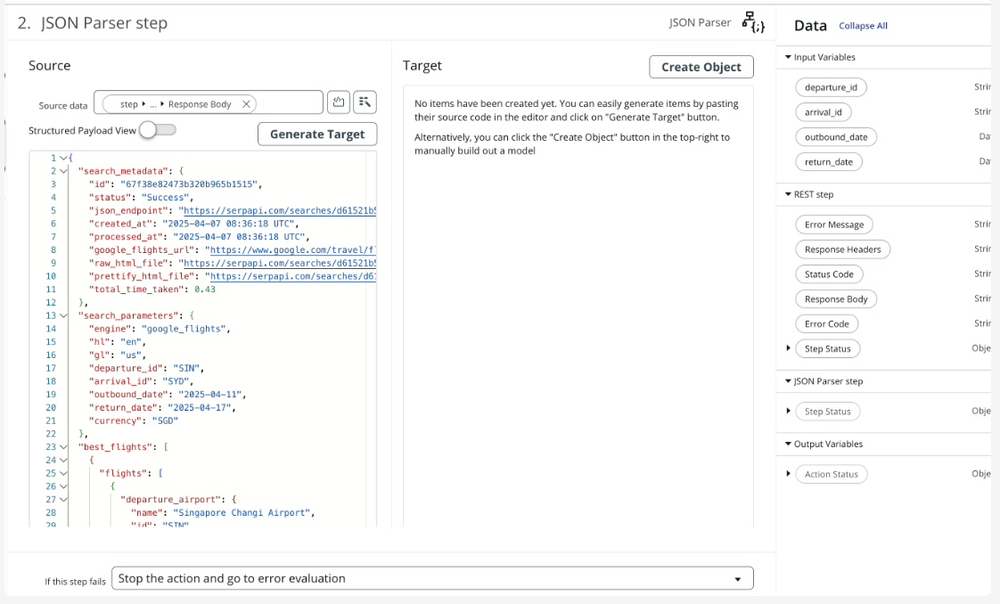

### Step 11:

Navigate to outputs > Create output > Change label to "Price Insights", Type: Object

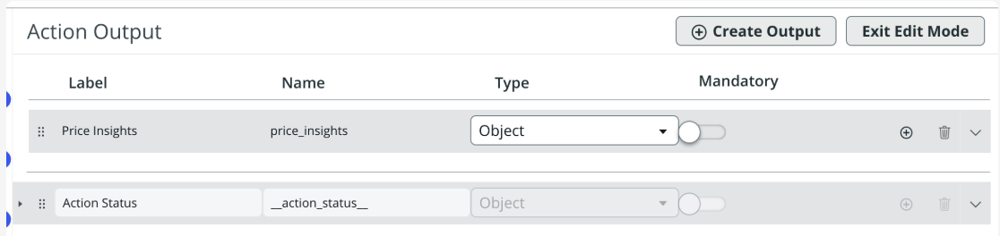

### Step 12:

Click "Exit Edit Mode" > On the pill picker, look for price_insights under JSON Parser step > Drag an drop into "Price Insights" output > Save

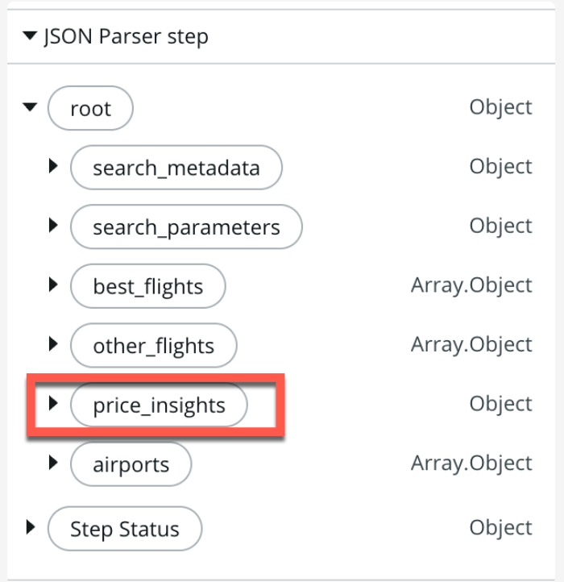

### Step 13:


Test again as before to confirm that you return the price insights > Click Publish

REMINDER: YOU HAVE TO PUBLISH THE FLOW, IF NOT YOU WON'T BE ABLE TO USE IT IN AN AGENT!

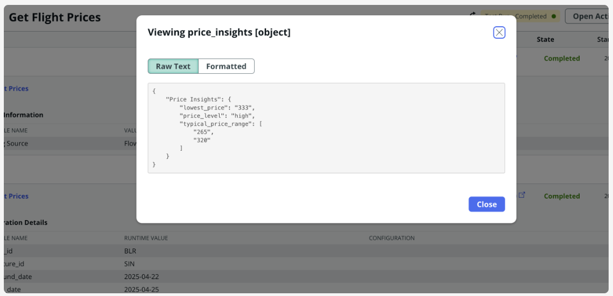

### Step 14:

vigate to AI Agent Studio > AI Agents > Create > New > Use Now Assist

### Step 15:

Enter prompt: This agent helps to check on flight prices > Generate > Save and continue

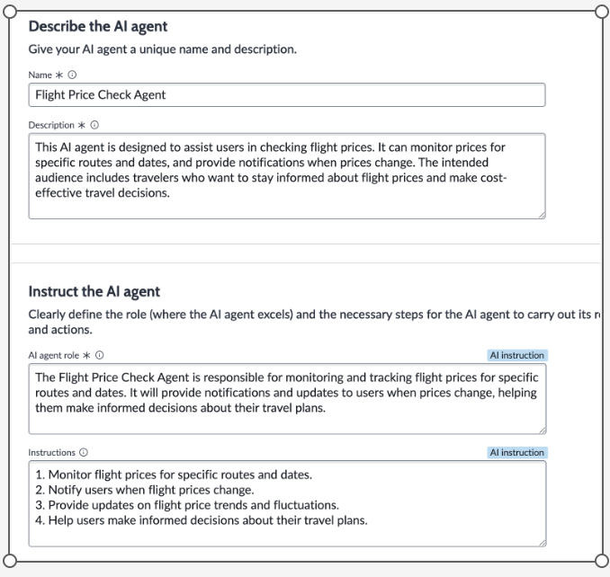

### Step 16:

Add tool > Flow action > Name: Get flight price information > Description: Use to retrieve flight prices for given travel itinerary. Always return the airport code, e.g. Singapore = SIN, Sydney = SYD > Select flow action: Get flight prices > Autonomous > Paraphrase

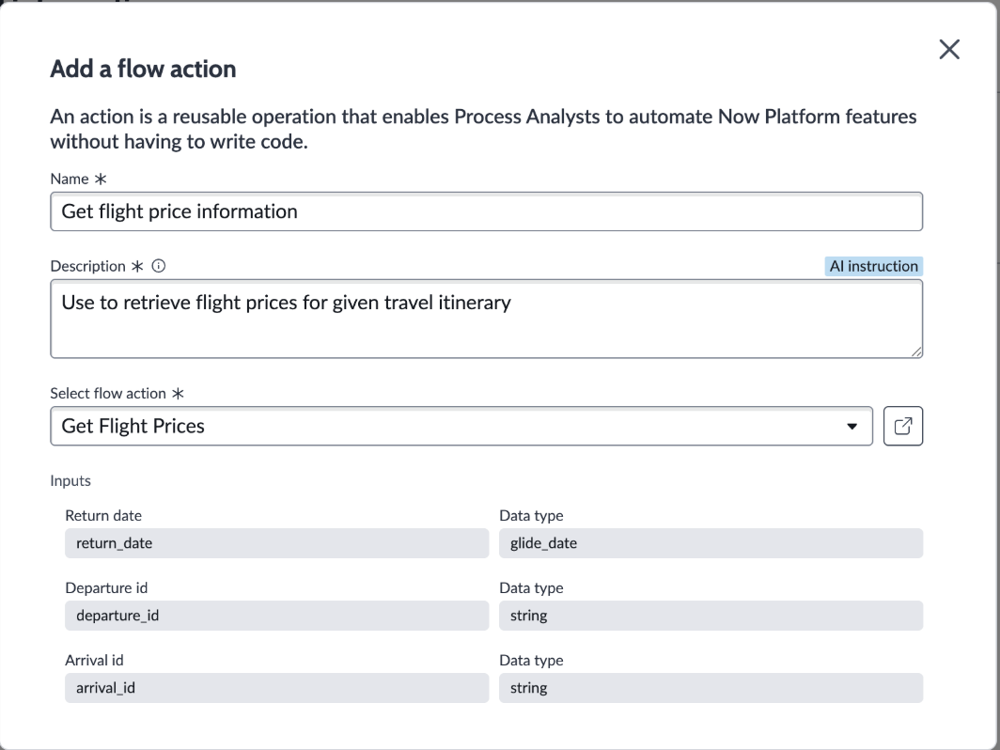

### Step 17:

Continue to testing: Get flight prices from SIN to SYD, leaving 19th Apr and returning 25th April > Check your output

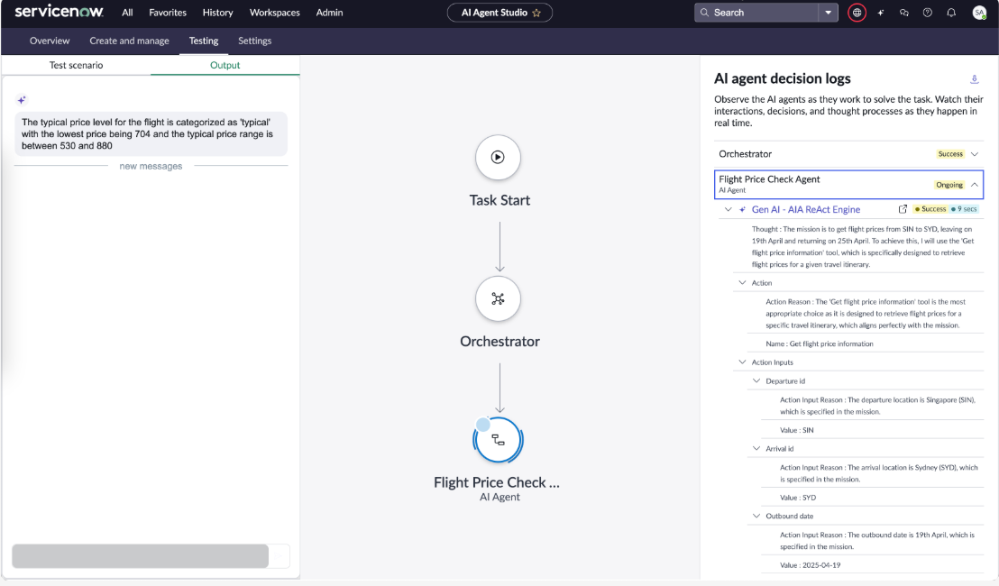

### Step 18:

CHALLENGE: How will you get the agent to recommend the most optimal flight by time and price?


