# Section 0: Integration Hub – Device Issues API (Two Approaches)

**Estimated time: 35 minutes**

## Overview

In this section, you will integrate with a fictional REST API that provides device issues (computers, printers, routers).  

You will explore **two different approaches (forks):**

- **Fork 1 – Persisted Data:** Create a custom table, ingest API data on a schedule using **IntegrationHub**, and then expose it to an **AI Agent**. This simulates a real ITSM scenario with reporting and history.  
- **Fork 2 – Live Query:** Call the API directly at runtime without storing results. This is faster to set up and useful when data doesn’t need to be persisted.  

Choose one fork to complete, or complete both to understand the trade-offs.

---

## Prerequisites

Before starting this section, please ensure you have:

- Access to an instance with **IntegrationHub** and **Flow Designer** enabled  
- Permissions to create custom tables and flows  
- An AI Agent workspace available  
- The mock API endpoint URL (provided by your instructor, e.g., `https://itsm-mock-api.servicenow.workers.dev`)

---

## Review the API

The mock service is hosted online and returns JSON data about device issues.

**Endpoints**

- `/issues` – returns latest issue per device (summary mode)  
- `/issues?device=PRN-7F3&limit=5` – returns the last 5 issues for a device (history mode)  
- `/devices` – returns list of available device IDs  
- `/health` – returns service status  

**Example call**  
`https://itsm-mock-api.servicenow.workers.dev/issues?device=PRN-7F3&limit=3`

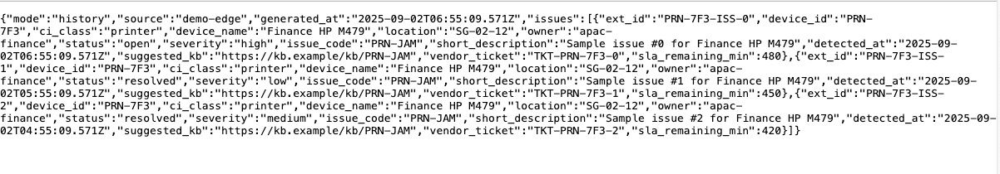

---

## Build the Flow in Flow Designer

<!-- 1. Go to **Workflow Studio > New Flow**.  
//   - Name: `Fetch Device Issues`  
 //  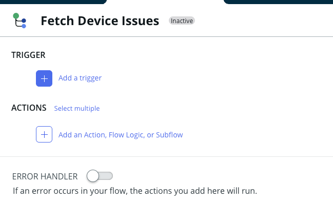
   
2. **Trigger**:  
   - Type: Scheduled  
   - Frequency: every 10 minutes  
   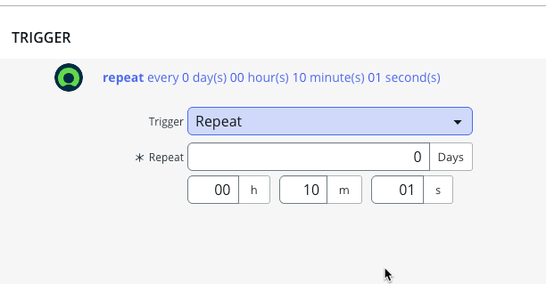 
   
3. **Step 1: HTTP Request**  
   - Method: GET  
   - URL: `https://<your-worker>.workers.dev/issues?limit=10`  
   - Headers: `Accept: application/json`  
    -->
   
1. Go to **Workflow Studio**

2. Click **New** > **Spoke**
   
	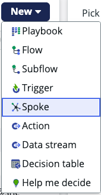

3. Give is a **Name** : `ITSM Rest API Spoke` and **Description**: `Spoke for REST API Call` and click **Continue**.

	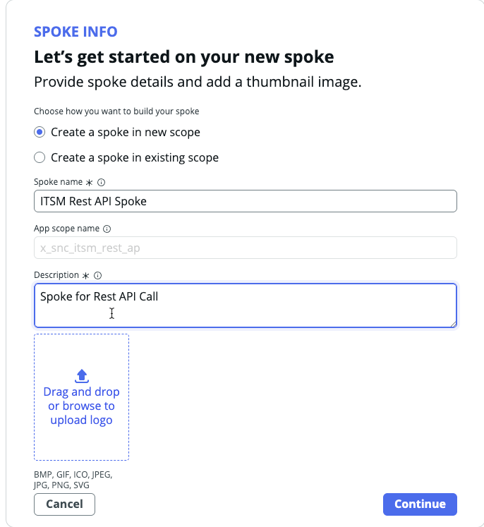

4. Click **Create action** drop down and select **Action Designer**

	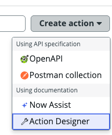

5. Let's name the Action Designer: `ITSM REST API Action`. Ensure that the **Application** is selected as the Spoke we created. 

	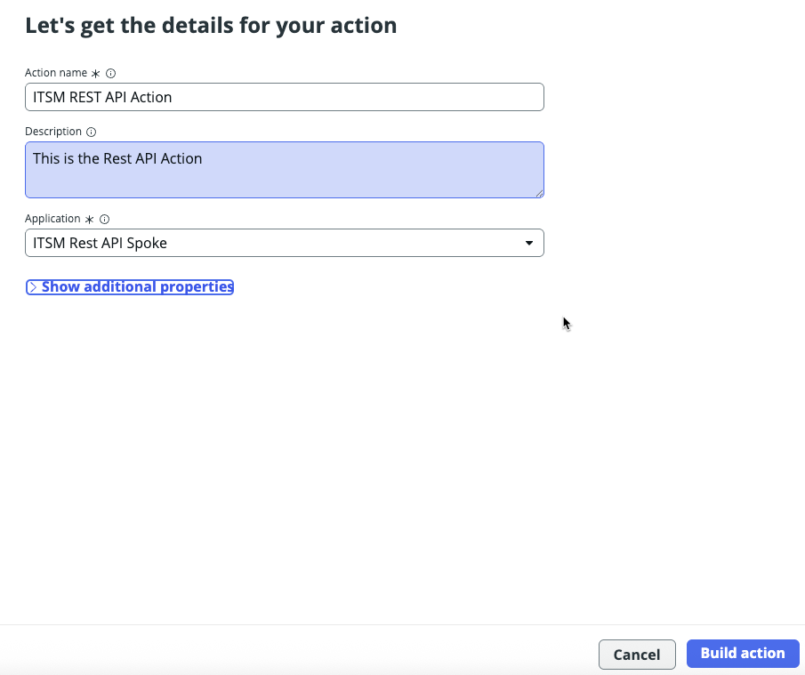

6. Click **Create Input** on the right, and create two input variable. Name them `device` and `limit`. These are the parameters that we would be sending to our REST API Call. 

	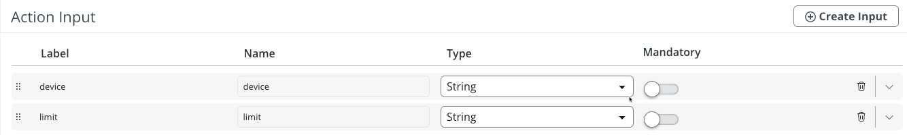

7. Click the '+' symbol below the Inputs in the left pane, to **Add a New Step**. This is where we would put in our REST API Call. 

	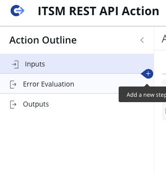
	
8. In the pop window, Type **REST** and choose **Perform a REST web service request**.

	

9. In the next screen, make the following selections:
	- **Connection**: `Define Connection Inline`
	- **Base URL**: `https:\\itsm-mock-api.servicenow.workers.dev/`
	- **Build Request**: `Manually`
	- **Resource Path**: `issues?`
	- **HTTP Method**: `GET`
	- Click '+' and add 2 query parameters:
		- **Name**: `device` and `limit`
		- Drag the **Input varibles** from the right. These are the ones we had created in the previous step. 
		- `device` will have `action>device`
		- `limit` will have `action>limit`

	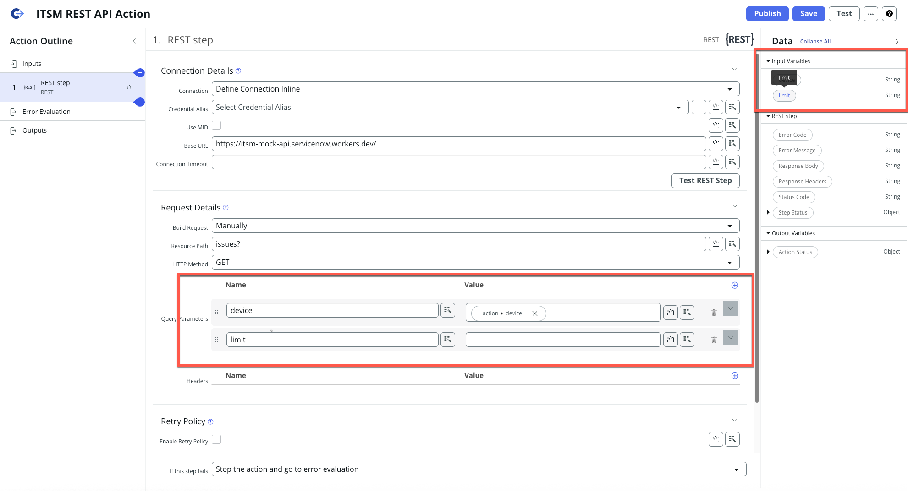
	
10. Click **Save**. Click **Test** to test our API. 
	- In the test window, type `PRN-7F3` as **device**
	- **Limit** it to `4`
   - Click **Run Test**
   
	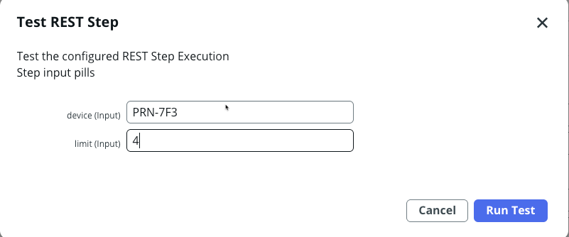
	
11. If the test is successful, you will see the **Response Body** has been populatd. 

	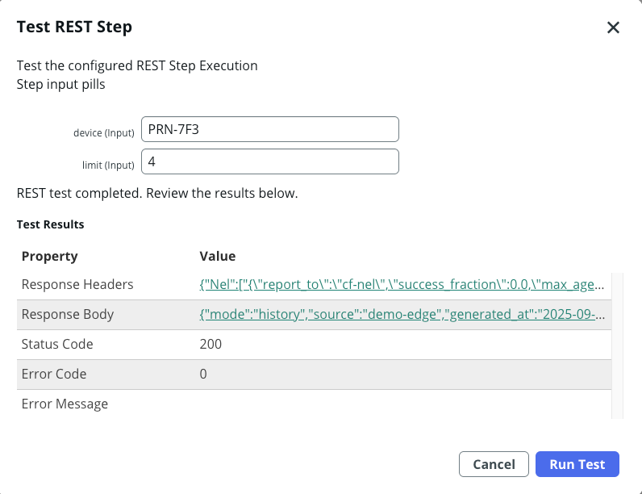

12. Clicking on the **Response Body** shows additional details about the messages returned (raw)

	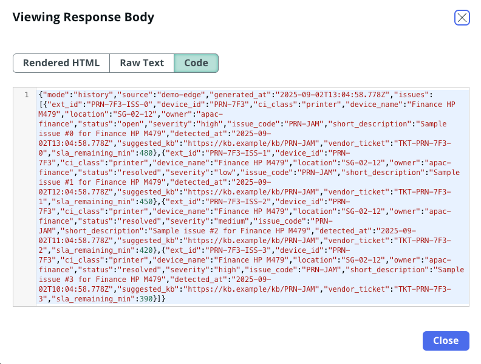

13. The next thing we need to do is to add a **JSON Parser** as a step after the REST Step. This is to be able to read the individual values from the response body that has been returned. 
	- Click '+' symbol below the REST Step
	- Add `JSON Parser` from the list

	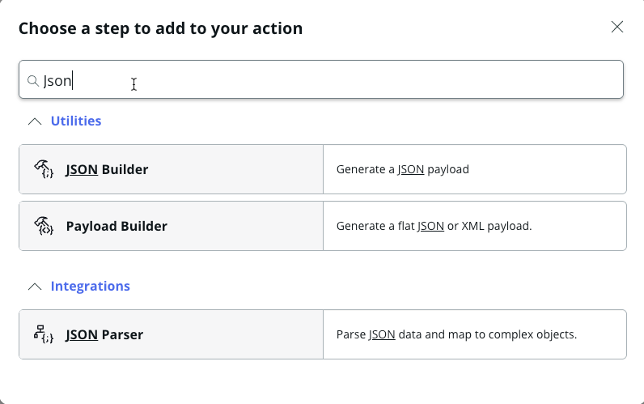

14. Once **JSON Parser** Step has been added, drag `Response Body` from `REST Step` on the right panel, to the field **Source Data**

	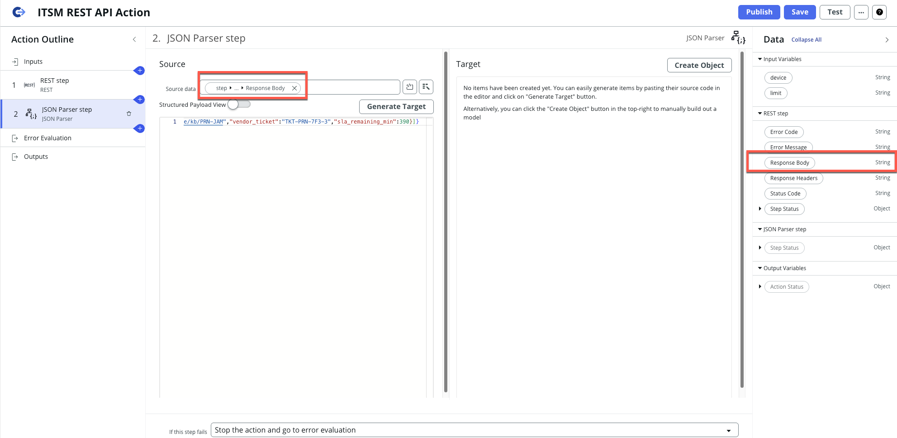
	
15. Click **Generate Target**. This will extract the file information from the response body, and this will be displayed in the **Target** Panel

	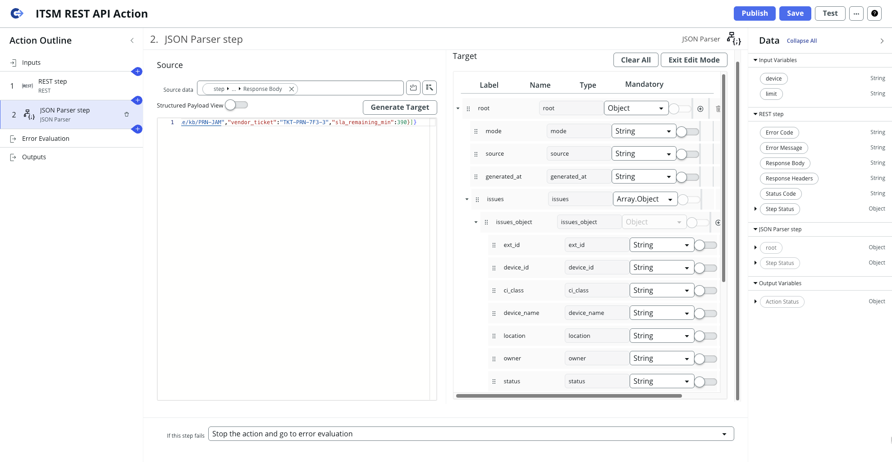
	
16. Now we need add output variable to our **Action Outline**. Click the **Outputs**

	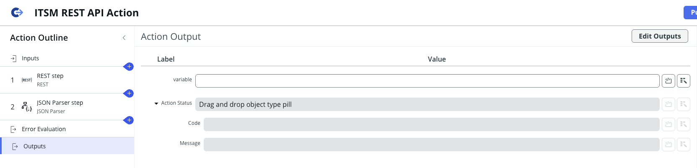

17. Click **Edit Output**. Change/Add the label as follows:
	- Change the **Label** to `device issues`
	- Change the **Type** to `Array.Object`

	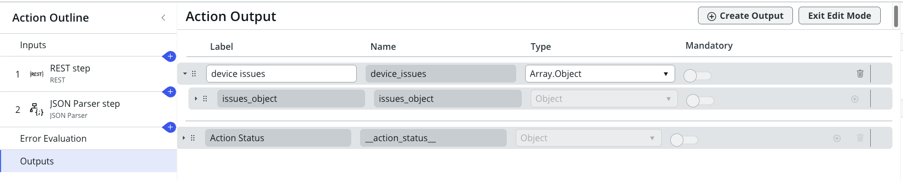

18. Expand the **JSON Parser Step** to review the `root` Object.

	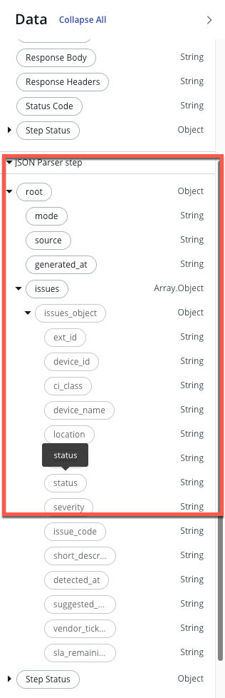

19. Click **Exit Edit Mode**. Drag the `issues` from the **JSON Parser Step**, into the `device issues` variable. 

	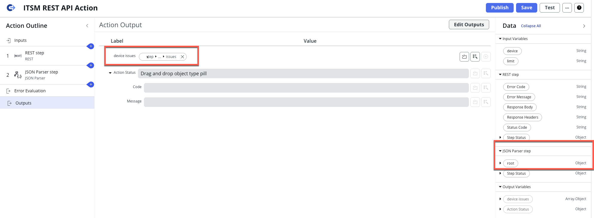

20. **Save** the Action. Now let's test the entire flow by clicking **Test**
	
21. While testing the full action, let's provide the following values:
	- **Device**: `PRN-7F3`
	- **limit**: `3`
	
	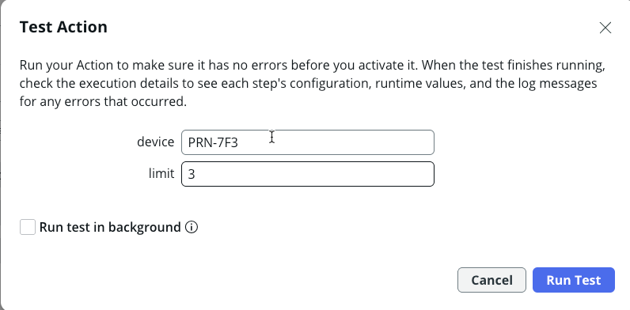
	
22. After the action has been successfully run, it show show the following:

	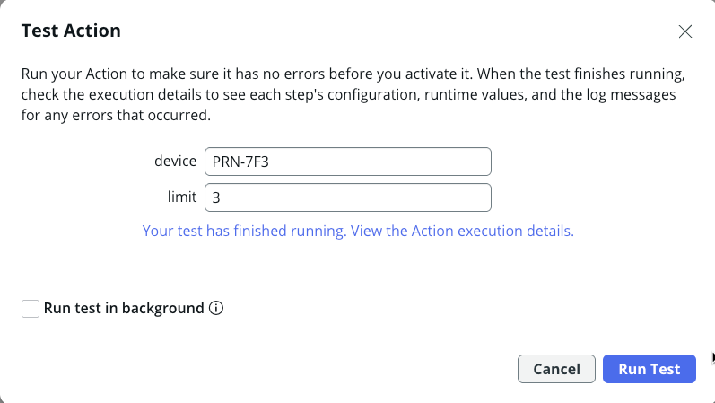

23. If everything has run successfully, the **device issues** should be populated correctly. 	
	
	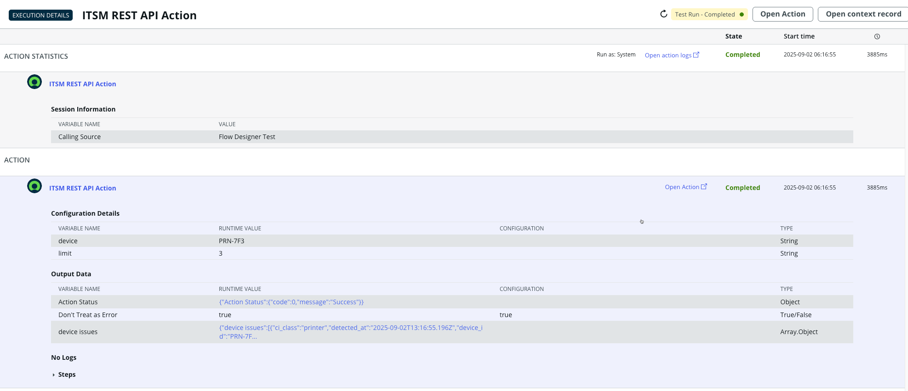
	
23. Click the values displayed in **device issues**, to view the values populated in the `Array Object`

	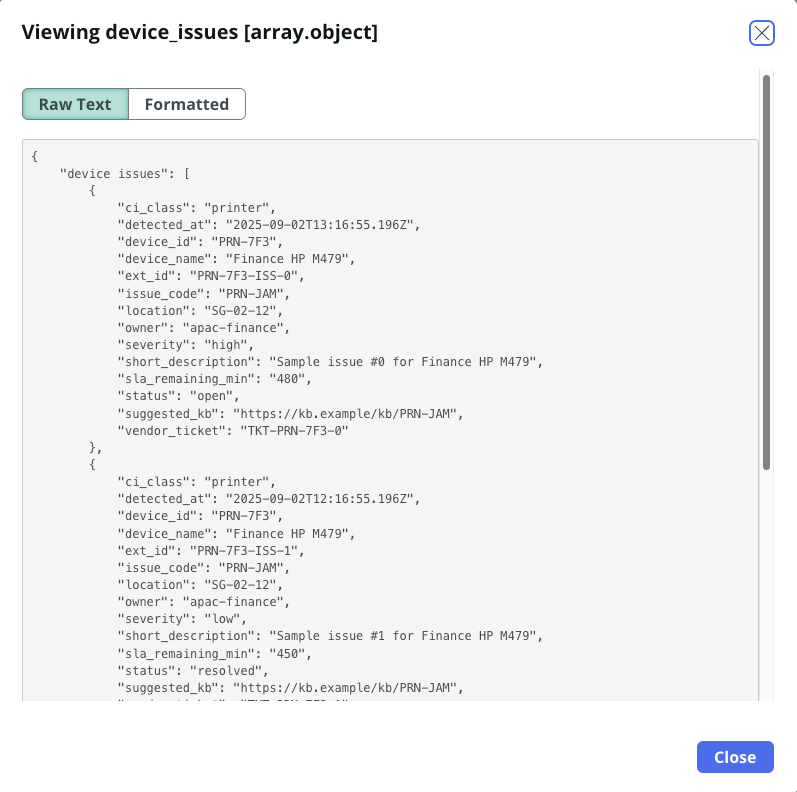
	
24. Everything looks good. Let's **Publish** the action. 

	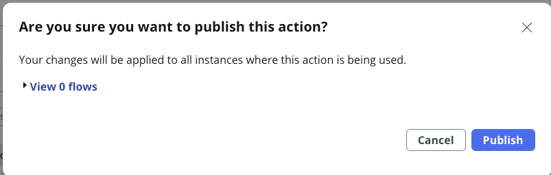
	
Since we have completed the creation of the spoke. Now we can test it with 2 options. 

-------

## Step: Let's persist this data into a Custom Table

Navigate to **System Definition > Tables** and create a new table:

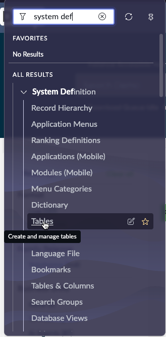

**Table Name:** `u_ext_device_issue`

**Fields to add:**

- `u_ext_id` (String, 64, unique)  
- `u_device_id` (String, 64)  
- `u_ci_class` (String, 40)  
- `u_device_name` (String, 255)  
- `u_location` (String, 100)  
- `u_owner` (String, 100)  
- `u_status` (Choice: open, acknowledged, resolved)  
- `u_severity` (Choice: low, medium, high, critical)  
- `u_issue_code` (String, 50)  
- `u_short_description` (String, 255)  
- `u_detected_at` (Date/Time)  
- `u_suggested_kb` (URL)  
- `u_vendor_ticket` (String, 100)  
- `u_sla_remaining_min` (Integer)

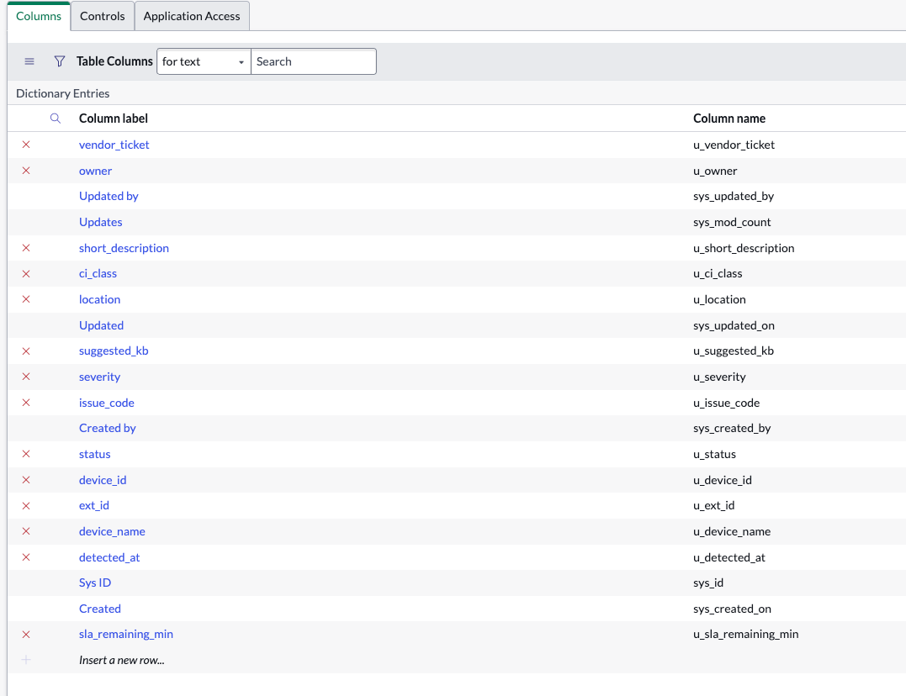

--------

## Step: Let's build an AI Agent to call this API 