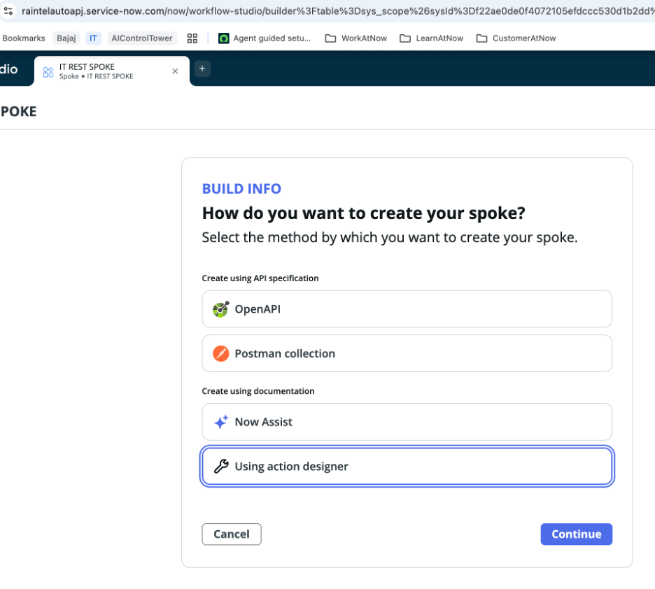

# Section 0: Integration Hub – Device Issues API (Two Approaches)

**Estimated time: 35 minutes**

## Overview

In this section, you will integrate with a fictional REST API that provides device issues (computers, printers, routers).  

You will explore **two different approaches (forks):**

- **Fork 1 – Persisted Data:** Create a custom table, ingest API data on a schedule using **IntegrationHub**, and then expose it to an **AI Agent**. This simulates a real ITSM scenario with reporting and history.  
- **Fork 2 – Live Query:** Call the API directly at runtime without storing results. This is faster to set up and useful when data doesn’t need to be persisted.  

Choose one fork to complete, or complete both to understand the trade-offs.

---

## Prerequisites

Before starting this section, please ensure you have:

- Access to an instance with **IntegrationHub** and **Flow Designer** enabled  
- Permissions to create custom tables and flows  
- An AI Agent workspace available  
- The mock API endpoint URL (provided by your instructor, e.g., `https://itsm-mock-api.servicenow.workers.dev`)

---

## Step 1: Review the API

The mock service is hosted online and returns JSON data about device issues.

**Endpoints**

- `/issues` – returns latest issue per device (summary mode)  
- `/issues?device=PRN-7F3&limit=5` – returns the last 5 issues for a device (history mode)  
- `/devices` – returns list of available device IDs  
- `/health` – returns service status  

**Example call**  
`https://itsm-mock-api.servicenow.workers.dev/issues?device=PRN-7F3&limit=3`

---

# Fork 1: Persisted Data (Custom Table + Flow)

## Step 2A: Create a Custom Table

Navigate to **System Definition > Tables** and create a new table:

**Table Name:** `u_ext_device_issue`

**Fields to add:**

- `u_ext_id` (String, 64, unique)  
- `u_device_id` (String, 64)  
- `u_ci_class` (String, 40)  
- `u_device_name` (String, 255)  
- `u_location` (String, 100)  
- `u_owner` (String, 100)  
- `u_status` (Choice: open, acknowledged, resolved)  
- `u_severity` (Choice: low, medium, high, critical)  
- `u_issue_code` (String, 50)  
- `u_short_description` (String, 255)  
- `u_detected_at` (Date/Time)  
- `u_suggested_kb` (URL)  
- `u_vendor_ticket` (String, 100)  
- `u_sla_remaining_min` (Integer)

## Step 3A: Build the Flow in Flow Designer

1. Go to **Flow Designer > New Flow**.  
   - Name: `Fetch Device Issues`  
   
   
2. **Trigger**:  
   - Type: Scheduled  
   - Frequency: every 10 minutes  
    
   
3. **Step 1: HTTP Request**  
   - Method: GET  
   - URL: `https://<your-worker>.workers.dev/issues?limit=10`  
   - Headers: `Accept: application/json`  
   
   

