# Section 11: Introduction: Now Assist for Doc Intel
Now Assist for Doc Intel allows you review documents for key information and extract document data for use in your workflows.

## What are we building ?
### Following is the use case and the outcome of the use case

Use Case: This is a life insurance use case where you’ve be tasked to create a PoV use case for a Insurance customer, who wants to leverage servicenow’s agentic AI capability for Claims validation, i.e., the claim that is submitted vs. the documents provided as part for validation.

This lab we will cover building Doc-Intel use case using Now Assist Document Extraction Skill, which will be integrated into OOTB Document and Visual Insights AI Agent (we will customize this) and how to extract data from custom table and use it as part of AI Agent
Fun fact: OOTB Document and Visual Insight AI Agent if not customized doesn’t support more than 1 document

The lab is designed to enable you with the following:
1. Creation of custom table (extension of task table)
2. Importing records to custom table & attaching pdf
3. Building Document Extraction use cases (For each document). This step may take some time and is pre-requisite to step 4 to 6.
4. Using the Document extraction use cases in the custom OOTB Document & Visual Insights AI Agents (named: Claims Intimation AI Agent)
5. Extracting Data from custom table using Flow Action and integrating this in AI Agent (Claims Details Agent)

## It makes following capabilities available to AI Agents:
- Document Extraction: Agents can extract information from documents and review the information, which then can be stored in mapped tables and fields in the workflow.
- Document Q&A: AI Agents can review documents and can help provide answers to pre-defined questions.
- Attachment Summarization: AI Agents utilized Now Assist for Doc Intel to get a summary of attachment content, along with the record summary for validation or comparison.
- Document Chat: AI Agents can now interact with the document in Now Assist for Virtual Agent and can get chat responses based on Document Content.

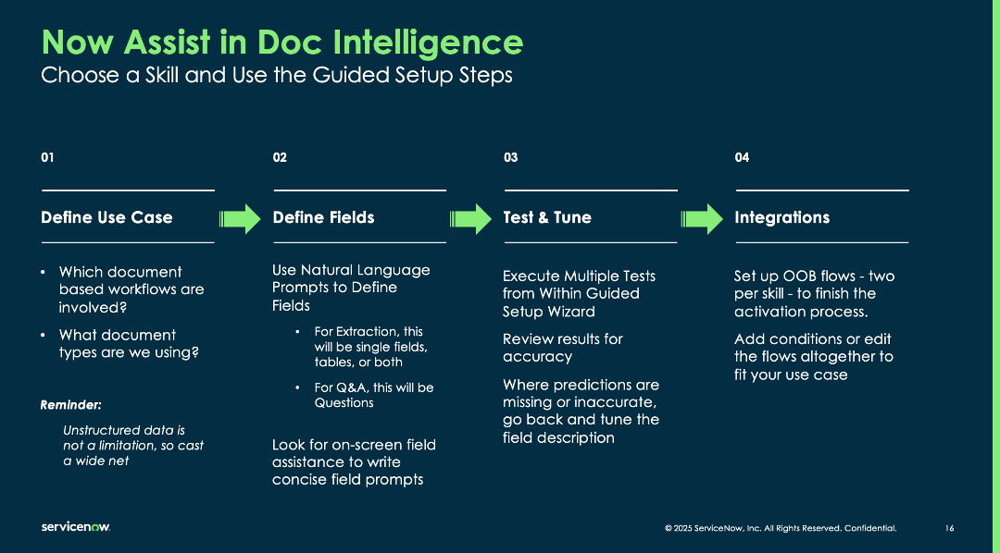

## What roles do I need to build Now Assist for Doc Intel Use cases?
- DocIntel Admin
- DocIntel Manager
- DocIntel Extraction Agent

## What plugins do I need to activate Now Assist for Doc Intel?
- Now Assist
- Document Intelligence
- Now Assist for Document Intelligence
- Now Assist Platform

## Pre-requisites for Now Assist for Doc Intel

- Each feature in Now Assist for Doc Intel gets activated from Now Assist Admin, by default they are Inactive. 
- Pre-defined document structure, fields, tables and questions.
Now Assist for Document Intelligence work on pre-defined document structure, defined field names and established questions, while they can modify or improve.

## Building of Now Assist for Doc Intel Use Cases
Document Extraction use cases:
- Use cases where we must extract defined field of information from a document, the format of the document can be pdf, jpg, png.

Especially cases, where the attachment is part of a record (either custom attachment table or the sys_attachment table) and the extracted fields get updated as part of a target table.

To activate the Document Extraction Skill, we will create a use case, An extraction use case allows us to define the data we want to extract from a document

On Top Left, Go to Admin > Now Assist Admin > Now Assist Skill > Platform

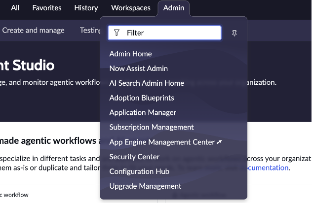

Select Platform

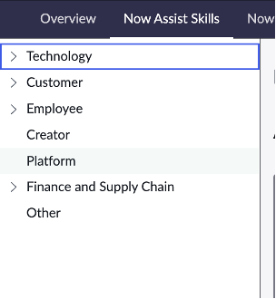

On Now Skill for Platform Page, In Search Bar - Find Document

We get two results
1. Document Q&A
2. Document Extraction

### Step1 : We will activate Document Extraction Skill

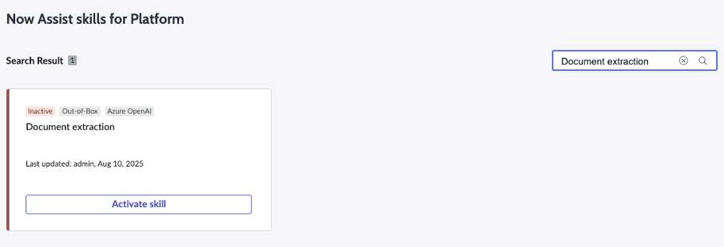

If you don't see Activate or it says Deactivate, that means for your instance it is already activated.

Click on 3 dots and click edit

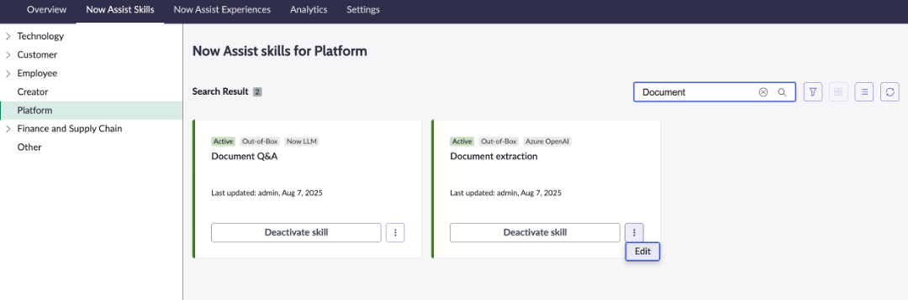

With this we now are entering the Document Extraction Use Case Playground, where we will be creating the use cases

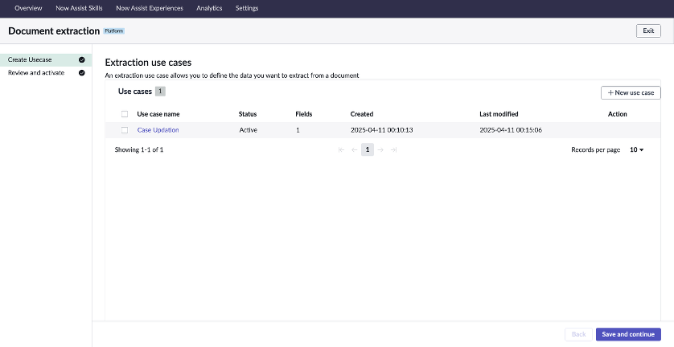

### Step2 : Click on New use case, and provide the Name and the target table (Claim Intimation Case) that we created in earlier steps.

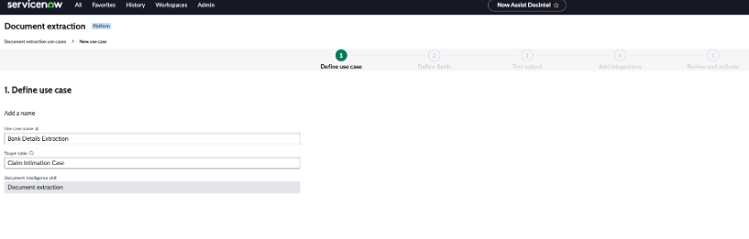

Once we have defined the use case, next step we add the respective fields
### Step3: Click Add Field Button, and add the details of the field

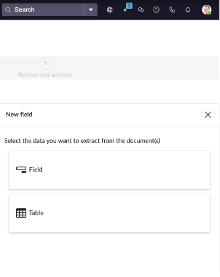

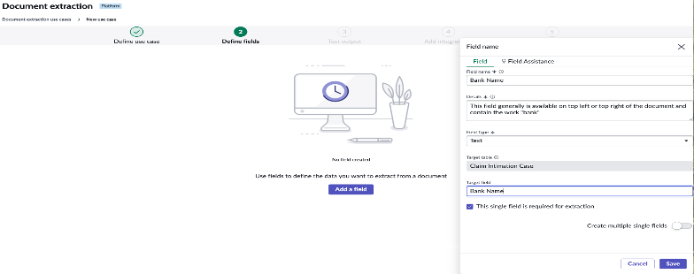

- Name: Bank Name
- Details: This field is generally available on the top left or top right of the document and is the name of the bank 
**Note** : This is critical field, as the LLM uses the Details field to locate the information and extract the details
- Field: Text (Default)
- Target Field: u_Bank_Name or Bank Name (If we search, we will see the options)

With this now we have added the first field in the first use case

### Step4: Next we will add the second field for the use case

- Name: Bank Account Number
- Details: This field is generally a numeric field, mentioned generally after A/C No.
**Note** : This is critical field, as the LLM uses the Details field to locate the information and extract the details
- Field: Text (Default)
- Target Field: Bank Account Number

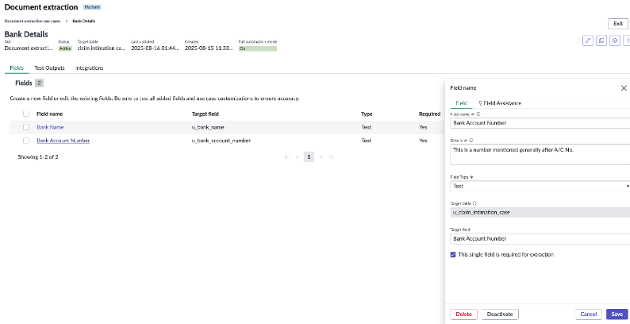
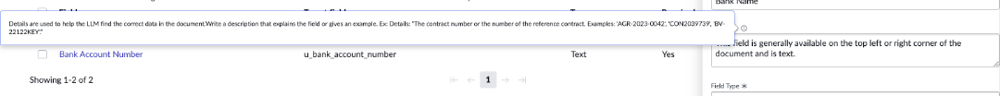

**Note**: We will skip Test Output tab for now and directly navigate to Integrations

### Step5: As part of integration, we define the extraction and processing part, where for each part a flow action.

- Click Add Integrations
Name: BankDetailsExtract
What type of integration do we want to set? : Extract values
Create Flow (Check Default) - No change
**Click Save**

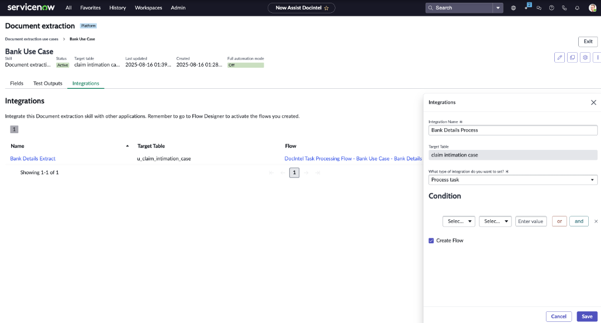
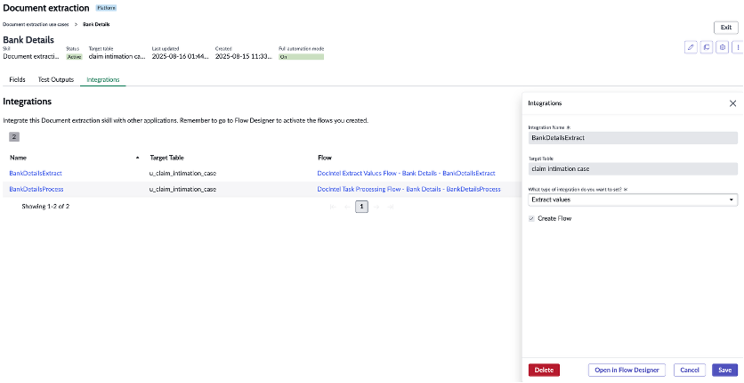

- Let's Add Second Integration
Click Add Integrations

Name: BankDetailsProcess
What type of integration do we want to set? : Process values
Condition: Find **Number** in drop down - Next drop down, find **is not empty**
Create Flow (Check Default) - No change
**Click Save**

### Step6: Open both integrations, one by one, Click Open in Flow Designer and activate them.

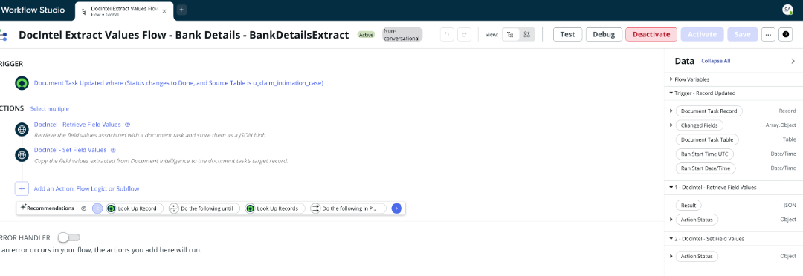

**Why are we doing the Integration** : So far, we have defined the fields that we want to extract, but these fields are not getting updated anywhere, so to get these fields updated to target table (already defined in previous step), we need to create an extract integration and then a process integration. These are nothing but flow designer, flows which take the extracted fields, process them and update the records in target table.

### Step7: Go to Settings, (Gear Icon under Exit)
- Enable the Full automation mode toggle

**Exit**

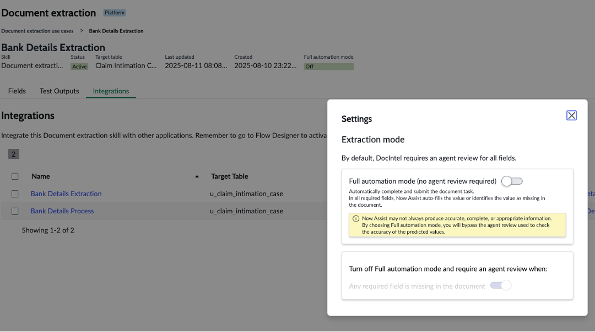

### Step8: Test Outputs for the Use Cases
- Next we will go back to the individual Use Case and test the use case using the record, to validate if our use case and table are correctly integrated and if the use case is able to fetch the attachments from the record.

Go to the use case (Bank Details), and go to the test output tab and click Test and search for the record in Upload from Record (Example: CLI0001004)

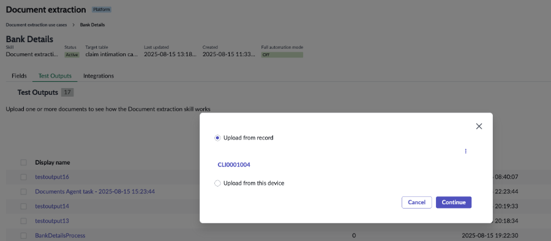

The documents available in the record will be loaded and now we validate the fields that we were extracting, in this use cases, it is Bank Name and Bank Account Number.
Click More > To Review > Validate the fields

And click each extracted value and once you see green check, we go and click confirm and submit.

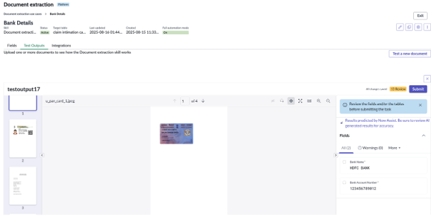

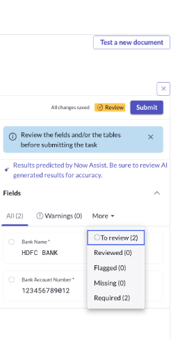

Once we have tested, it we will see the records getting populated in the individual record, check the Bank Name and Bank Account Number field, in the claim intimation case table.

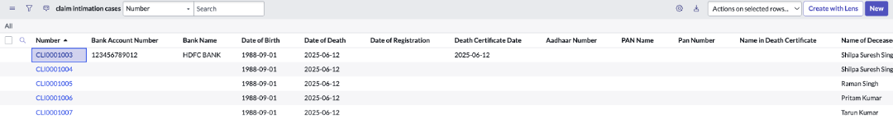

### Next, we Repeat all of the above steps for other documents & fields as well.
As we know we have total 4 documents for validation and we have created the use case for the first document.

#### Use Case 2 : Death Certificate

For Death Certificate we are extracting
- Name of Deceased
- Date of Death

Follow the information available in the below field screenshots

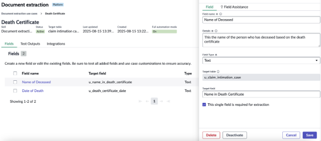

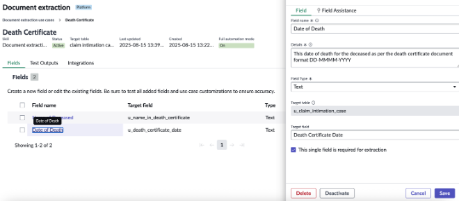

Skip test outputs and directly go to integration and create integrations like we did in previous use case

Follow the information available in the below integration screenshots

Integration Extract

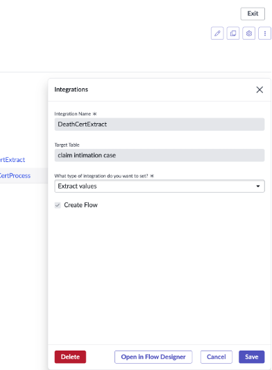

Integration Process
- Condition remains the same, i.e., Number is not empty

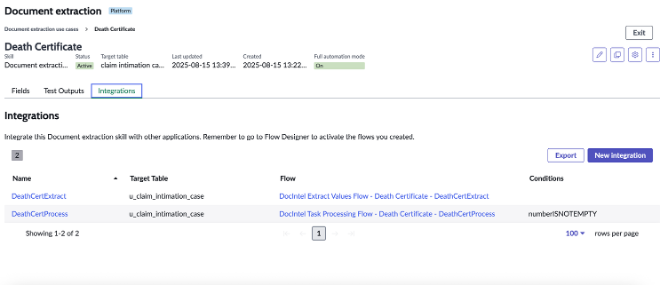

**Critical: Activate each of these Integration**

#### Use Case 3 : PAN Details Extraction

For PAN Details Extraction we are extracting
- PAN Number
- PAN Name

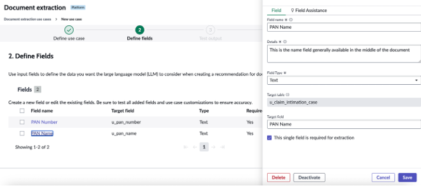

Integration Extract

Integration Process
- Condition remains the same, i.e., Number is not empty

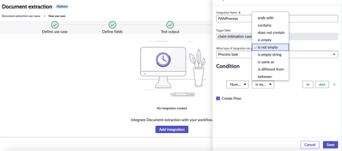
  
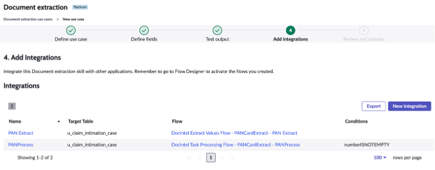

**Critical: Activate each of these Integration**

**Use Case 4** : Aadhaar Data Extract

For Aadhaar Data Extract we are extracting
- Aadhaar Number

Integration Extract

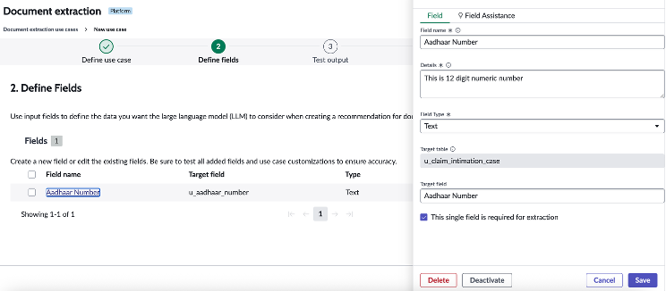

Integration Process
- Condition remains the same, i.e., Number is not empty
  
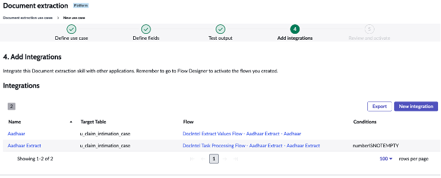

**Critical: Activate each of these Integration**

**Next Step:** [Section 12 - Reading Data from Custom Table](section12-reading-custom-table-data.md)
**Previous:** [Section 10 - Create Custom Table](section10-create-custom-table.md)
**Back to:** [Main README](README.md)

