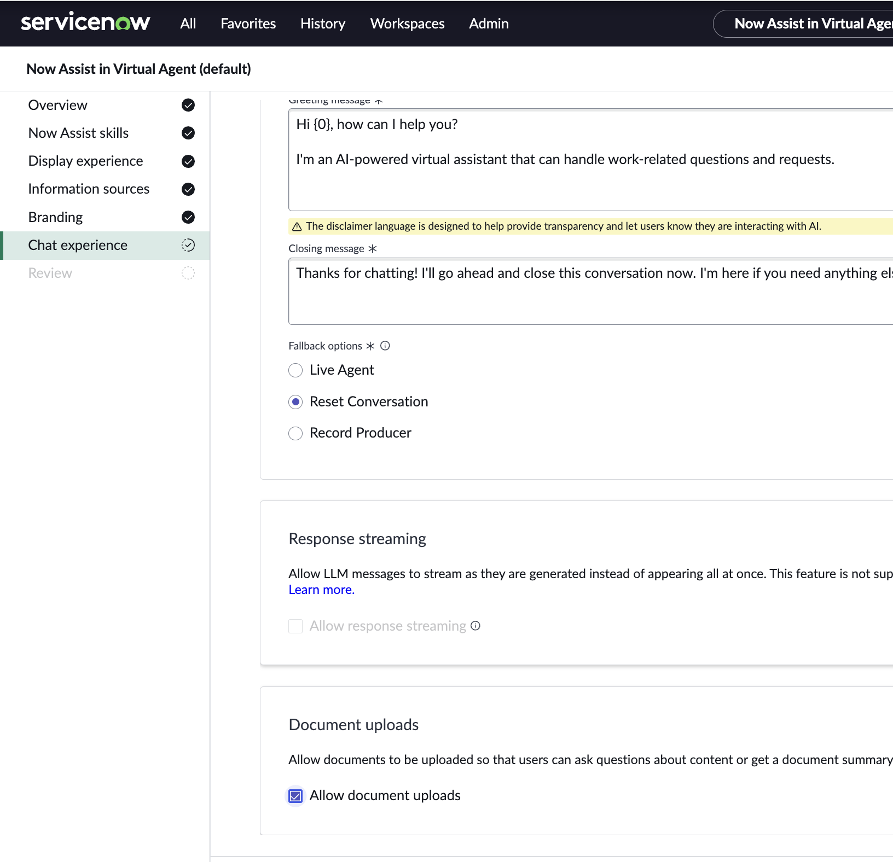

# Section 12: Advanced Features and Integration

**Estimated time: 15 minutes**

## Overview

This section covers advanced AI features available in ServiceNow, including Document Q&A capabilities, advanced integration patterns, and emerging AI functionalities that enhance the overall platform experience.

### Advanced Capabilities Covered

- **Document Q&A:** Natural language querying of organizational documents
- **Multi-Modal AI:** Integration with various content types
- **Advanced Analytics:** AI-powered insights and reporting
- **Integration Patterns:** Best practices for scaling AI across the organization

## Section 14.1: Document Q&A Implementation

### Overview of Document Q&A

Document Q&A enables users to ask natural language questions about organizational documents and receive AI-powered answers with source attribution.



**Key Features:**
- **Natural Language Queries:** Users ask questions in plain English
- **Intelligent Document Search:** AI finds relevant content across documents
- **Contextual Answers:** Responses based on document content
- **Source Attribution:** Clear references to source documents
- **Multi-Format Support:** PDFs, Word docs, web content, and more

### Document Processing Pipeline

**Step 1: Document Ingestion**
```javascript
// Document processing workflow
var documentProcessor = {
    supportedFormats: ['pdf', 'docx', 'txt', 'html', 'md'],
    
    processDocument: function(document) {
        // Extract text content
        var content = extractTextContent(document);
        
        // Apply security classification
        var classification = classifyDocument(content);
        
        // Create searchable chunks
        var chunks = createDocumentChunks(content);
        
        // Generate embeddings for semantic search
        var embeddings = generateEmbeddings(chunks);
        
        return {
            content: content,
            classification: classification,
            chunks: chunks,
            embeddings: embeddings
        };
    }
};
```

**Step 2: Query Processing**
```javascript
// Natural language query processing
function processUserQuery(query, userContext) {
    // Understand user intent
    var intent = analyzeQueryIntent(query);
    
    // Find relevant documents based on user permissions
    var accessibleDocs = getAccessibleDocuments(userContext);
    
    // Perform semantic search
    var relevantChunks = semanticSearch(query, accessibleDocs);
    
    // Generate contextualized response
    var response = generateAnswer(query, relevantChunks);
    
    return {
        answer: response.text,
        sources: response.sources,
        confidence: response.confidence
    };
}
```

### Security and Access Control

**Document-Level Security:**
- **Classification-Based Access:** Restrict based on document sensitivity
- **Role-Based Permissions:** Control access by user roles
- **Department Restrictions:** Limit documents by organizational unit
- **Dynamic Permissions:** Real-time access validation

**Query-Level Security:**
```javascript
// Secure query processing
function secureDocumentQuery(query, user) {
    // Validate user permissions
    if (!validateUserAccess(user)) {
        return "Access denied: Insufficient permissions";
    }
    
    // Filter documents by user access level
    var authorizedDocs = filterDocumentsByAccess(user);
    
    // Process query with security context
    var result = processQuery(query, authorizedDocs);
    
    // Apply response filtering
    return filterSensitiveInformation(result, user.clearanceLevel);
}
```

### AI Content Accuracy Warning


**User Education Components:**
- **Disclaimer Text:** "AI-generated content may be incorrect"
- **Source Verification:** "Always verify information with original sources"
- **Feedback Mechanism:** Allow users to report inaccuracies
- **Human Oversight:** Escalation path for critical decisions

## Section 14.2: Advanced Integration Patterns

### Multi-Application AI Workflows

**Cross-Application Data Flow:**

```javascript
// Integrated AI workflow across applications
var crossAppWorkflow = {
    // Incident → Knowledge → Change integration
    processIncidentWithAI: function(incident) {
        // Summarize incident using AI
        var summary = aiSummarize(incident);
        
        // Search knowledge base for solutions
        var solutions = searchKnowledge(summary.keywords);
        
        // If no solution found, suggest change request
        if (solutions.length === 0) {
            var changeRequest = suggestChangeRequest(incident, summary);
            return {
                type: 'change_required',
```

**Previous Section:** [Section 13 - Building Claim AI Agent](section13-building-claim-ai-agent.md)
**Back to:** [Main README](README.md)
                
    
