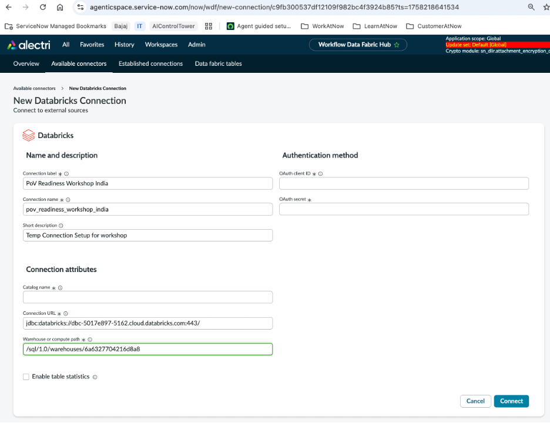
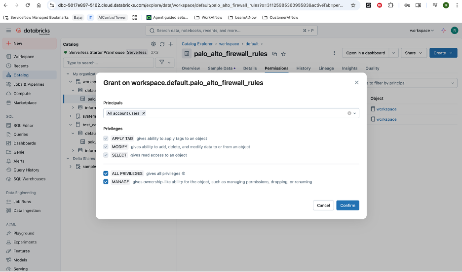

# Section 15: Zero Copy Connectors from Scratch with Databricks

  

By now we all know what Zero Copy Connectors are, so we will skip the introduction.

However, for refresher sharing the link to the WDF Second call deck which can help you if needed.

[WDF Second Call Deck](https://servicenow.seismic.com/Link/Content/DCDT2jDF9JVJc8CCFWPW7HQ7mcFG)

**What are we aiming to achieve at the end of this lab?**

- For customer PoVs, how easy it is to setup with databricks environment.
- Understand key details we would need request from customer for connection and authentication for databricks

## Let's get started with the lab!

Step 1: Create a databricks account

  

Since we are doing this for internally, let's select personal use

  

For Ease of logging, I am selecting `Continue with google`

  

Select `India` for location

  

The account is getting setup!

  

Perfect! we now are in the landing page of databricks

  

On the left pane, select `Data Ingestion` from `Data Engineering` section.

  

As part of today's exercise, we are only going to create the dataset in databricks by uploading the excel/csv.

You will be able to access the excel/csv from the [link](https://servicenow-my.sharepoint.com/:x:/p/rahul_adlakha1/EVnHG_4Sd15EkDLEbJwwzzcBQmqMnIMa6pRM0UHKJQ4s7g?e=fijwwn)

 

Upload the excel that you've downloaded from the above sharepoint link.

  

Click `Create Table` buttom at the bottom

Note: we are keeping the `catalog` and `schema` same.

  

Perfect! The table now is getting created!

  

Select `SQL Warehouses` from the left pane

This is a serverless sql warehouse, which is running already!

  

Open the  `SQL Warehouse`, i.e., Serverless starter warehouse

  

Click Connection details, this is where you will find the relevant connection details that we will leverage as part of servicenow WDF zero copy.

**Checkpoint on connection details, as we will be leveraging in SN instance**

  

With this, we now are moving on to the WDF capability in ServiceNow instance.

Navigate to Workflow Data Fabric Hub.

  

Under WDF Hub, let's begin connecting databricks!

  

Let's now leverage the databricks connection that we created in the databricks environment.

 

Starting with the `JDBC URL` from Databricks platform.

  

Update the JDBC URL in the `Connection URL` in the databricks connection setup in the instance.

  

We will be using the `HTTP URL` next

  

The HTTP URL will be going into the warehouse path

Along with this, let's also provide the connection details such as
1. `Connection label` : `PoV Readiness Workshop India`
2. `Short Description` : `Temp Connection setup for workshop`

  

Now the next two pending fields are Oauth fields.
For this we will establish a Service Principals

Go to `Settings`

 

Under `Identity and Access`, select `Service Principals` and click `Manage`

  

Click on `Add Service Principal`

Give it a name, let's call it : `test_auth_service`

  

Open the service principal that we just created

  

Select the `Secret` tab 

 

Click `Generate Secret`

 

Provide the number of days till when we want these credentials to remain.

  

**Critical Note: Copy the Client ID and Secret, this will not be available later**

  

Next, we will add the Client ID and Secret, in the ServiceNow Databricks connection.

Perfect! we now have established the connection, let make one last change in Databricks before we go ahead and test this.

  

In the databricks table, let's grant access of the table to the workspace.

  

Now we test! Click Test Connection

  

We now have the dataset available as part of our WDF hub!

Next most important piece is creation of `Data Fabric Table`
Click `Create Data Fabric Table`

  

Let's add the label for the Data Fabric Table : `firewall_rules`

Note that scope applies here, so you can create data fabric tables in scopes like how you would any custom table

  

Let's add the mapping for the data fabric table to based on the columns available in the data fabric table
For now we are not selecting the primary key or changing the Data type but that is a viable option

  

Perfect! with this our data fabric table got created!
 
  

**Leveraging the data fabric table in AI Agents**

  
  
  
  
  
  
  
  
  
