# Section 15: MCP External Tool Access in ServiceNow MCP Client

## What is AI Agent Fabric?

AI Agent Fabric is ServiceNow’s communication framework that connects AI agents and tools across any 
platform to deliver seamless, end-to-end automation. It enables agents to collaborate using shared protocols 
like Agent-to-Agent (A2A) and Model Context Protocol (MCP), breaking down silos and eliminating duplication. 
What sets ServiceNow apart is its ability to unify multi-agent and multi-tool ecosystems with built-in 
governance, memory, and workflow execution, on a single enterprise-grade platform.

## What is MCP?

**MCP - Model Context Protocol** 
- A standard that enables AI agents to securely interact with enterprise systems where data resides, such as content repositories, business applications, development environments and databases. 
- This allows enterprise businesses to reduce the integration challenges of manual workflows, thereby delivering outcomes from models more quickly. Since then, MCP servers have become foundational for agentic applications, providing a consistent and secure mechanism for invoking tools and retrieving data.

**What is the difference between MCP Server & MCP Client?**

An MCP Server is the provider that hosts and exposes tools, information, or capabilities for AI agents to access. 
It responds to structured requests from clients and delivers actionable outputs like incident summaries or HR 
case data. 
An MCP Client is the consumer that connects to one or more MCP Servers to request information or 
trigger actions via exposed tools. 
In ServiceNow, the MCP Client app allows AI agents to connect to external MCP Servers, while the MCP Server lets external agents leverage Now Assist skills. This distinction helps sellers 
explain how ServiceNow supports both inbound and outbound AI orchestration, enabling customers to integrate with external systems or expose their own capabilities, all within a governed, scalable framework.

**Why MCP ?**

- Open Standard introduced by Anthropic
- Enables AI Agents to access external tools, data and context
- Acts as universal connector for AI systems
- Standardizes communication between AI models and Enterprise systems
- Essential for scalable and interoperable AI Integrations

**How is MCP different from Zero Copy or APIs offered within the Workflow Data Fabric SKU?**

At first glance, MCP may resemble an API layer, but the difference lies in how context is handled, what standards are used, and the purpose of the requests. MCP is a standardized protocol that allows AI agents to 
discover and interact with external tools and data sources in real time, in a format optimized for large language models. 

It enables agents to understand and act autonomously without custom code or system-specific logic. 

In contrast, API connectors within Workflow Data Fabric are built to integrate systems and unify data into a single model that powers ServiceNow workflows, giving enterprise-wide data context to 
ServiceNow AI Agents and skills. 
These connectors, such as Zero Copy or external content connectors, focus on data access and normalization, allowing users to view and act on data without duplication. 

## ServiceNow as MCP Client

- Oauth support for connecting to external MCP Server
- Supports multiple OAuth grant types
    1. Authorization COde
    2. Client Credential
    3. JWT Bearer
- Ensure secure authentication and authorization
- Support dynamic client registration

## Dynamic Client Registration
- Automates OAuth client creation with MCP Servers
- Uses discovery endpoints for authorization metadata
- Eliminates need for manual client configuration
- Ensures up-to-date and secure integration

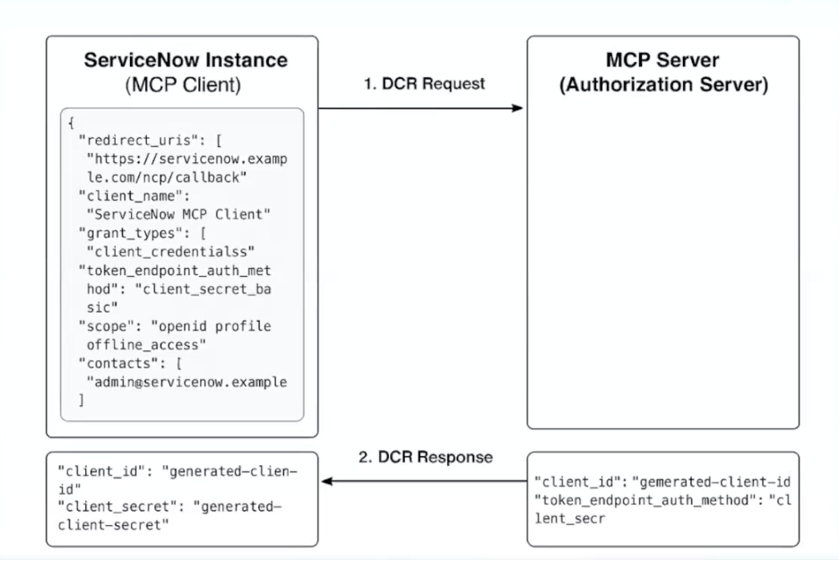

**Benefits:**
- Reduces manual errors and admin effort
- Enables plug-and-play integration with MCP Servers
- Aligns with secure OAuth best practices
- Accelerates AI adoption across enterprise workflows

## Before we get started with the lab, Below are the pre-requisites

Prerequisites:
1. Platform version: YP6+ / ZP1+
2. Application: Now Assist AI Agents 5.0.24+

Go to `All`, search for `Plugins`, open plugins under `System Definition`
Search for `Model Context Protocol Client` (version 1.0.7) and install

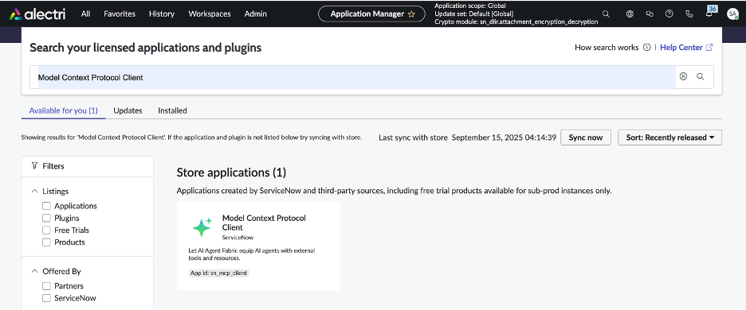

Login as maint role user, update MCP tool property, `sn_aia.enable_mcp_tool`, and set to `true`
Once done, logout!

Great! With this you now have everything that is needed for accessing external mcp server within ServiceNow.

Now login as admin, and Go to `All`, Search for `AI Agent Studio`, then go to `Settings`

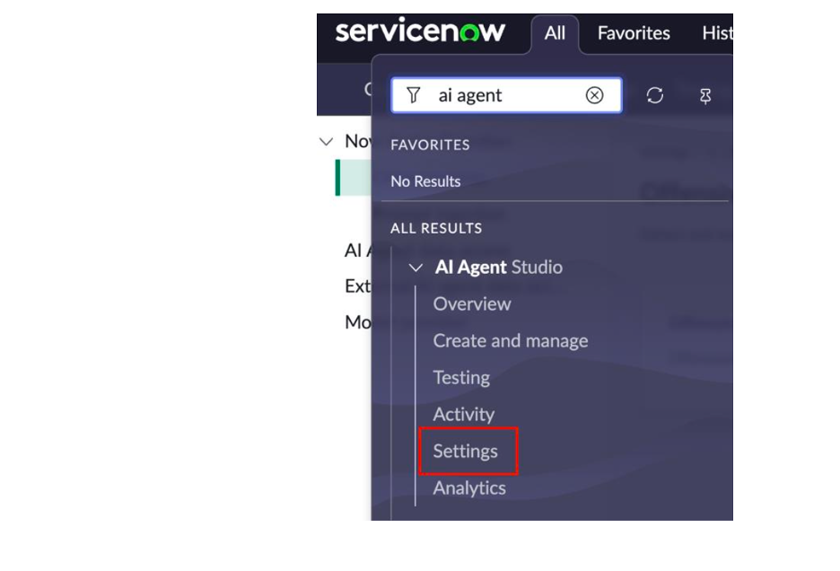

In Settings, select `Manage MCP Servers`, this is the place where we add new MCP connections and later use them as part of AI Agents as tools.

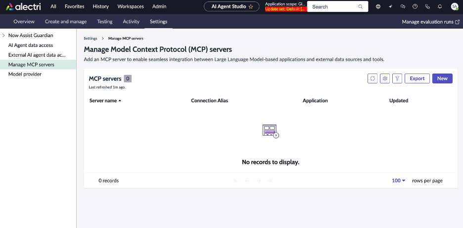

Now, as part of today's lab, we will be using MCP Server of `Prisma.io` which is a postgres database platform.
Before we move forward, i would request you to go to `prisma.io` and create your account. This would be essential step before we go ahead and start integration with the MCP server of `prisma.io`.

I hope everyone by now has created account with `prisma.io`, and created your workspace.
Great! let's proceed with our lab.

Click `New` to add a new mcp server connection.

Add `Name`, which in this case we are giving as `Prisma`
Provide `Authentication Type`, which will be `OAuth 2.0`
Provide `MCP Server URL`, which will be `https://mcp.prisma.io/mcp`

Click, `Next`

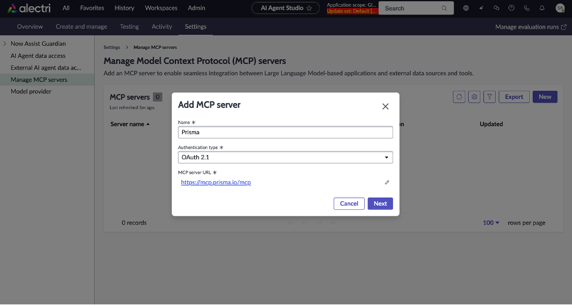

This is where we select the `Client Registration type`, which we will be `Dynamic Client Registration`
Keep everything same, i.e.,

- `Grant type` will be `Authorization Code`
- `Token authentication method` will be `Client Secret Basic`
- `Authorization URL` will be `https://mcp.prisma.io/authorize`
- `Token URL` will be `https://mcp.prisma.io/token`
- `Token Revokation URL` will be `https://mcp.prisma.io/token`

Click `Add`

Perfect! With this we have added our first MCP Server.

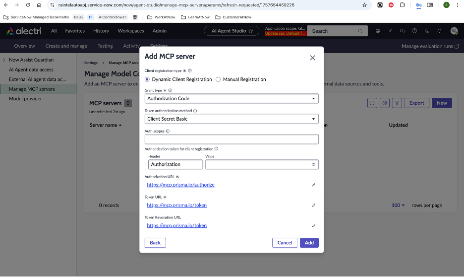

While we have added our first MCP Server, one critical piece that is pending is the authentication.
**Check out the pink bar on top**

Now, to authenticate, click the `Authenticate` button, this take you to prisma.io for authentication.

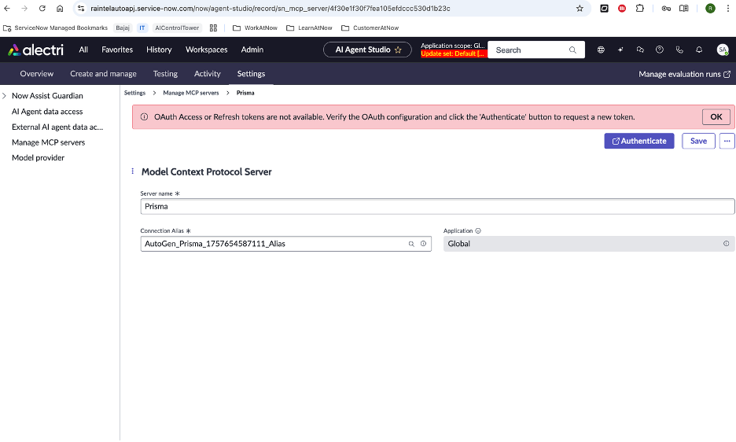

Now, as part of this, we need to authorize the API access to the `prisma.io` mcp server, by logging into the `prisma.io`.
Can be a google/email/SSO sign-in.

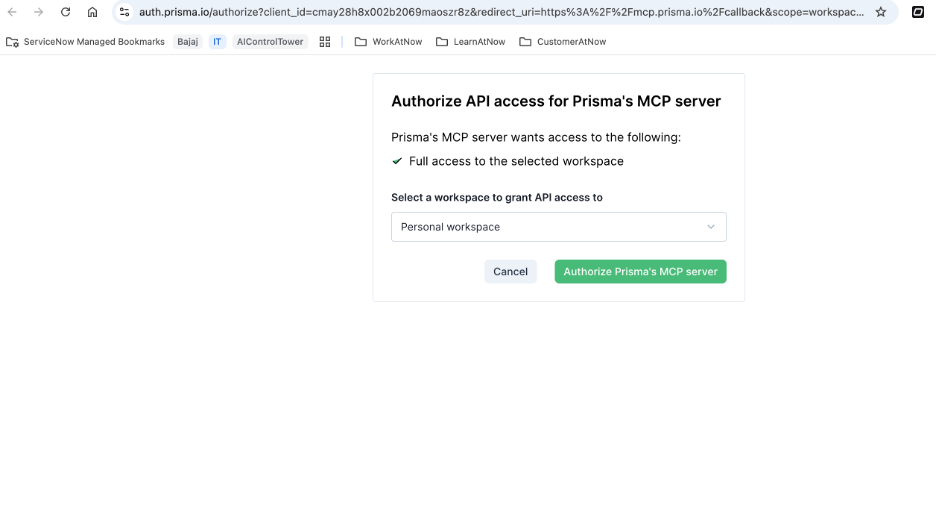

Once Authenticated, we will now see `Re-authenticate` and the pink bar on top will be gone.

Click `Save`

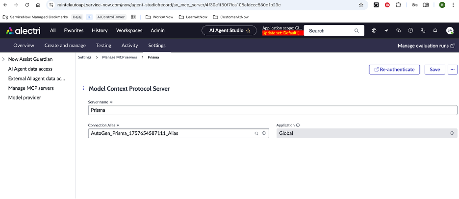

Perfect! with this we now have completed the connection setup of our first mcp server.

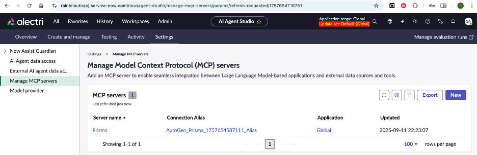

Next, we will now try build an AI Agent that leverages this MCP Server.

Go to `Create and Manage` from the bar, go to `AI Agents` and click `New`

Let's define the the AI Agent, starting with `Define the specialty`

- Give the AI Agent a `Name`, let's call it `Prisma AI Agent`
- Provide a `Description`, let's say `AI Agent to manage database workflows`

Let's define the role and required steps

- `AI Agent Role` : `You are an AI Agent that manages database workflows`
- `List of steps` : `Manage database workflows using the existing tools`

Click `Save and Continue` at bottom right.

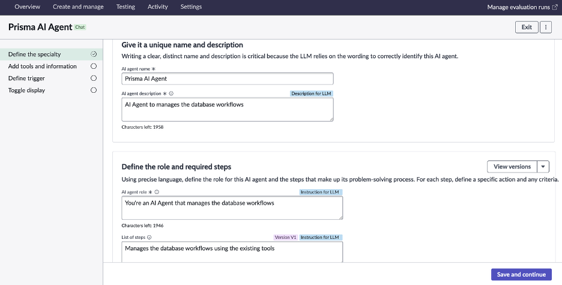

Click on `Add Tools` and select `MCP Server Tool`

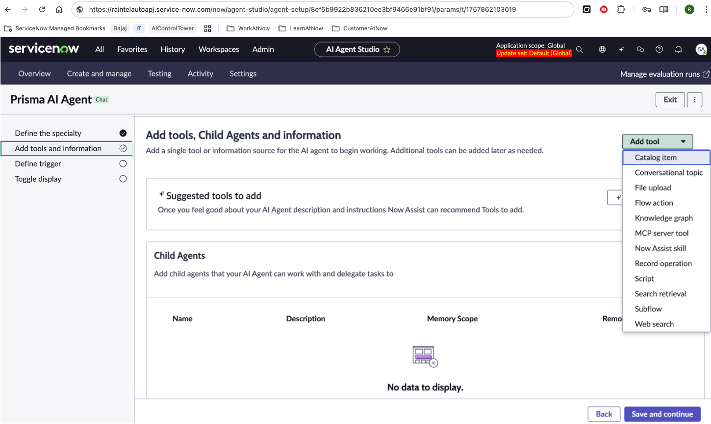

With this we add the MCP tool that we have defined. `Prisma`

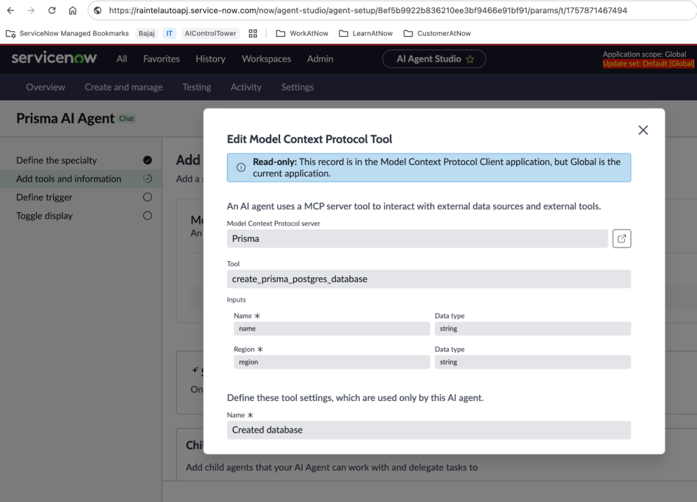

Perfect! we now have added our first tool to our first AI Agent with MCP.

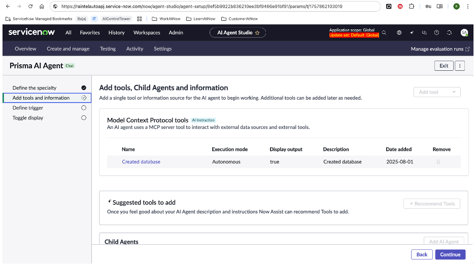

Click `Continue`

And then Click `Save and Test`
