# Section 4. Now Assist Skill Kit

**Estimated time: 25 minutes**

The Now Assist Skill Kit (NASK) enables you to extend Now Assist with custom skills tailored to your organization's specific needs.

A skill is basically a way to enable communication between the ServiceNow instance and a LLM model. You can use one of the existing LLM models, such as the Now LLM, or you can create custom LLMs, even locally hosted ones! So, a skill -- you can almost think of it as an integration.

## Key NASK Capabilities

**Custom Skill Creation:**
- Build organization-specific AI capabilities
- Integrate with external systems and data sources
- Create domain-expert knowledge assistants
- Automate complex business processes

**Extensibility Framework:**
- Plugin architecture for easy skill deployment
- APIs for custom integrations
- Webhooks for real-time data processing
- Template system for rapid development

**Enterprise Integration:**
- Connect to legacy systems
- Utilize existing data repositories
- Maintain security and compliance standards
- Scale across multiple departments

## Access Skill Kit

Now Assist Skill Kit (NASK) allows you to create new generative AI skills using the generic Now LLM or your own LLM.  NASK has been designed to easily manage and integrate new skills into the ServiceNow platform via a UI Action and soon into the Now Assist Panel. With NASK you define the input data, leverage tools to process the data, activate the new skill, and deploy it to the platform.

## Skill Kit Use Case

In this particular use case, we will create a Child Incident Summarization Skill, and we would leverage a script as a tool to do intermediate processing, within the skill kit. This will provide a good example of a complex scenario. 

1. Before we build our Skill Kit, we would need to do some pre-work. Deploying a script, that we will leverage in Skill. 

2. Click **Script Includes** under **System Definition**.

3. Click **New** to create a new Script. 

4. **Name**: `ChildIncidentSummarizer`

5. Ensure that the **Active** checkbox is enabled. 

6. Put in the following code in the Script:

```
var ChildIncidentSummarizer = Class.create();
ChildIncidentSummarizer.prototype = {
    initialize: function() {
    },

	getChildData: function(inc) {
		var childSummary = ""; //this will store the text. I've tried in JSON before, but it works fine in plain text
		var grCI = new GlideRecord('incident'); //this will pull in the data from the incidents for the parent and child records
		grCI.addQuery('parent_incident', inc);
		grCI.query();
		while (grCI.next()){
			childSummary += "\nNumber: " + grCI.getValue('number') + "\n";
			childSummary += "Category: " + grCI.getDisplayValue('category') + "\n";
			childSummary += "Subcategory: " + grCI.getDisplayValue('subcategory') + "\n";
			childSummary += "Service: " + grCI.getDisplayValue('business_service') + "\n";
			childSummary += "Short description: " + grCI.getDisplayValue('short_description') + "\n";
			childSummary += "Description: " + grCI.getDisplayValue('description') + "\n";
		}
		return childSummary;
	},

    type: 'ChildIncidentSummarizer'
}; 
```

7. Click **Submit**. In this script, the childSummary += part is where you choose on which fields you want to summarize. You can add more or take away some, this is just for purposes of this tutorial.

8. Now with the script created, let's start building our new Skill. 

9. Clicking the **Create Skill** button will pop-up a modal window asking you some information. Let's start by accessing the Skill Kit menu. 

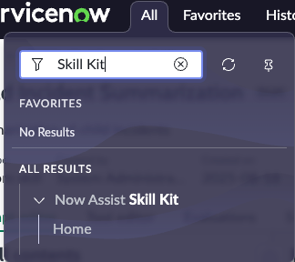

10. Select **Home** to be taken to the NASK homepage. On the homepage, there are some helpful videos and guides, seen below.

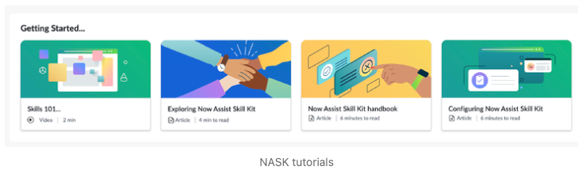

Beneath this section is where the skills are housed. By default, you should see the Incident Summarization (Although, this might depend on which other plugins you have installed, such as Now Assist for ITSM), as well as any custom skills that you have created. To create a new skill, you will select the 'Create Skill' button just to top-right of the list of skills.

11. Put in the following details in the window. 
- **Skill Name**: `Child Incident Summarization`
- **Description**: `Summarization of Child Incidents`
- **Default Provider**: `Now LLM Generic`
- **Provider API**: `Now LLM Generic`

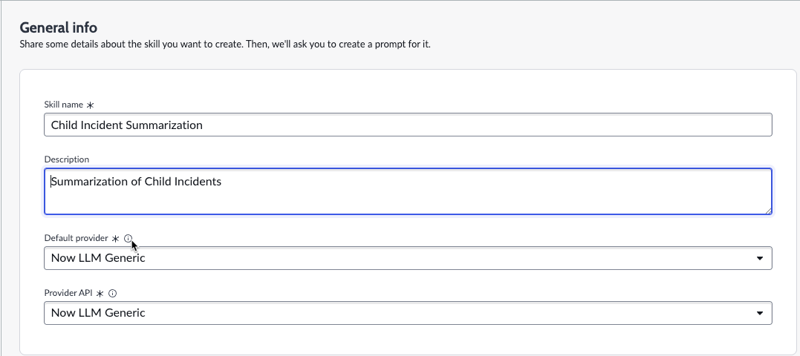

12. In the second section of this screen, choose the option **Write from Scratch** as we would be defining our own prompt. Click **Next**.

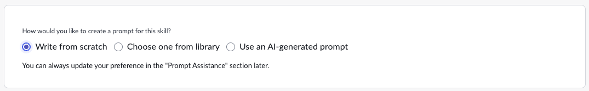

In the Prompt editor screen, you see three two major sections, **Skill Contents** on the left, and the **Prompt** information on the right. Underneath the Skill contents are four sub-menus: **Skill inputs**, **Skill outputs**, **Tools**, and **Prompts**. The Skill inputs are where you define what the initial entry point is, in this case it will be an Incident Record. The Skill outputs are what the LLM will return. We won't have to change anything here. The Tools are where we point the skill to a Flow Action, Script, or one of a few other types of objects that will gather our information and prepare it for the LLM. Finally, the Prompts are where you will define which LLMs you are using, and which prompt in the right half of the screen you will send to the LLM. The prompt will include the output from the Tool in our case.

On the right-hand side, you see the Prompt at the top. The Prompt and test prompt section are tied to the prompts on the left hand side. In the prompt window, you'll include the information that you would tell the LLM. Here you might instruct it to return the information in a specific format, or perhaps you'll tell it special information. This is essentially what you would type to the LLM. Then, you can pass it parameters. In the screenshot above, you can see that by default it includes the incident.short_description, incident.description, and incident.priorty, enclosed in double curly braces {{}}. This is the format of how you grab the input for the LLM.

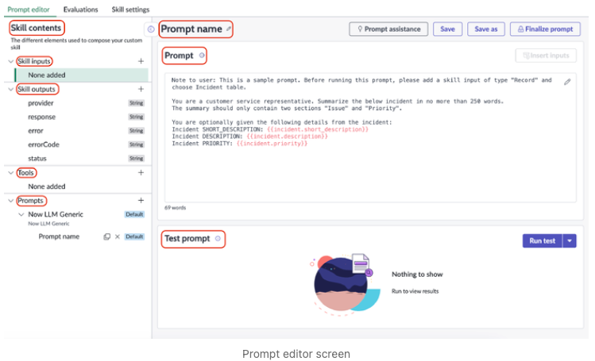

13. Let's start off by naming our prompt. So, just above the Prompt dialog, where you type in what prompt you want to send to the LLM, you'll see **Prompt name** listed. Click the pencil next to it to edit it. Let's call it 'Summarize Child Incidents.' It is set up to where you can have multiple prompts per skill in case you needed to do more things with a given skill.

14. Now that we've given our prompt a name, let's go ahead and click on plus sign beside the Skill inputs menu on the left of the screen. Let's enter the following data:
- **Datatype**: `Record`
- **Table Name**: `Incident`
- **Name**: `Incident`
- **Choose Test Record**: Browse to select a parent record that has multiple child incidents. I will be using `INC0009001`. 

>Note: Check if your Incident number has child incidents under it or not. If not, then you may need to create one to ensure some data shows up in the record later. If you are doing this on a demohub instance, then you can choose the record `INC0025561` which has a lot of child incidents. 
>
>--

15. Next, let's add a tool. So, let's click the 'Tool Editor' tab on the menu to create a new tool. 

16. On top of **Skill prompt**, there would be a +, option. Click the + symbol to add a tool. 

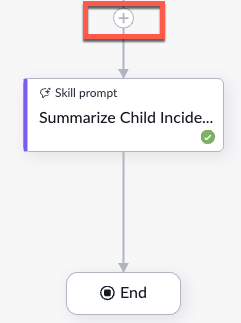

17. In the next screen, choose **Tool Node**. Click **Add**.

In the next field, we will choose the tool to use. 

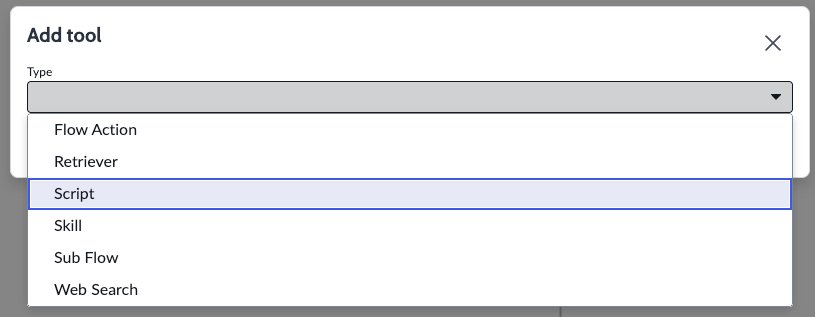

There are 6 options to choose from: Flow Action, Retreiver, Script, Skill, Sub Flow, Web Search.

18. Give the **Name** to the tool as `SummarizeChildIncidents`

19. Click **Choose existing script**, and then select the **Resource** as the script that we created in the very first step. The name of the Script we creaated was `ChildIncidentSummarizer`. After selecting this Script, another field will pop up for **Script Function**. Select the function from the drop down, that we created in our script `getChildData`.

20. In the **Inc** field, type `{{incident.sys_id}} in the **Value**. 

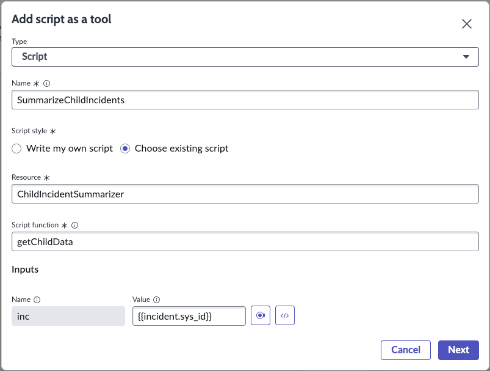

21. Click **Next**. 

22. In the next screen, keep the defaults, and click **Next**. 

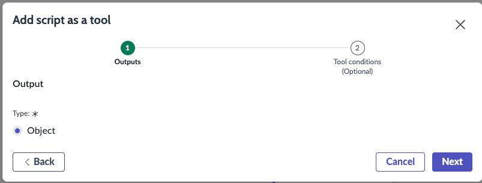

23. In the next screen, keep default options and click **Next**. 


24. In the confirmation window, check that all inputs are correct and then click **Add Tool**. 

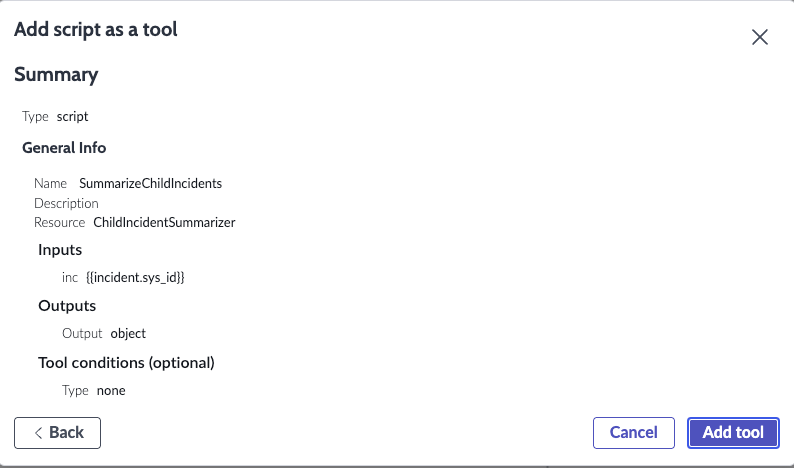.

The tool will show up on the canvas. 

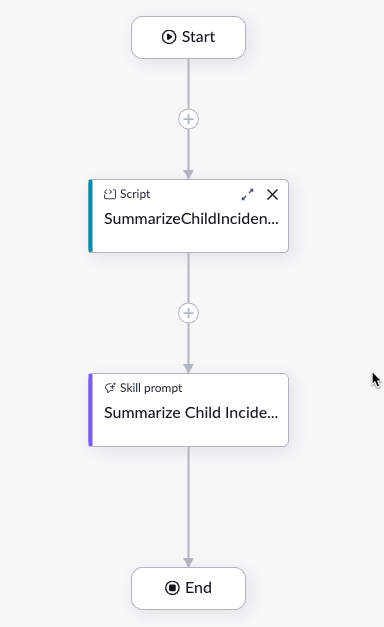

25. Go back to the prompt editor, as we need to add inputs to our prompt, and change the definition as well. You will want to work around here, as the value of an LLM is greatly dependent on the quality of the prompt. I even like to run prompts through Chat GPT or some other LLM to ask it to make it better. So, let's start out by changing the static part of the prompt. The static part is the part that will be the same every time. Let's enter the following as our static part of the prompt:

```
You are a highly skilled IT Service Desk professional with expertise in diagnosing and resolving network issues, server problems, performance degradation, and other technical incidents.

Summarize the child incidents of the below given parent incident. The summary should contain key issues and impact across the child incidents, highlighting any patterns, recurring problems, or significant outliers. When summarizing, please consider the following: Parent incident short description: {{incident.short_description}} Parent incident description: {{incident.description}} Here are the child incident details:  {{SummarizeChildIncidents.output}} 
```
In this prompt, we are passing dynamic data to the LLM. Here we will include data from the Incident record we pass in, and then we will also include the results of the tool.

While we have typed this information in our prompt (since we had added the inputs, as well as the tool already), otherwise this can be done with the **Insert Inputs** button at the right, which shows all inputs and outputs available. 

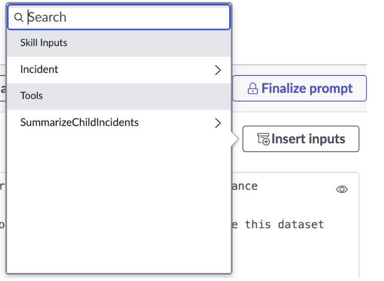

26. Click **Save** to save your prompt. You should get a confirmation that **Saved Prompt Successfully**.

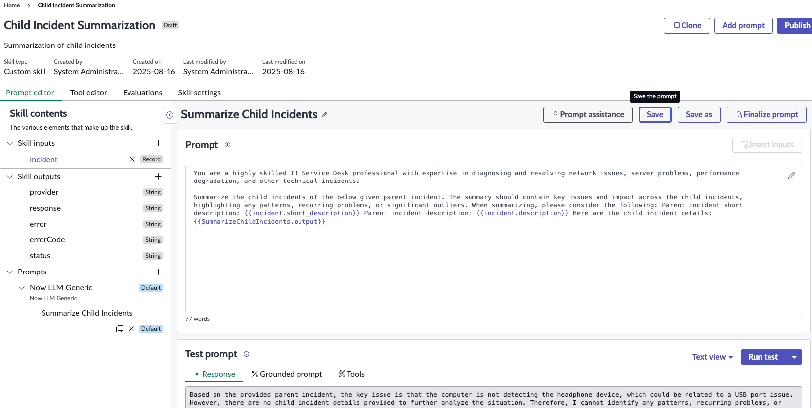

27. Click **Run Test**. For this, choose an incident number that has Child Incidents attached. Your output should look like this: 

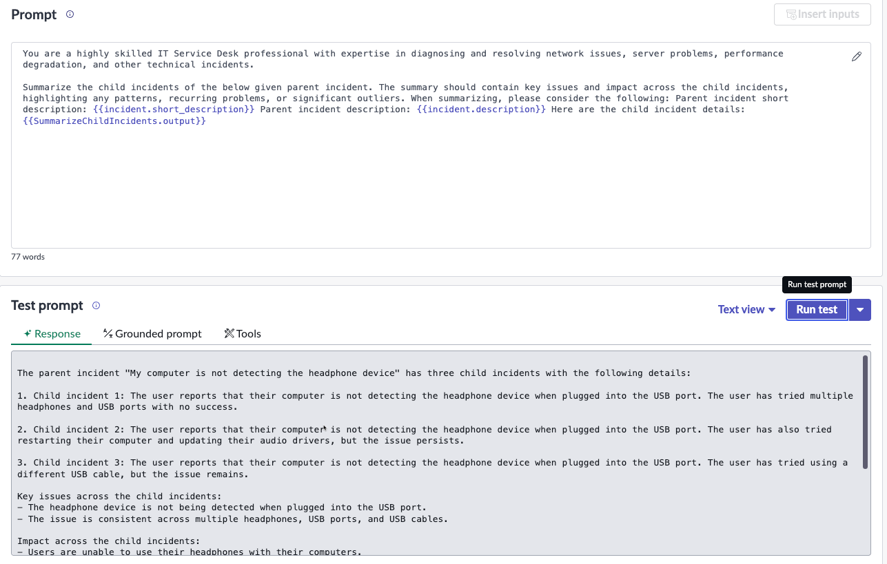

Running this on a demohub instance, would return a lot more records, and a more comprehensive output. 

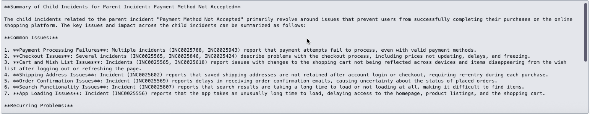

28. If the output looks ok, then we can proceed and **Finalize prompt** by clicking the button on the extreme right. 

Once you click the Finalize prompt, and select Finalize prompt on the next window that pops up, you'll be taken back to your skill. Notice the Prompt window is now read only. This is because this prompt is finalized. If you need to make edits, you can click the **Update prompt** button to the top-right corner of the prompt itself. This will make a copy of the prompt with a later version. You can make your changes needed there, then re-finalize it.

After you are happy with the finalized prompt, now it's time to make this available to users. To do this, we'll have to perform a couple of steps.

29. First, let's click the Skill settings from the menu ribbon, as seen in the image below.

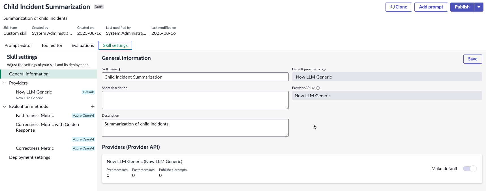

30. Click **Save**. Then click **Publish**. 

Here you'll want to select the checkmark next to the Prompt name (v1) that you had finalized. This will make this the default prompt to use for this skill. Later on, if you edit this, you'll get another pop up asking if you want to make this prompt the default prompt for the provider. Be careful there, because if you have other skills that use the same provider (LLM) you might have some unexpected results. But, the above window is safe to check.

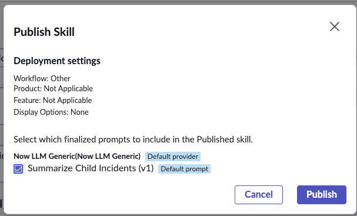

31. Once you click the Publish button, you'll see the following message pop up. This likely won't happen once you update the skill, but just the first time you publish it:


32. Only thing pending now is to activate the skill, just like how we activate any OOTB skills. Now we need to go to Admin Center -> Now Assist Admin -> Skills. This will take you to the Now Assist Admin workspace. On the right side of the workspace, you'll see the needs attention widget. On that widget, you'll see the 'Skills not started' section. our new skill will be listed under here by the name of the skill. See screenshot below.

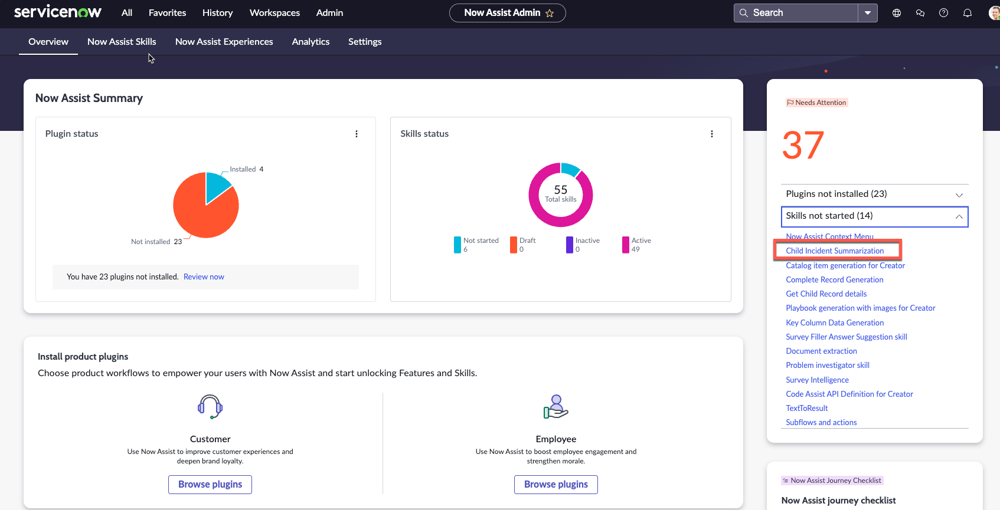

33. Now let's click on the Child Incident Summarization from the Skills not started drop-down that I have circled above.

This will take us to manage the platform Now Assist skills for Platform. Find the tile for our skill we created. There may be multiple skills listed here if you have other for the same area that are inactive. Find the tile for our custom skill and click on the 'View details' button.

From here, you can click the 'Activate skill' button to activate the skill. Select how you want to show this skill, I'll select in the Core UI as a UI Action, so I click the toggle for the display option for Core UI.

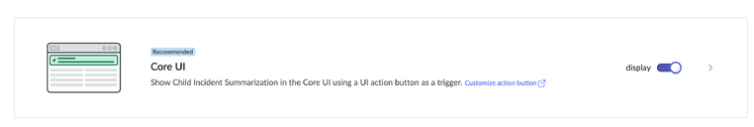

Once the skill is activated, it can now be used within an AI Agent or another flow, script etc.

>This is an example that leverages additional complexity with Skill Kit and deploys it via UI action. This is not to be completed within the lab, but as an extra learning exercise. 
>_____

## Explore the NASK Community Resources

Go to the following community site and familiarize yourself with the NASK features:

**Visit:** [https://www.servicenow.com/community/now-assist-articles/now-assist-skill-kit-use-case-library/ta-p/3053580](https://www.servicenow.com/community/now-assist-articles/now-assist-skill-kit-use-case-library/ta-p/3053580)

## What You'll Find in the Community

The Now Assist Skill Kit Use Case Library provides:

### 📚 **Documentation and Guides**
- Comprehensive setup instructions
- Best practice implementation guides
- Troubleshooting resources
- API documentation

### 🛠️ **Ready-to-Use Skills**
- Pre-built skill templates
- Industry-specific use cases
- Integration examples
- Customization patterns

### 💡 **Use Case Examples**
- Customer service automation
- IT operations optimization
- HR process enhancement
- Field service improvements

### 🤝 **Community Support**
- User forums and discussions
- Expert advice and tips
- Shared experiences and solutions
- Feature requests and feedback


For our use case we will use NASK to send a prompt to the LLM asking it to review the contents of our knowledge article, and to provide suggestions on how to improve it. This feedback will be stored in a Feedback Task attached to the knowledge article.

Prior to running this lab, please ensure that you create a knowledge article with the following content. This has some intentional grammaer, spelling and structural issues. 

```
R u having trouble with ur Outlook inbox? It can b a real pain in the butt when things aren't working rite, huh? Well, let me break it down 4 u and give u sum tips on how to fix those pesky issues.

First of all, one common problem peepl have with their Outlook inbox is that emails are not showing up or they r disappearing randomly. This can b super frustrating, especially if you're waiting for an important email. One possible reason for this is that ur inbox is getting too full and causing Outlook to glitch out. So, what u can do is try clearing out sum old emails or moving them to a different folder to free up sum space.

Another issue u might encounter is that ur inbox is running super slow or freezing up. This could be due to a bunch of different factors, like a slow internet connection, a bug in the Outlook program, or a problem with ur computer's hardware. To help speed things up, try closing out of any unnecessary programs or tabs, restarting ur computer, and checking for any updates to the Outlook program.

Sumtimes, u might find that emails r not sending or receiving properly in ur inbox. This could b because of incorrect email settings, a problem with ur internet connection, or issues with the recipient's email server. To troubleshoot this problem, double-check ur email settings to make sure everything is set up correctly, restart ur internet connection, and reach out to ur email provider if necessary.

Overall, dealing with issues in ur Outlook inbox can b a real headache. But by following these tips and staying patient, u should b able to troubleshoot and fix those problems like a pro. Good luck!

```

Ensure that you save the number of the knowledge article that you just created. We will be using it later. 

Now let's build the custom skill. 

Type ```Now Assist Skill Kit``` in the function list. 


Click create new skill. 

Name the skill Knowledge Article Coach. In this lab, we will be using the Now LLM service to complete our task, so ensure the Default provider and Provider API values are both set to Now LLM Generic.


Add a new skill input by clicking the plus icon next to it. This is where we add the reference to a knowledge article to use within the prompt.


Populate the skill input form as seen below, replacing the test record with the number of your knowledge article from phase 1. Once complete, click Add skill input.


[Optional] Click the Pencil Icon next to the prompt name to rename the prompt. We are renaming it to Knowledge Coach here. Click Save changes.


In the prompt field, remove the template text and replace it with the following:

```
You are an AI model specialized in evaluating the quality of knowledge base articles on IT issues. A knowledge base article that covers a specific IT topic will be presented. Your task is to perform a quality check on the article by evaluating it against the following criteria:


Rubric for quality check:
1. Clarity and Conciseness: The article should be easy to understand, with clear, concise language that avoids unnecessary jargon.
2. Comprehensiveness: The article should cover all necessary aspects of the issue, including steps for resolution, potential pitfalls, and any additional resources.
3. Grammar and Language Use: The article should be free from spelling, grammar, and punctuation errors, and the language should be professional and appropriate for the audience.
4. Usability: The article should be organized in a user-friendly manner, with clear headings and step-by-step instructions that help the user navigate the content.


Evaluation Instructions:
- Each criterion should be evaluated as either "Satisfactory" or "Unsatisfactory."
- If a criterion is evaluated as "Satisfactory," provide no additional explanation.
- If a criterion is evaluated as "Unsatisfactory," provide a brief explanation of why the article does not meet the criteria.
- By the end of the evaluation, if one or more criteria were deemed "Unsatisfactory," provide overall improvement suggestions.


Article to be assessed:
```

Click in the text box to add your cursor focus to the end of the prompt. (i.e. have the flashing line appear after the text “Article to be assessed”). Click Insert inputs.


Click on the arrow icon next to the Knowledge skill input we added in step 5.


Select Article body.


Your prompt field should now contain a reference to the skill input:


Click Save.


**Test the custom skill**

Scroll down to the Test prompt section. Click Run tests.


From the dialog box that appears, verify which knowledge article you wish to test your skill against, then click Run Tests.


Verify the output from the LLM is to your liking. You can iterate upon the provided prompt if you desire.


To verify if information from your skill inputs is being brought in correctly, click on the tab named Grounded prompt. You will see the input that was delivered to the LLM, including your knowledge article text.


Once content with the output of your skill, click Finalize prompt.


**Deploy the custom skill**

Click on Skill settings at the top of the page.


Click on the option named Deployment Settings.


Underneath the workflow header, set the value to be Other.
Tick the option marked UI Action, and set the table to Knowledge (to do so, type in kb_knowledge and scroll down until you find it)


Click Create UI Action, then Link to UI Action once it appears.


A new window containing your UI Action will appear. Change the value in the Name field to Review my article.


In the script field, replace everything from the try statement and below with the code provided below. Ensure you replace the instance URL with your instance’s URL.


```
try {

    var output = sn_one_extend.OneExtendUtil.execute(request)['capabilities'][request.executionRequests[0].capabilityId]['response'];

   

      var newFeedback = new GlideRecord("kb_feedback");

newFeedback.initialize();

newFeedback.article = current.sys_id;

var feedbackSysId= newFeedback.insert();


      var newTask = new GlideRecord("kb_feedback_task");

        newTask.initialize();

        newTask.assigned_to = gs.getUserID();

         newTask.feedback = feedbackSysId;

        newTask.short_description = "Knowledge Article Feedback generated by NowLLM";

        newTask.description = JSON.parse(output).model_output;

        var newTaskSysid = newTask.insert();


        //get the link to the new case/incident

        var mylink = '<a href="https://INSTANCE URL.service-now.com/kb_feedback_task.do?sys_id='+newTaskSysid.toString()+'">here</a>';


        //publish an info message

        gs.addInfoMessage("We have finished reviewing your Knowledge article and have created a feedback task for you to review. Click " +  mylink +  " to open.");


} catch(e) {

    gs.error(e);

    gs.addErrorMessage('Something went wrong while executing skill.');

}

action.setRedirectURL(current);
```

Click Update to save the record.
Return to your skill within Now Assist Skill Kit.
In the top right corner, click Publish.


In the module that opens, tick the box containing your finalized prompt, then click Publish.


**Activate the custom skill**

Navigate to Now Assist Admin from within the filter navigator.


Click on Now Assist Features, then Other to find your published skill.


Click on the tab named Available to find your published skill. Click Activate skill.


Set the Display trigger to true, then click Save and continue.


Review the next page, then click Activate.


Dismiss the message stating confirmation of activation.

**See the custom skill in action**

Type kb_knowledge.list into the filter navigator. Find the knowledge article you wish to run your custom skill on and open the record.


Click the UI Action you created – you may have named it something else.


Review the information message that appears. Click the link in the message to open the feedback task.
Review the output from your custom skill in the description field of the feedback task.


Congratulations! You have now created and deployed a custom skill.

Next Section: [Section 5 - Virtual Agent Designer with LLM](section5-virtual-agent-designer.md)


**Next Section:** [Section 5 - Building AI Search and Stop Words](section5-ai-search-stop-words.md)
**Previous Section:** [Section 3 - Design Knowledge Graph](section3-design-knowledge-graph.md)
**Back to:** [Main README](README.md)