# Section 6: Stop Words and AI Search Configuration

**Estimated time: 25 minutes**

## Overview

Stop words are common words that are typically filtered out during text processing and search operations. In ServiceNow AI Search, stop words are stored in Dictionary objects, and each search profile can have one dictionary associated with it.

This section covers:
- Creating custom stop word dictionaries
- Applying dictionaries to search profiles  
- Configuring AI Search optimization
- Troubleshooting common dictionary issues

### Why Stop Words Matter

Stop words help improve search relevance by:
- **Filtering noise:** Removing common words that don't add semantic value
- **Improving precision:** Focusing on meaningful terms
- **Reducing processing:** Less computational overhead
- **Enhanced ranking:** Better relevance scoring for search results

## Prerequisites

- Administrative access to ServiceNow instance
- AI Search functionality enabled
- Existing search profiles configured
- Understanding of your organization's search requirements

## Section 6.1: Creating Stop Words Dictionary

### Step 1: Navigate to Dictionary Management

1. Navigate to **All > AI Search > Dictionary**

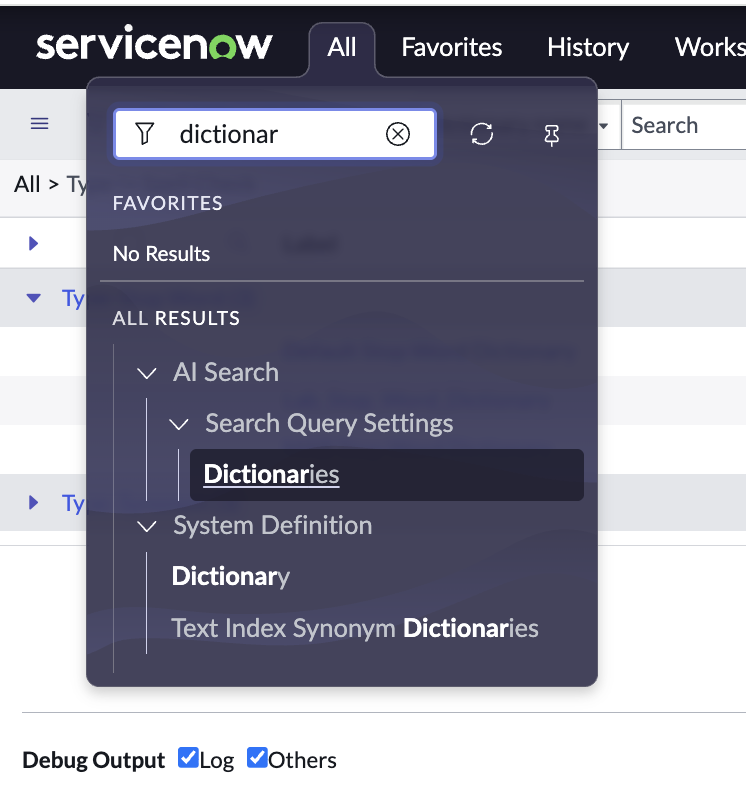

### Step 2: Create New Dictionary

2. **Create a new dictionary** by clicking the **New** button

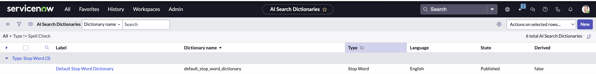

### Step 3: Configure Dictionary Properties

3. Configure the dictionary with the following settings:

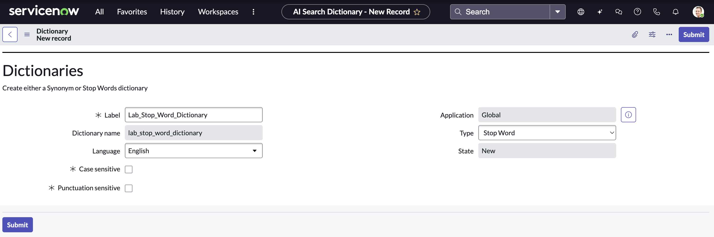

**Dictionary Configuration:**
- **Name:** `Lab_Stop_Word_Dictionary`
- **Type:** Stop word
- **Description:** Custom stop words dictionary for lab environment
- **Active:** True
- **Application:** Global (or your specific application scope)

### Step 4: Add Stop Words

4. **Add the following stop words** to the dictionary and then publish it:

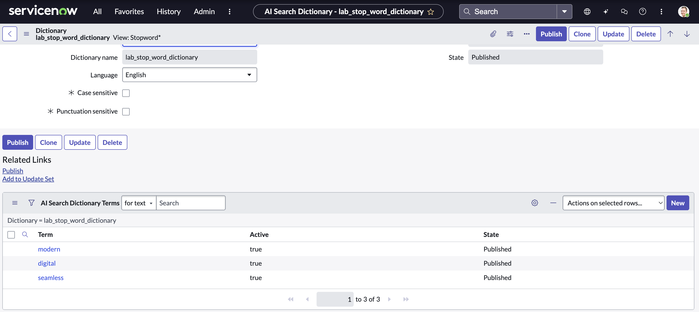

**Recommended Stop Words for Lab:**
```
the
and
or
but
in
on
at
to
for
of
with
by
from
about
into
through
during
before
after
above
below
up
down
out
off
over
under
again
further
then
once
```

**Custom Domain-Specific Stop Words:**
```
please
thank
thanks
help
need
want
issue
problem
question
```

### Step 5: Publish the Dictionary

5. **Publish the dictionary** to make it available for search profiles:
   - Click **Publish** button
   - Verify status changes to "Published"
   - Confirm no validation errors

## Section 6.2: Configure Search Profile

### Step 1: Access Search Profiles

5. Navigate to **All > AI Search > Search Profile**

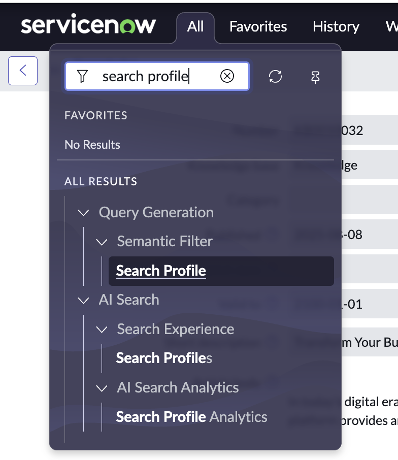


### Step 2: Update Search Profile Dictionary

6. **Modify the target search profile** to use your custom dictionary:

**Remove Existing Dictionary:**
- Unlink current dictionary (if any)
- Confirm removal

**Add New Dictionary:**
- Link the `Lab_Stop_Word_Dictionary`
- Verify association

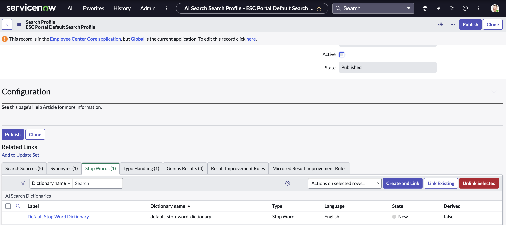

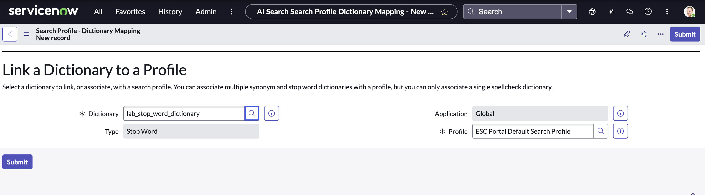

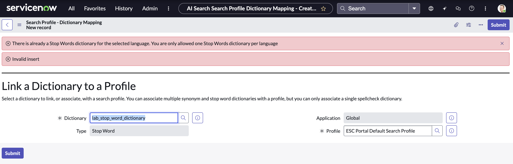

### Step 3: Validate Configuration

7. **Verify the search profile configuration:**
   - Dictionary properly linked ✓
   - Profile status: Active ✓
   - No validation errors ✓

## Section 6.3: Troubleshooting Dictionary Issues

### Common Issue: Publishing Error

**Problem:** Cannot publish search profile due to unpublished dictionaries

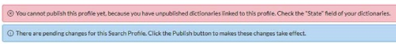

**Error Message:**
```
"You cannot publish this profile yet, because you have unpublished 
dictionaries linked to this profile. Check the 'State' field of 
your dictionaries."
```

### Root Cause Analysis

**Cause:** Orphaned many-to-many (m2m) records in the table `ais_search_profile_ais_dictionary_m2m` that are:
- Linked to the AI Search Profile
- NOT linked to any AI Dictionary (showing as "empty")

### Resolution Steps

**Step 1: Identify Orphaned Records**

1. Navigate to **System Definition > Tables**
2. Search for table: `ais_search_profile_ais_dictionary_m2m`
3. Identify records with empty dictionary references

**Step 2: Clean Up Orphaned Records**

1. **Backup the records** before deletion (important for rollback)
2. **Delete the orphaned m2m records** that show as "(empty)"

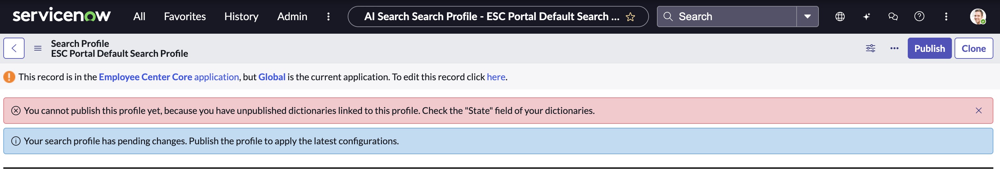

**Step 3: Publish Search Profile**

3. **Publish the AI Search Profile** - the error should now be resolved

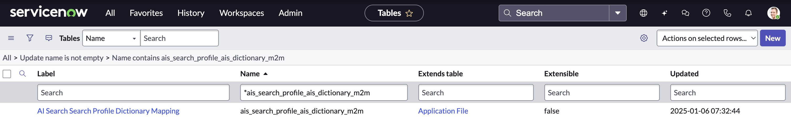

### Prevention Measures

To prevent future orphaned records:
- Always unlink dictionaries properly before deletion
- Use the UI for dictionary management rather than direct table manipulation
- Validate configurations before publishing
- Regular maintenance of search profile associations

## Section 6.4: AI Search Configuration and Optimization

### Step 1: Configure AI Search Settings

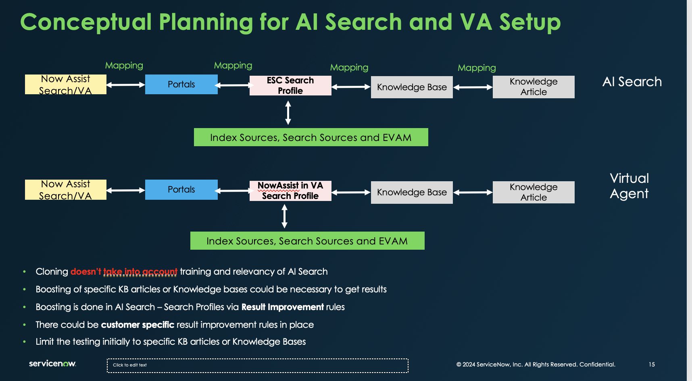


**Key Configuration Areas:**
- **Indexing Settings:** Control what content gets indexed
- **Search Algorithms:** Configure ranking and relevance
- **Performance Tuning:** Optimize for speed vs. accuracy
- **Content Sources:** Define what gets searched

### Step 2: Advanced Search Configuration


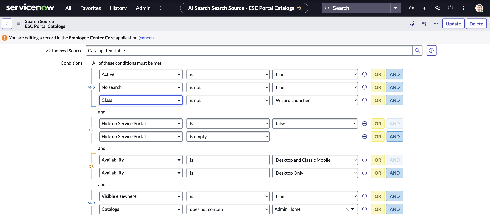

**Advanced Settings:**
- **Semantic Search:** Enable contextual understanding
- **Fuzzy Matching:** Handle typos and variations
- **Stemming:** Include word variations (run, running, runs)
- **Synonyms:** Expand search terms automatically

### Step 3: Content Source Configuration

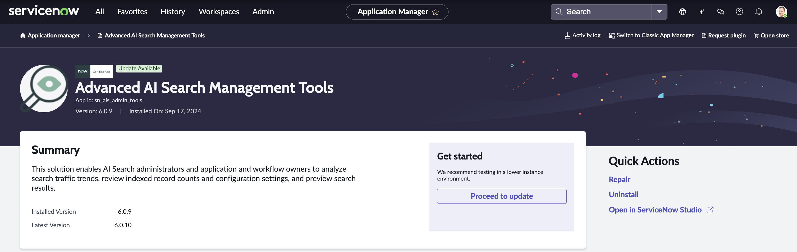

**Content Sources to Configure:**
- **Knowledge Base Articles:** Primary help content
- **Incident Resolutions:** Historical problem solutions  
- **Change Documentation:** Process and procedure guidance
- **FAQ Content:** Frequently asked questions
- **Custom Documentation:** Organization-specific content

## Section 6.5: Testing Stop Words Implementation

### Before Stop Words Implementation

Test search functionality before applying stop words:

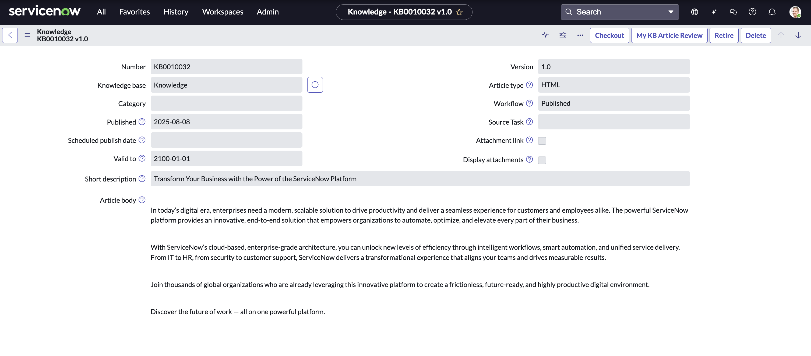

**Test Query:** "Help me with the password reset process"
**Results:** May include many irrelevant matches due to common words

### After Stop Words Implementation

Test the same search with stop words active:

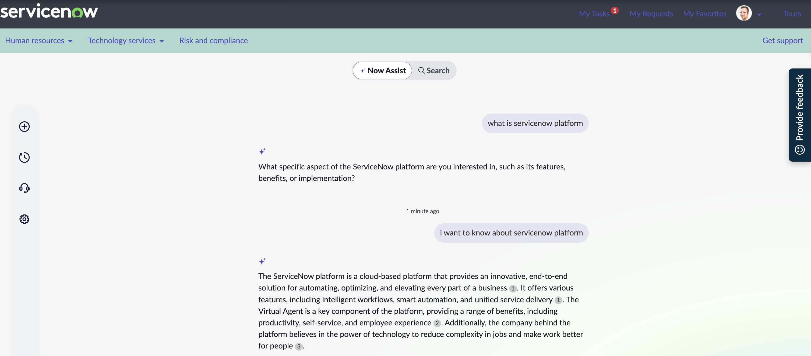

**Same Test Query:** "Help me with the password reset process"
**Results:** More focused, relevant results with noise words filtered

### Validation Metrics

**Search Quality Improvements:**
- **Precision:** Higher percentage of relevant results
- **Recall:** Still capturing all important matches
- **Speed:** Faster search processing
- **User Satisfaction:** More useful search experience

## Section 6.6: Best Practices for Stop Words

### Domain-Specific Considerations

**IT Service Management Stop Words:**
```
ticket, incident, request, issue, problem, case, record, item, entry
```

**HR Service Delivery Stop Words:**
```
employee, staff, person, individual, team, department, group
```

**Customer Service Stop Words:**
```
customer, client, user, caller, contact, person, individual
```

### Balancing Act

**Too Few Stop Words:**
- Results in noisy search results
- Slower processing
- Poor relevance ranking

**Too Many Stop Words:**
- May filter out important terms
- Reduced recall
- Missing relevant content

### Regular Maintenance

**Monthly Review:**
- Analyze search logs for patterns
- Identify new stop word candidates
- Remove stop words that are filtering important content
- Adjust based on user feedback

**Quarterly Optimization:**
- Performance analysis
- User satisfaction surveys
- Search analytics review
- Content source evaluation

## Section 6.7: Advanced Dictionary Configuration

### Multiple Dictionary Types

ServiceNow supports several dictionary types:

| **Type** | **Purpose** | **Use Case** |
|----------|-------------|--------------|
| Stop Words | Filter common words | Improve search relevance |
| Synonyms | Word equivalents | Expand search terms |
| Stemming | Word variations | Handle grammatical forms |
| Custom | Organization-specific | Business terminology |

### Dictionary Inheritance

**Global Dictionaries:**
- Apply across all search profiles
- System-wide stop words
- Common organizational terms

**Profile-Specific Dictionaries:**
- Department-specific terms
- Application-focused filtering
- Targeted optimization

### Multi-Language Support

**Considerations for Global Organizations:**
- Language-specific stop words
- Cultural terminology differences
- Regional business terms
- Character encoding support

## Monitoring and Analytics

### Search Performance Metrics

Track the following metrics to measure stop words effectiveness:

**Before/After Comparisons:**
- Average search response time
- Click-through rates on results
- User session duration
- Search abandonment rates

**Quality Indicators:**
- Precision at top 5 results
- User satisfaction scores
- Help desk ticket reduction
- Self-service adoption rates

### Continuous Improvement

**Data-Driven Optimization:**
1. Collect search query logs
2. Analyze search patterns
3. Identify improvement opportunities
4. Test dictionary modifications
5. Measure impact and iterate

## 🎉 Stop Words Configuration Complete!

You have successfully:

- ✅ **Created a custom stop words dictionary** with relevant terms
- ✅ **Configured search profiles** to use the new dictionary
- ✅ **Resolved common publishing issues** with orphaned records
- ✅ **Optimized AI Search performance** through stop words filtering
- ✅ **Established monitoring** for ongoing optimization
- ✅ **Implemented best practices** for dictionary management

### Key Benefits Achieved

🔍 **Improved Search Relevance:** More accurate and focused search results
⚡ **Enhanced Performance:** Faster search processing with reduced noise
📊 **Better Analytics:** Cleaner data for search behavior analysis
🎯 **User Experience:** More satisfying search interactions
🔧 **Maintainable System:** Structured approach to search optimization

---

**Next Section:** [Gen AI Controller Configuration](section6-genai-controller-config.md)
**Previous Section:** [Skill Kit](section4-skill-kit.md)
**Back to:** [Main README](README.md)