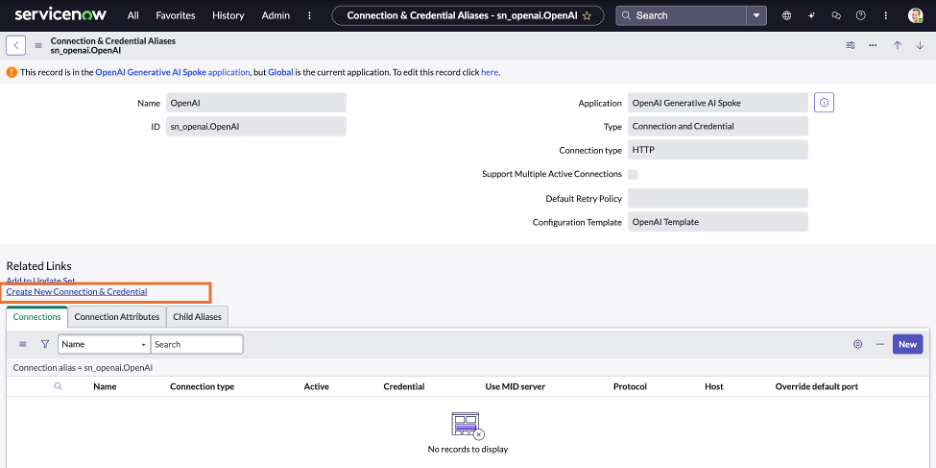

# Section 6: Generative AI Controller Configuration

**Estimated time: 30 minutes**

## Overview

In this section, we will configure OpenAI as an external LLM provider and enable three key capabilities:
- **Generic Prompt** - General purpose AI text generation
- **Summarization** - Content summarization capabilities  
- **Sentiment Analysis** - Emotional tone detection

For reference, see the [ServiceNow documentation on configuring Generative AI providers](https://www.servicenow.com/docs/bundle/zurich-intelligent-experiences/page/administer/generative-ai-controller/task/configure-a-provider-for-a-generative-ai-capability.html).

## Prerequisites

Before starting this section, ensure you have:
- ServiceNow instance with GenAI Controller plugin activated
- OpenAI spoke plugin installed and up-to-date
- Administrative access to the instance
- API key from your LLM provider

> **⚠️ Security Note:** The API key provided in this lab is for training purposes only. In production, use your own secured API keys.

## Step 1: Access OneExtend Capability Configuration

The Generative AI Controller comes with four capabilities by default. If you have installed other Now Assist applications, you may see additional capabilities in the OneExtend Capability table.

In this lab, we will be enabling three capabilities:
- Sentiment Analysis
- Summarization  
- Generic Prompt

### Access the Configuration Table

1. In the **navigation filter**, search for the OneExtend Capability table by entering: 
   ```
   sys_one_extend_capability.list
   ```


2. **Open the record** for the capability you want to configure, such as **Sentiment Analysis**.


## Step 2: Configure Sentiment Analysis Capability

3. Open the record for **Sentiment GPT4 (OpenAI Chat Completion)**


> **Important:** Only one capability can have "Default" set to true at a time.

4. **Open the record** for detailed configuration


## Step 3: Configure Generic Prompt Capability

6. Repeat the same process for the **Generic Prompt** capability

**Navigate to Generic Prompt:**


**Configure Generic Prompt:**


> **Important:** Only one capability can have "Default" set to true at a time.

Changing the existing capability to false


Changing the openai GPT4 to true


Set the capability as **Default** and **Active** for Generic Prompt functionality.

## Step 4: Configure Summarization Capability

7. Configure the **Summarization** capability following the same pattern

**Summarization Setup:**


## Step 5: Configure OpenAI Connection and Credentials

Now we need to configure the connection to OpenAI using the provided API key.

### Access Connections and Credentials

7. Navigate to **Connections and Credentials** to configure the OpenAI API key


### Search for OpenAI Configuration

8. **Search for OpenAI** - In the search field, type: `*openai`


### Configure API Connection

9. **Open the OpenAI record** from the search results

10. **Create a new connection & credentials** and paste the provided API key




> **🔑 API Key Management Best Practices:**
> - Store API keys securely in credential stores
> - Rotate keys regularly (quarterly recommended)
> - Monitor usage and costs through provider dashboards
> - Implement proper access controls and logging
> - Never commit API keys to version control

## Step 6: Configure Builder Integration

### Activate OneExtend Builder Config

11. Configure the **OneExtend Builder Config** for Virtual Agent Designer integration

Because we want to use Virtual Agent Designer, we need to activate the `sys_one_extend_builder_config` for OpenAI.


### Configure Virtual Agent Designer Integration

12. **Open the Virtual Agent Designer record**


13. **Verify configuration settings:**
   - **Active:** True
   - **Default execution mode:** "Async"

> **Note:** Async execution mode is recommended for better performance and user experience.

### Verify Activated Capabilities

14. Confirm that all capabilities are properly activated and available


### Add Missing Capabilities (If Needed)

15. If any capabilities are missing, click **New** and add the required capabilities:
    - Sentiment Analysis
    - Generic Prompt  
    - Summarization

**For each capability, set:**
- **Execution mode:** "Async"
- **Active:** True


## Configuration Tables Reference

Understanding the key tables involved in GenAI Controller configuration:

| **Table Name** | **Table** | **Description** |
|----------------|-----------|-----------------|
| OneExtend Capability | `sys_one_extend_capability` | Core GenAI Controller capabilities including Summarize, Record Summarization, Generate Content, and Generic Prompt |
| OneExtend Capability Definition | `sys_one_extend_capability_definition` | Attribute configuration for input and output variables for Workflow Studio subflows |
| OneExtend Capability Definition Attribute | `sys_one_extend_definition_attribute` | Input and output variables for Workflow Studio subflows. Variable names can't be changed if capability is active and in use |
| **OneExtend Builder Config** | `sys_one_extend_builder_config` | **Determines which capability and provider is related to each builder component for Workflow Studio and Virtual Agent Designer** |
| OneExtend Builder Capability | `sys_one_extend_builder_capability` | Definitions for capacity and provider relationships for builder components |
| OneExtend Usage | `sys_one_extend_usage` | Tracks each usage of a capability in Workflow Studio or Virtual Agent Designer topics, plus scripts like business rules or UI actions |
| Gen AI Log Metadata | `sys_gen_ai_log_metadata` | Logs data about requests to LLMs, including definition info, errors, user data, and feedback |
| Generative AI Metric | `sys_generative_ai_metric` | Logs performance metrics to evaluate LLM responses: edit score, edit distance, guardrail activity, and model details |

## Verification Steps

### Confirm Configuration

1. **Verify all three capabilities are active:**
   - Sentiment Analysis ✓
   - Generic Prompt ✓  
   - Summarization ✓

2. **Check API connection:**
   - OpenAI credentials configured ✓
   - Connection test successful ✓

3. **Validate builder integration:**
   - Virtual Agent Designer integration active ✓
   - Async execution mode enabled ✓

### Test Basic Connectivity

Before proceeding to the next section, you can test the OpenAI connection:

1. Navigate to **System Definition > Script - Background**
2. Run a simple test script to verify connectivity (ask your lab instructor for the test script)

## Troubleshooting Common Issues

### Issue: Capability Not Appearing as Default

**Symptoms:** Multiple capabilities marked as default
**Solution:** Ensure only one capability per type is marked as default

### Issue: API Connection Fails

**Symptoms:** Connection test fails or timeout errors
**Solution:** 
- Verify API key is correct and active
- Check network connectivity and firewall rules
- Validate API endpoint URLs

### Issue: Builder Integration Not Working

**Symptoms:** Capabilities don't appear in Virtual Agent Designer
**Solution:**
- Verify OneExtend Builder Config is active
- Check execution mode is set to "Async"
- Restart the application scope if needed

## Security Considerations

### Data Privacy
- **PII Handling:** Configure appropriate data masking for sensitive information
- **Audit Logging:** Enable comprehensive logging for compliance
- **Access Controls:** Implement role-based access to AI capabilities

### API Security
- **Key Rotation:** Implement regular API key rotation policies
- **Usage Monitoring:** Set up alerts for unusual API usage patterns
- **Rate Limiting:** Configure appropriate rate limits to prevent abuse

## Next Steps

With the Generative AI Controller properly configured, you're now ready to:

1. **Create intelligent Virtual Agent topics** using the configured capabilities
2. **Build custom AI workflows** in Workflow Studio
3. **Implement AI-powered business processes** across your ServiceNow instance

## 🎉 Configuration Complete!

You have successfully configured the Generative AI Controller with OpenAI integration. The following capabilities are now available:

- ✅ **Sentiment Analysis** - Detect emotional tone in text
- ✅ **Generic Prompt** - General AI text generation  
- ✅ **Summarization** - Intelligent content summarization
- ✅ **API Integration** - Secure connection to OpenAI
- ✅ **Builder Integration** - Ready for Virtual Agent Designer

---

**Next Section:** [Section 7 - Skill Kit with OpenAI](section7-skill-kit-with-open-ai.md)
**Previous Section:** [Section 5 - AI Search and Stop Words](section5-ai-search-stop-words.md)
**Back to:** [Main README](README.md)
