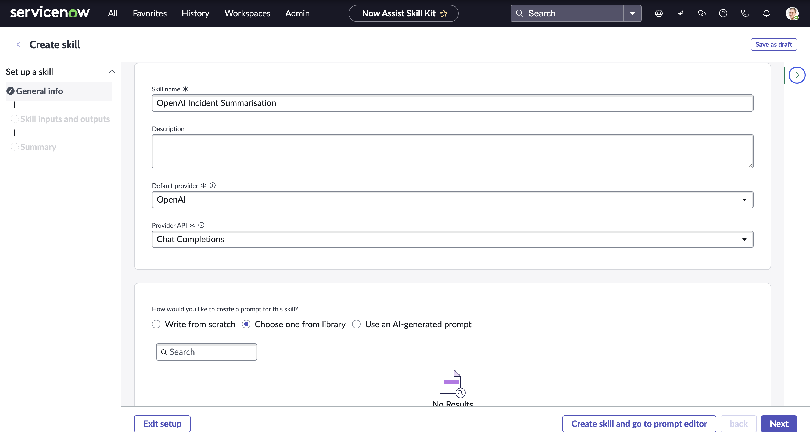
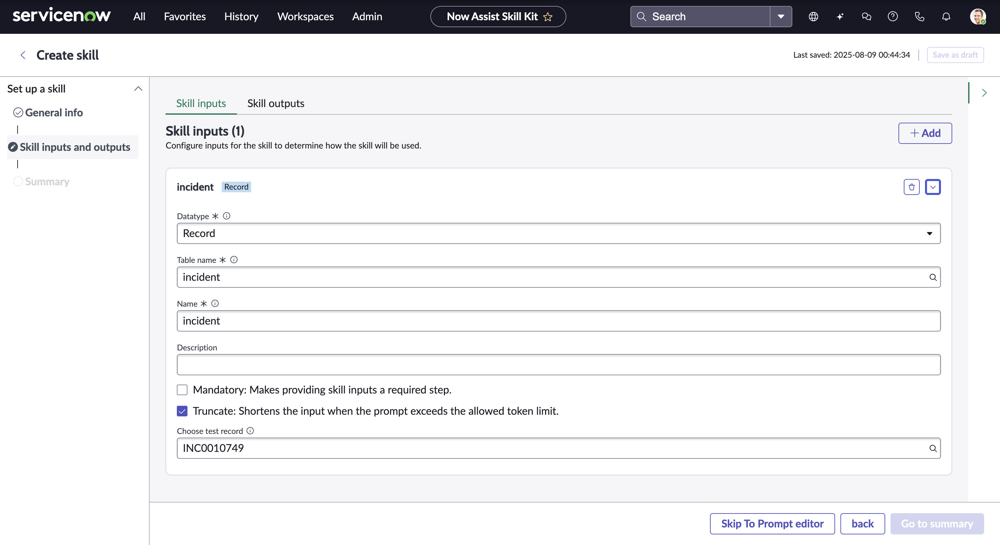
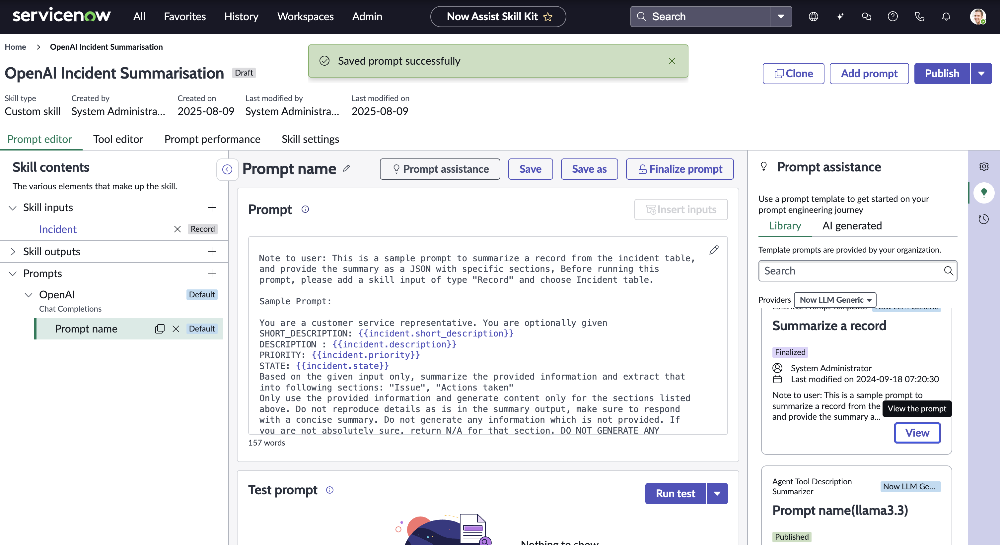
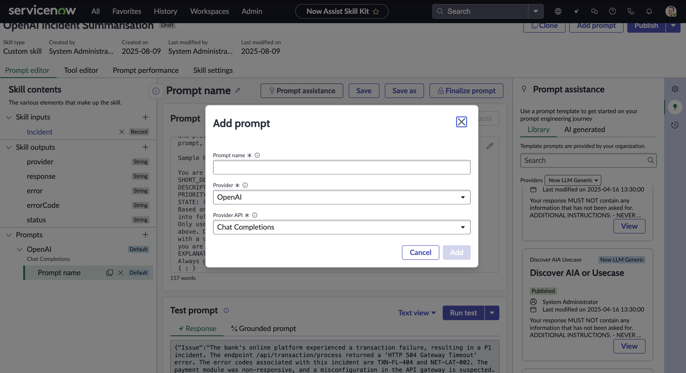
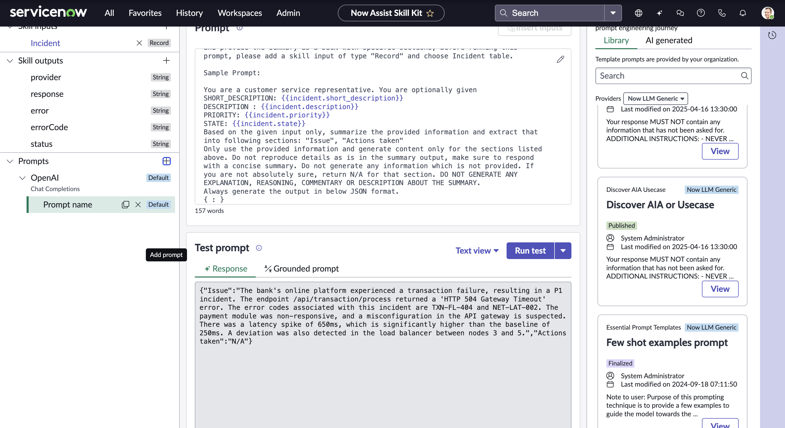
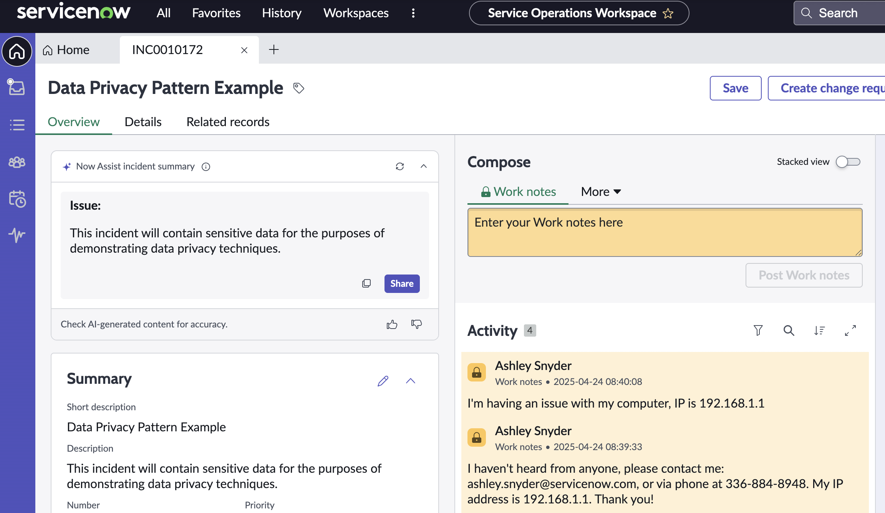

# Section 8: Skill Kit Implementation - Incident Summarization with OpenAI

**Estimated time: 30 minutes**

## Overview

The Now Assist Skill Kit enables you to create custom AI-powered skills that extend ServiceNow's native AI capabilities. In this section, we'll build a custom skill that uses OpenAI to automatically summarize incident records, providing agents with quick, actionable insights.

### What We'll Build

A custom skill that:
- **Analyzes incident records** automatically
- **Generates concise summaries** using OpenAI
- **Extracts key information** like impact, urgency, and resolution steps
- **Integrates seamlessly** with ServiceNow workflows
- **Provides consistent formatting** for agent consumption

### Business Value

**For IT Agents:**
- Faster incident understanding and resolution
- Consistent summary format across all incidents
- Reduced time spent reading lengthy descriptions

**For Organizations:**
- Improved MTTR (Mean Time to Resolution)
- Better knowledge capture and sharing
- Enhanced agent productivity and satisfaction

## Prerequisites

- Completed previous sections (8.1-8.3)
- OpenAI integration configured and tested
- Access to Now Assist Skill Kit
- Administrative privileges for skill creation
- Sample incident records for testing

## Step 1: Access Skill Kit Interface

### Navigate to Skill Kit

1. Navigate to **All > Now Assist > Skill Kit**



### Explore Available Templates

2. **Review available skill templates** and select the appropriate base template for incident summarization

The Skill Kit provides pre-built templates for common use cases, which can be customized for your specific needs.

## Step 2: Create New Incident Summarization Skill

### Initialize Skill Creation



3. **Create a new skill** with the following configuration:

**Basic Skill Information:**
- **Name:** "OpenAI Incident Summarizer"
- **Description:** "Automatically generates concise summaries of incident records using OpenAI"
- **Category:** IT Service Management
- **Version:** 1.0.0

### Configure Skill Parameters



**Input Parameters:**
- **Incident Number:** Required field for incident identification
- **Summary Type:** Option to choose summary style (brief, detailed, technical)
- **Include History:** Boolean to include/exclude work notes history

**Output Parameters:**
- **Summary Text:** Generated incident summary
- **Key Points:** Bulleted list of critical information
- **Recommended Actions:** AI-suggested next steps
- **Confidence Score:** AI confidence level in the summary

## Step 3: Design the Skill Logic

### Configure AI Processing Logic



**Core Processing Steps:**

1. **Data Extraction:**
   ```javascript
   // Extract incident data
   var incident = new GlideRecord('incident');
   if (incident.get(input.incident_number)) {
       var incidentData = {
           number: incident.number.toString(),
           short_description: incident.short_description.toString(),
           description: incident.description.toString(),
           category: incident.category.toString(),
           priority: incident.priority.getDisplayValue(),
           state: incident.state.getDisplayValue(),
           assigned_to: incident.assigned_to.getDisplayValue(),
           work_notes: getWorkNotes(incident.sys_id)
       };
   }
   ```

2. **OpenAI Prompt Construction:**
   ```javascript
   // Build comprehensive prompt for OpenAI
   var prompt = `
   Analyze the following ServiceNow incident and provide a concise summary:
   
   Incident: ${incidentData.number}
   Title: ${incidentData.short_description}
   Description: ${incidentData.description}
   Category: ${incidentData.category}
   Priority: ${incidentData.priority}
   Current State: ${incidentData.state}
   Assigned To: ${incidentData.assigned_to}
   
   Work Notes History:
   ${incidentData.work_notes}
   
   Please provide:
   1. A 2-3 sentence executive summary
   2. Key technical details (bullet points)
   3. Current status and progress
   4. Recommended next actions
   5. Potential risks or escalation triggers
   
   Format the response in a clear, structured manner for IT support agents.
   `;
   ```

3. **Response Processing:**
   ```javascript
   // Process OpenAI response
   var aiResponse = callOpenAIAPI(prompt);
   var summary = {
       executive_summary: extractSection(aiResponse, 'executive_summary'),
       key_details: extractBulletPoints(aiResponse),
       current_status: extractSection(aiResponse, 'status'),
       recommendations: extractBulletPoints(aiResponse, 'recommendations'),
       confidence: calculateConfidence(aiResponse)
   };
   ```

### Error Handling and Fallbacks



**Robust Error Handling:**

```javascript
// Error handling for AI service issues
try {
    var aiSummary = generateAISummary(incidentData);
    return formatResponse(aiSummary);
} catch (error) {
    // Fallback to template-based summary
    gs.warn('AI summarization failed: ' + error.message);
    return generateTemplateSummary(incidentData);
}

function generateTemplateSummary(data) {
    return {
        summary: `Incident ${data.number}: ${data.short_description}`,
        details: `Priority: ${data.priority}, Category: ${data.category}`,
        status: `Current state: ${data.state}`,
        recommendations: ["Review incident details", "Check for similar incidents", "Follow standard procedures"]
    };
}
```

## Step 4: Configure Integration Points

### Workflow Integration

Configure the skill to integrate with existing ServiceNow workflows:

**Trigger Points:**
- **Incident Creation:** Auto-summarize new incidents
- **Incident Update:** Re-summarize when significant updates occur
- **On-Demand:** Manual trigger by agents
- **Scheduled:** Batch processing for reporting

### UI Integration

**Agent Interface Enhancements:**
- **Summary Panel:** Display AI summary in incident form
- **Quick Actions:** One-click summarization button
- **History Tracking:** Maintain summary version history
- **Feedback Collection:** Allow agents to rate summary quality

## Step 5: Testing and Validation

### Unit Testing

Test the skill with various incident scenarios:

**Test Case 1: Simple Incident**
```
Incident: INC0000123
Description: "User cannot access email"
Expected: Brief, focused summary with standard troubleshooting steps
```

**Test Case 2: Complex Incident**
```
Incident: INC0000456
Description: Multiple system failures with extensive work notes
Expected: Comprehensive summary highlighting key events and current status
```

**Test Case 3: Escalated Incident**
```
Incident: INC0000789
Description: Critical system outage with multiple stakeholders
Expected: Executive-level summary with clear escalation status
```

### Integration Testing

Verify the skill works properly within ServiceNow:

**Workflow Testing:**
- Trigger mechanisms work correctly
- Output integrates properly with incident forms
- Error handling gracefully manages failures
- Performance meets acceptable thresholds

## Step 6: Deployment and Configuration

### Production Deployment



**Deployment Checklist:**

✅ **Security Review:** Validate data handling and API security
✅ **Performance Testing:** Confirm acceptable response times
✅ **User Training:** Prepare documentation and training materials
✅ **Monitoring Setup:** Configure logging and alerting
✅ **Rollback Plan:** Prepare contingency procedures

### Configuration Management

**Environment-Specific Settings:**
- **Development:** Full logging, test API endpoints
- **Staging:** Production-like configuration with test data
- **Production:** Optimized performance, minimal logging

**Access Controls:**
- **Skill Execution:** Limit to authorized roles
- **API Access:** Secure OpenAI credentials
- **Data Access:** Respect incident visibility rules

## Advanced Features and Enhancements

### Multi-Language Support

```javascript
// Detect incident language and adjust prompt
var userLanguage = detectLanguage(incidentData.description);
var localizedPrompt = getPromptTemplate(userLanguage);
```

### Context-Aware Summarization

```javascript
// Adjust summary based on incident context
var summaryStyle = determineSummaryStyle(incidentData);
// Executive summary for P1 incidents
// Technical summary for development teams
// User-friendly summary for end-user communications
```

### Learning and Improvement

```javascript
// Collect feedback for continuous improvement
function collectSummaryFeedback(incidentId, summaryId, rating, comments) {
    var feedback = new GlideRecord('x_custom_ai_feedback');
    feedback.initialize();
    feedback.incident = incidentId;
    feedback.summary_id = summaryId;
    feedback.rating = rating;
    feedback.comments = comments;
    feedback.insert();
}
```

## Monitoring and Analytics

### Performance Metrics

Track key performance indicators:

**Operational Metrics:**
- **Response Time:** Average time to generate summary
- **Success Rate:** Percentage of successful summarizations
- **Error Rate:** Frequency and types of failures
- **API Usage:** OpenAI token consumption and costs

**Quality Metrics:**
- **Agent Satisfaction:** User ratings of summary quality
- **Usage Adoption:** Frequency of skill utilization
- **Time Savings:** Reduction in incident review time
- **Accuracy:** Correlation between summaries and actual resolutions

### Continuous Improvement

**Monthly Reviews:**
- Analyze user feedback and ratings
- Review error logs and failure patterns
- Optimize prompts based on performance data
- Update skill logic for better accuracy

**Quarterly Enhancements:**
- Expand to additional record types
- Integrate new AI capabilities
- Enhance integration points
- Scale to additional use cases

## Security and Compliance

### Data Privacy

**Sensitive Information Handling:**
- **PII Detection:** Automatically detect and mask personal information
- **Data Minimization:** Only process necessary incident data
- **Retention Policies:** Implement appropriate data retention
- **Audit Logging:** Track all AI processing activities

### API Security

**OpenAI Integration Security:**
- **Key Rotation:** Regular API key updates
- **Rate Limiting:** Prevent abuse and manage costs
- **Error Handling:** Avoid exposing sensitive error information
- **Network Security:** Secure API communication channels

## 🎉 Skill Kit Implementation Complete!

You have successfully:

- ✅ **Created a custom AI skill** using the Now Assist Skill Kit
- ✅ **Integrated OpenAI** for intelligent incident summarization
- ✅ **Implemented robust error handling** and fallback mechanisms
- ✅ **Configured workflow integration** for seamless operation
- ✅ **Established monitoring** and continuous improvement processes
- ✅ **Applied security best practices** for data protection

### Key Benefits Achieved

🤖 **Intelligent Automation:** AI-powered incident analysis and summarization
⚡ **Improved Efficiency:** Faster incident understanding and resolution
📊 **Consistent Quality:** Standardized summary format across all incidents
🔄 **Scalable Architecture:** Framework for expanding to additional use cases
📈 **Measurable Impact:** Clear metrics for ROI demonstration

### Skill Kit Capabilities Unlocked

**Current Implementation:**
- Incident summarization with OpenAI
- Workflow integration and automation
- Error handling and fallback procedures
- Performance monitoring and analytics

**Future Expansion Opportunities:**
- **Change Request Summarization:** Apply to change management
- **Knowledge Article Generation:** Auto-create KB articles from incidents
- **Predictive Analysis:** Identify potential issues before they escalate
- **Multi-Record Analysis:** Summarize related incident patterns

---

**Next Step:** [Section 9 - Data Privacy and Security](section9-data-privacy.md)
**Previous:** [Section 7 - Gen AI Controller Config](section7-genai-controller-config.md)
**Back to:** [Main README](README.md)