# Section 5: Virtual Agent Designer with LLM

**Estimated time: 45 minutes**

## Overview

In this section, we'll create an intelligent Virtual Agent topic using the external LLM capabilities configured in the previous section. This exercise demonstrates how to design custom conversational flows using ServiceNow's Virtual Agent Designer with OpenAI integration.

### What We'll Build

We will create a Virtual Agent that:
1. **Greets users** and asks how they're feeling
2. **Performs sentiment analysis** on the user's response
3. **Routes the conversation** based on sentiment:
   - **Positive/Neutral:** Provides encouraging response and ends conversation
   - **Negative:** Asks how the agent can help and searches knowledge base
4. **Searches knowledge base** for relevant information
5. **Summarizes findings** and provides helpful responses

### Expected Solution Architecture

The completed solution will implement this conversational flow:

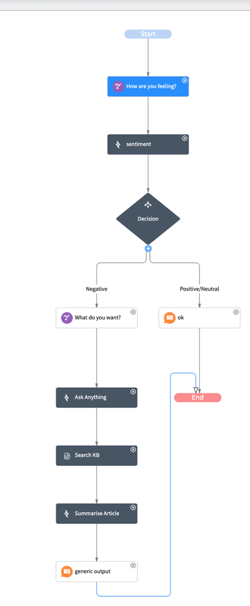

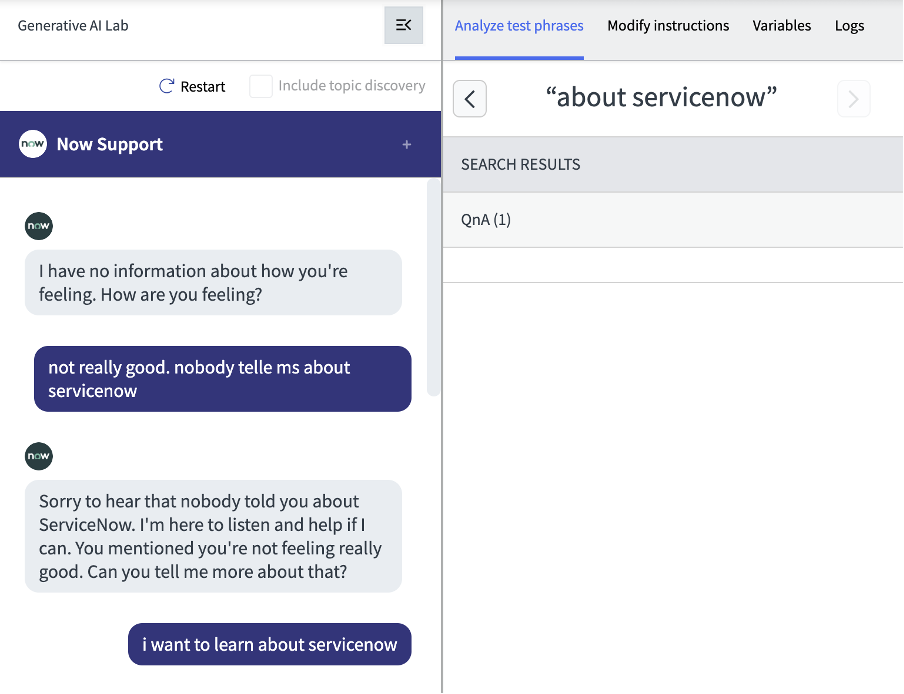

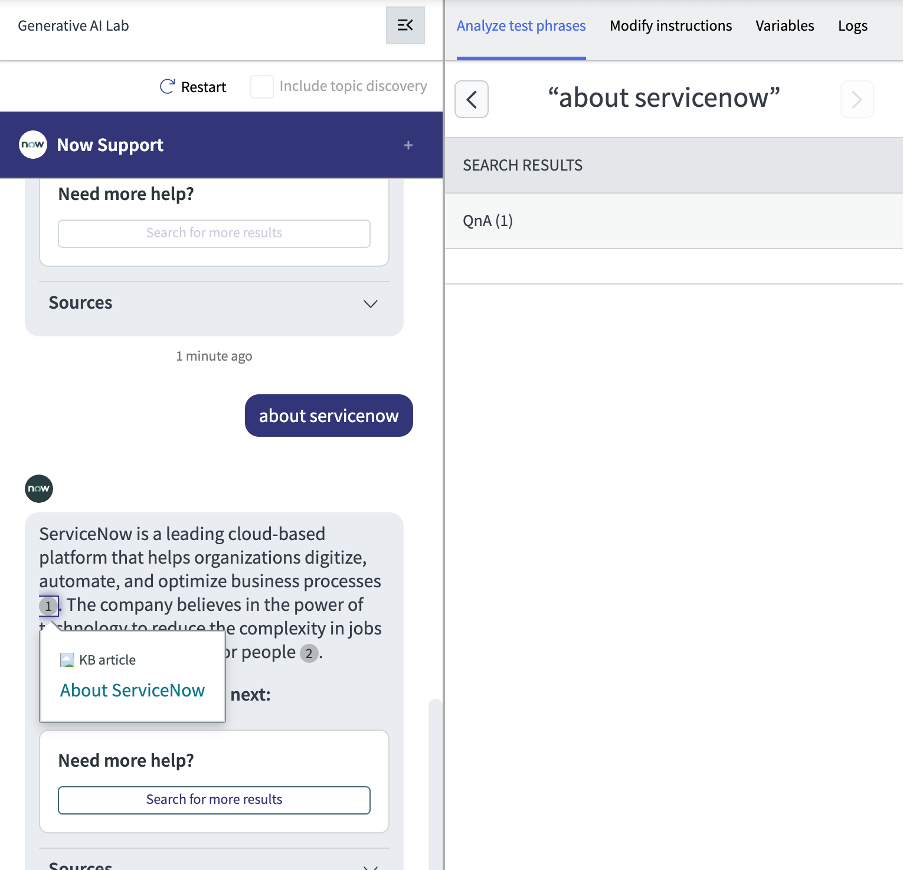

This exercise helps customers design topics of their choice using external or BYO (Bring Your Own) LLM. The topics can then be used in AI Agents and Custom Skills to scale use cases further, illustrating how the Generative AI Controller can be leveraged across various scenarios.

## Prerequisites

- Completed [Section 8.1: Generative AI Controller Configuration](section8-genai-controller.md)
- OpenAI integration active and tested
- Knowledge base articles available in your instance
- Access to Virtual Agent Designer

## Step 1: Create New Virtual Agent Topic

### Access Virtual Agent Designer

1. Navigate to **All > Virtual Agent Designer**

### Create the Topic

2. **Create a new topic** with the following configuration:

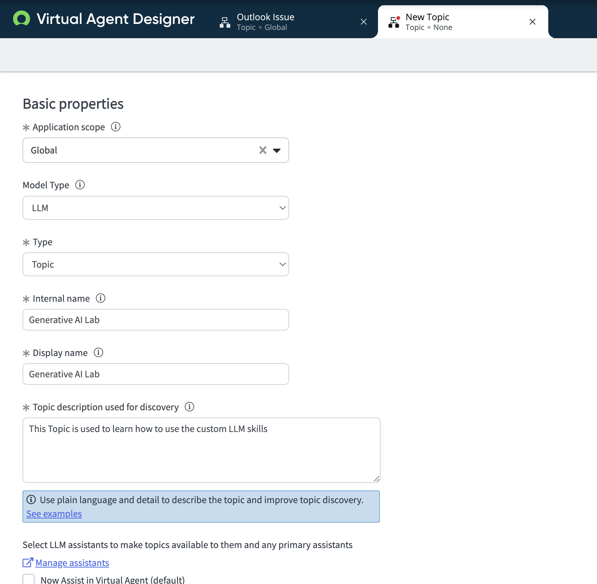

**Topic Configuration:**
- **Name:** "Sentiment-Based Support Assistant"
- **Description:** "AI-powered agent that provides support based on user sentiment"
- **Category:** Customer Support
- **Active:** True

## Step 2: Verify Available LLM Capabilities

### Check Activated Capabilities

3. In the Virtual Agent Designer, notice the **activated capabilities** from the previous section are now available in the component palette:


**Available Components:**
- 🎭 **Sentiment Analysis** - Detect emotional tone
- 💬 **Generic Prompt** - AI-powered responses  
- 📝 **Summarization** - Content summarization
- 🔍 **Lookup Utilities** - Knowledge base search

## Step 3: Build the Initial User Input Flow

### Add User Input Component

4. **Drag an LLM Input Text** component onto the canvas and configure it:

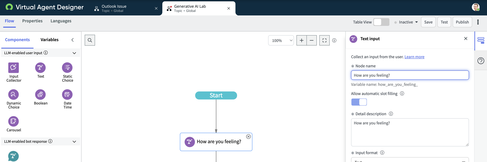

**Configuration:**
- **Component:** User Input (Text)
- **Prompt:** "How are you feeling today?"
- **Variable Name:** `user_feeling`
- **Required:** True

This component will capture the user's initial response about their emotional state.

## Step 4: Implement Sentiment Analysis

### Add Sentiment Analysis Component

5. **Drag the Sentiment Analysis component** and configure it to analyze the user's response:

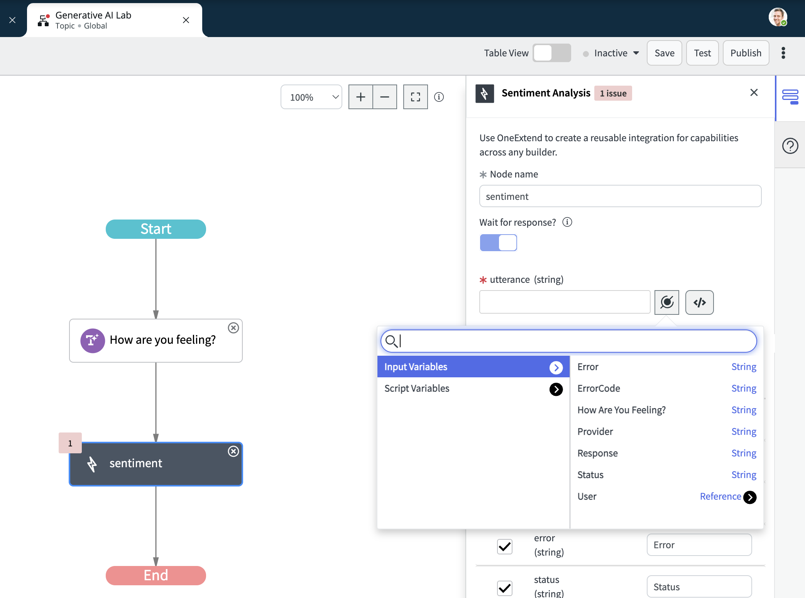

**Configuration:**
- **Input Text:** `{user_feeling}` (reference to user input)
- **Output Variable:** `sentiment_result`
- **Provider:** OpenAI GPT-4
- **Confidence Threshold:** 0.7

The sentiment analysis will categorize the user's response as positive, negative, or neutral.

## Step 5: Create Decision Logic Based on Sentiment

### Add Decision Component

6. **Drag a Decision component** to route the conversation based on sentiment analysis results:

### Configure Negative Sentiment Path

**For Negative Sentiment:**
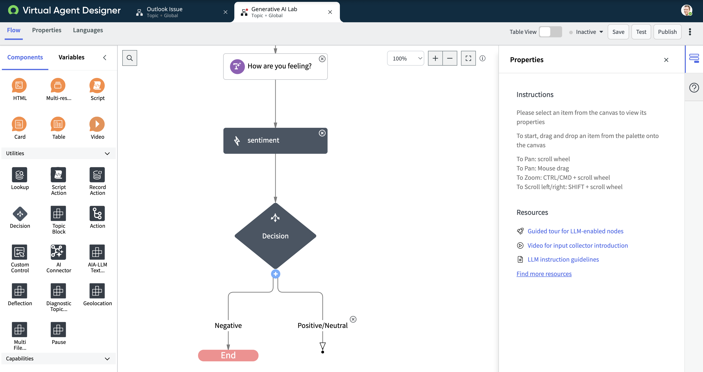

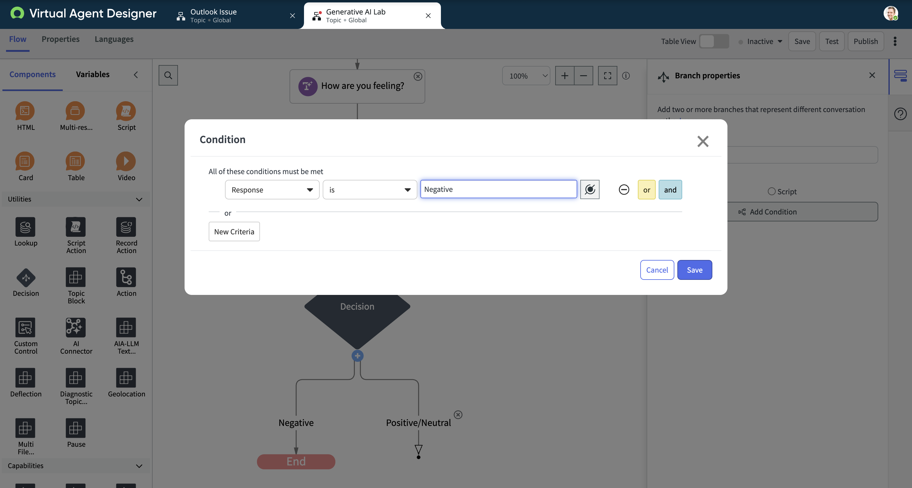

**Condition Logic:**
```javascript
// Condition for negative sentiment
sentiment_result.classification == "negative" || 
sentiment_result.score < -0.3
```

### Configure Positive/Neutral Sentiment Path

**For Positive/Neutral Sentiment:**
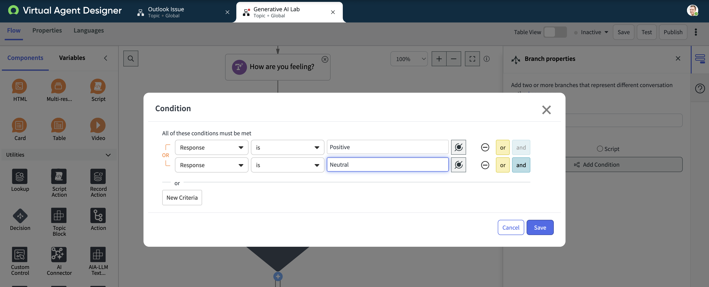

**Condition Logic:**
```javascript
// Condition for positive or neutral sentiment
sentiment_result.classification == "positive" || 
sentiment_result.classification == "neutral" ||
sentiment_result.score >= -0.3
```

## Step 6: Build the Negative Sentiment Flow

### Add Generic Prompt for Support

7. On the **negative sentiment path**, drag a **Generic Prompt** component to gather more information:


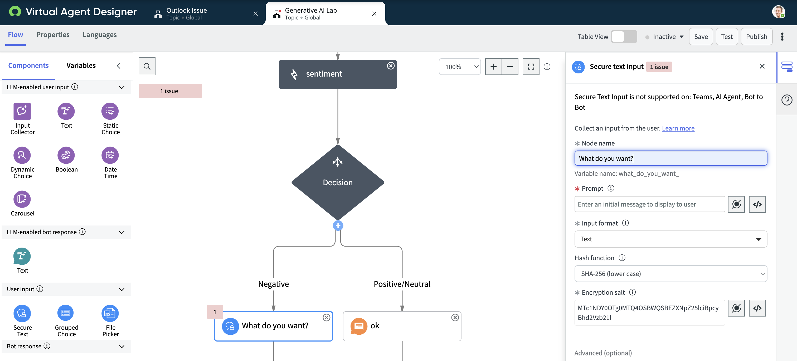


**Generic Prompt Configuration:**
- **Prompt Template:** "I understand you're having a difficult time. How can I help you today? Please describe what's bothering you."
- **Input Variable:** `user_feeling`
- **Output Variable:** `user_request`
- **Max Tokens:** 150

### Test the Prompt Response

8. **Add a Bot Response component** to test the prompt functionality:

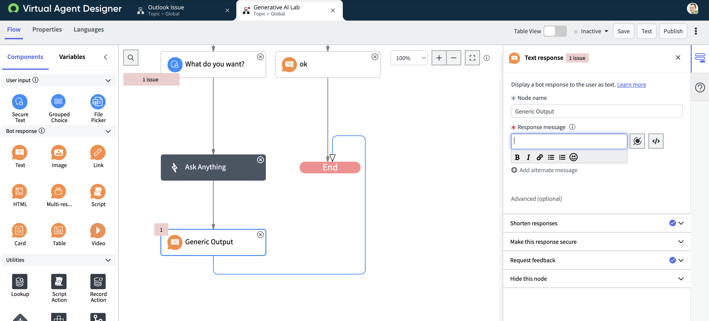


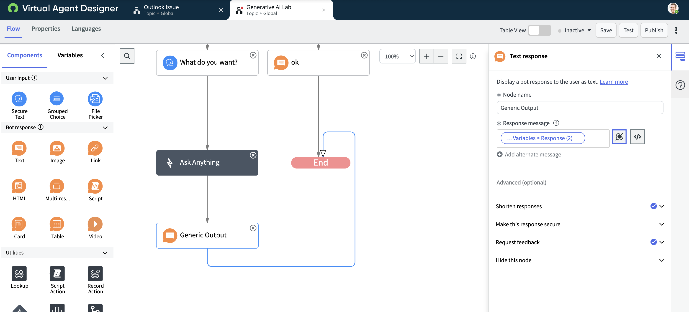

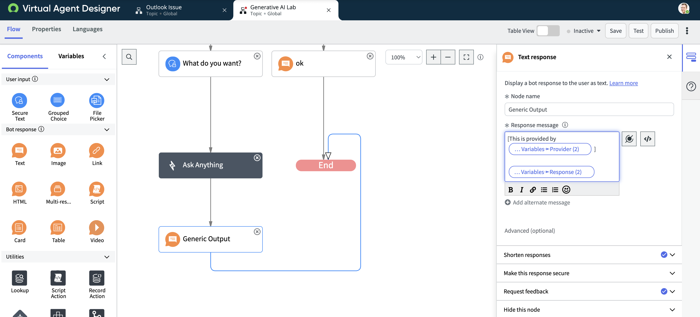

## Step 7: Implement Knowledge Base Search

### Add Knowledge Base Lookup

9. **Add Knowledge Base Lookup** capability to find relevant information:

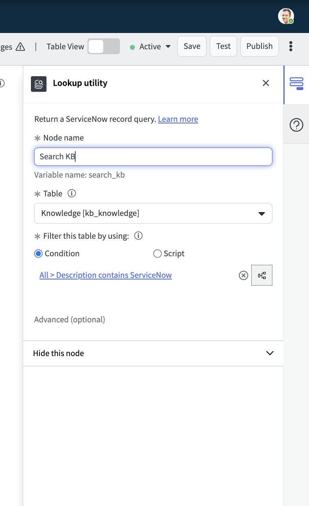


**Knowledge Search Configuration:**
- **Search Query:** `{user_request}` (user's description of their issue)
- **Search Sources:** Knowledge Base, FAQ, Support Articles
- **Max Results:** 5
- **Relevance Threshold:** 0.6
- **Output Variable:** `search_results`

This component will search the knowledge base for articles relevant to the user's specific request.

## Step 8: Add Content Summarization

### Configure Summarization Component

10. **Drag Summarization component** to create concise, helpful responses:

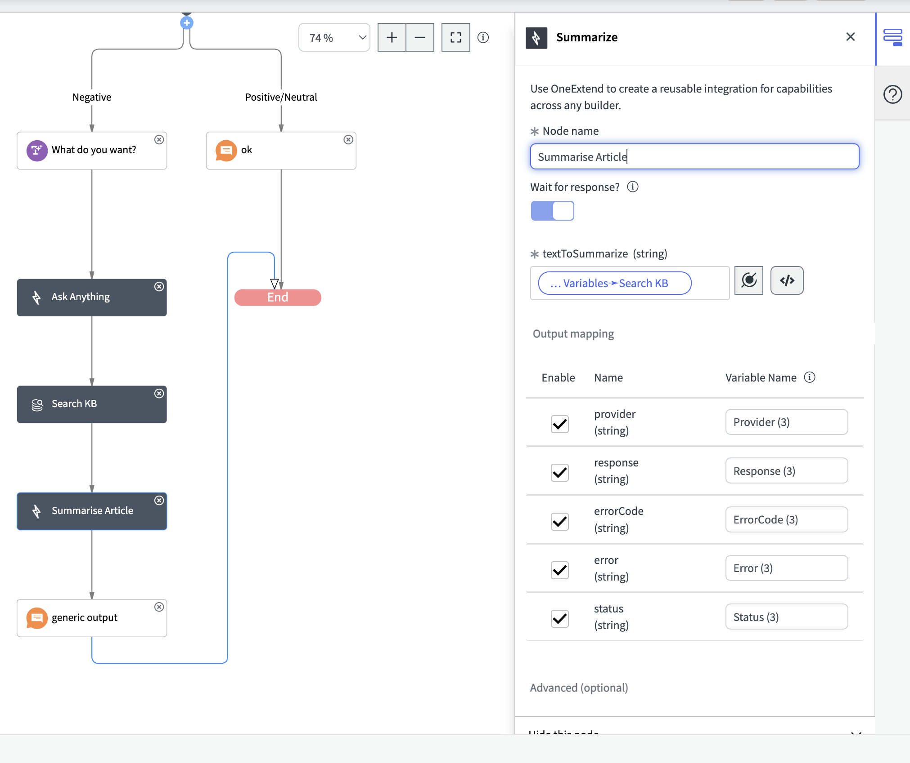

**Summarization Configuration:**
- **Input Content:** `{search_results}` (knowledge base search results)
- **Summary Type:** "Helpful and actionable"
- **Max Length:** 200 words
- **Output Variable:** `summarized_help`
- **Include Sources:** True

The summarization will condense the found knowledge articles into actionable advice.

## Step 9: Create Final Response

### Configure Comprehensive Response

11. **Configure final text response** that includes:
- Summarized knowledge base information
- Provider attribution
- Helpful next steps

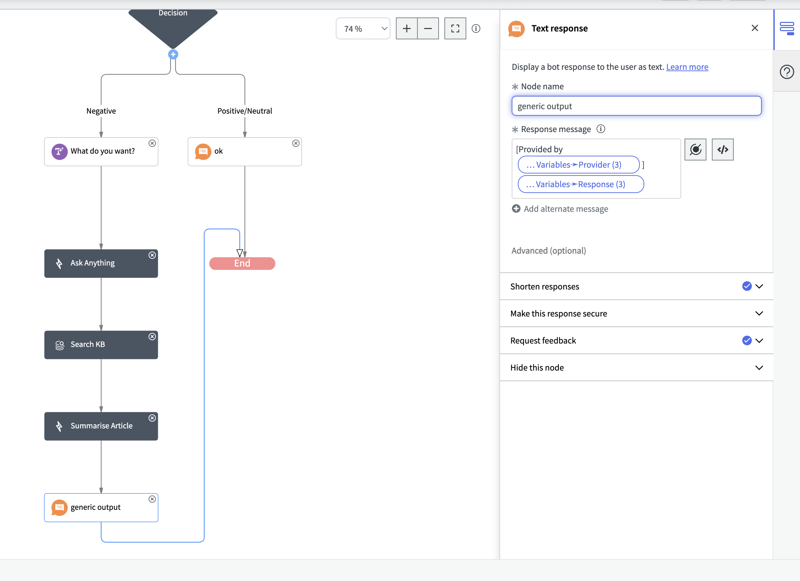

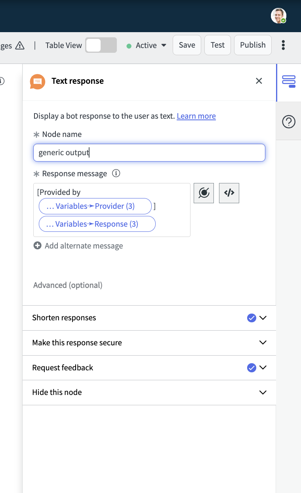

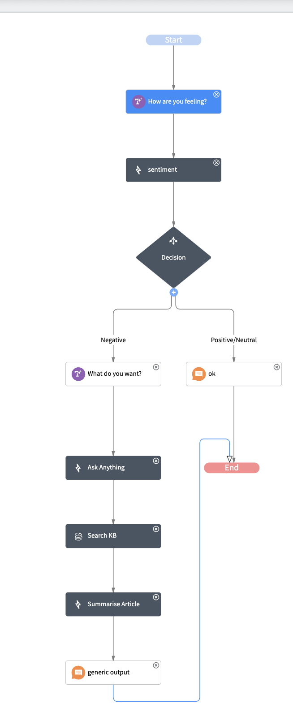

**Final Response Template:**
```
I found some information that might help you:

{summarized_help}

Here are your next steps:
1. Try the suggested solutions above
2. If the issue persists, consider contacting direct support
3. You can also search our knowledge base for more specific information

Is there anything else I can help you with today?

---
*Response generated by AI Assistant powered by OpenAI*
```

## Step 10: Configure Knowledge Base Prerequisites

### Verify Knowledge Articles

Ensure your instance has relevant knowledge articles configured:

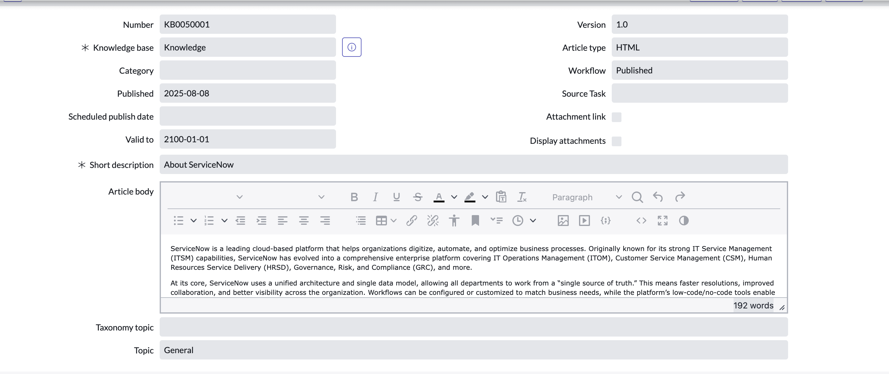

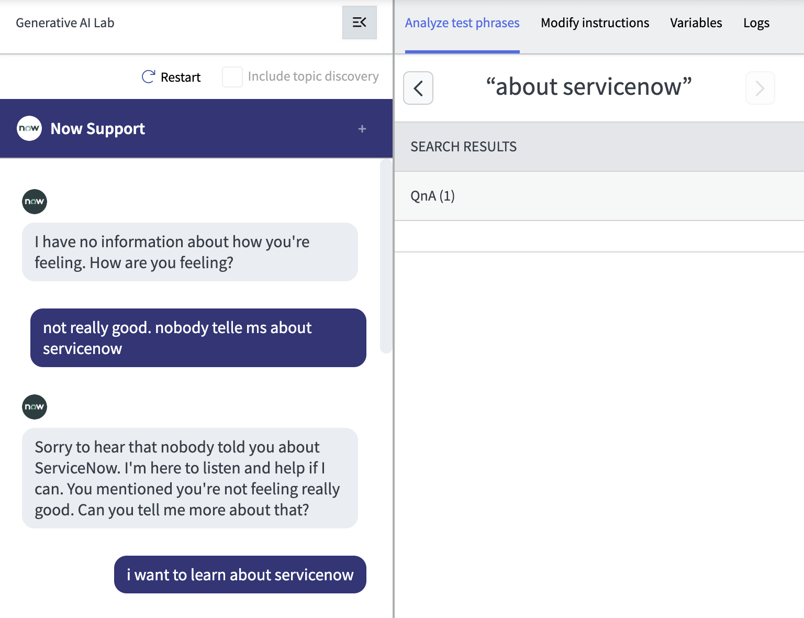

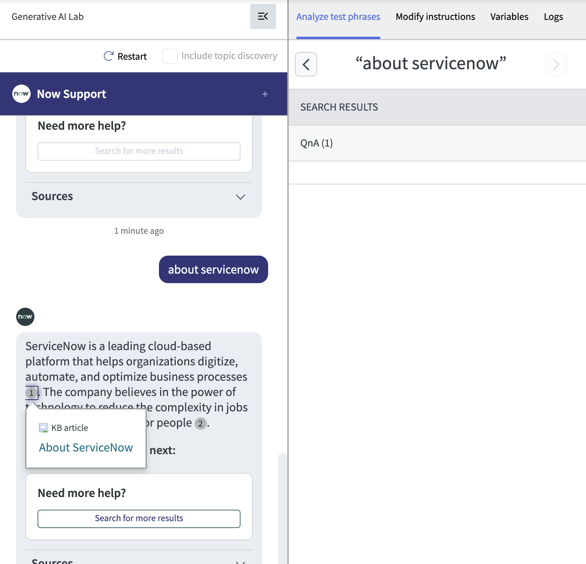

**Knowledge Article Requirements:**
- **Categories:** IT Support, General Help, Troubleshooting
- **Keywords:** Properly tagged for search optimization
- **Content:** Clear, actionable guidance
- **Status:** Published and active

## Step 11: Test the Complete Flow

### Testing Scenarios

**Test Case 1: Positive Sentiment**
- **Input:** "I'm feeling great today!"
- **Expected:** Positive response, conversation ends

**Test Case 2: Negative Sentiment**
- **Input:** "I'm really frustrated and stressed"
- **Expected:** Supportive response, request for more details, knowledge search

**Test Case 3: Neutral Sentiment**
- **Input:** "I'm okay, just need some help"
- **Expected:** Polite response, direct to help options

### Validation Points

✅ **Sentiment Analysis Accuracy:** Verify correct sentiment detection
✅ **Flow Routing:** Confirm proper path selection based on sentiment
✅ **Knowledge Search:** Validate relevant article retrieval
✅ **Summarization Quality:** Check for helpful, concise responses
✅ **User Experience:** Ensure natural conversation flow

## Advanced Configuration Options

### Enhanced Sentiment Thresholds

For more nuanced sentiment detection:

```javascript
// Advanced sentiment routing
if (sentiment_result.score <= -0.7) {
    // Very negative - immediate escalation
    route = "urgent_support";
} else if (sentiment_result.score <= -0.3) {
    // Moderately negative - knowledge search
    route = "knowledge_search";
} else if (sentiment_result.score >= 0.3) {
    // Positive - encouragement
    route = "positive_response";
} else {
    // Neutral - general help
    route = "general_assistance";
}
```

### Contextual Prompt Enhancement

Improve prompt responses with context:

```
Based on your sentiment analysis indicating ${sentiment_result.classification} feelings, I want to provide the most appropriate support. 

Previous context: ${conversation_history}
Current concern: ${user_request}

How can I best assist you today?
```

### Multi-Turn Conversation Memory

Implement conversation context retention:

```javascript
// Store conversation context
conversation_context = {
    initial_sentiment: sentiment_result,
    user_requests: [user_request],
    provided_solutions: [summarized_help],
    timestamp: new Date()
};
```

## Performance Optimization

### Async Processing Benefits

- **Faster Response Times:** Non-blocking AI processing
- **Better User Experience:** Progressive conversation updates
- **Resource Efficiency:** Optimal system resource utilization
- **Scalability:** Handle multiple concurrent conversations

### Caching Strategies

- **Sentiment Results:** Cache similar sentiment patterns
- **Knowledge Searches:** Cache frequent search queries
- **Summarizations:** Store common summarization results

## Error Handling and Fallbacks

### AI Service Unavailable

```javascript
// Fallback for AI service issues
if (ai_service_error) {
    response = "I'm experiencing some technical difficulties. " +
               "Let me connect you with a human agent who can help.";
    escalate_to_human = true;
}
```

### No Knowledge Found

```javascript
// Fallback for empty search results
if (search_results.length === 0) {
    response = "I couldn't find specific information about your request, " +
               "but I'd be happy to connect you with a specialist who can help.";
}
```

## 🎉 Virtual Agent Creation Complete!

You have successfully created an intelligent Virtual Agent that:

- ✅ **Analyzes user sentiment** using OpenAI
- ✅ **Routes conversations** based on emotional state  
- ✅ **Searches knowledge base** for relevant information
- ✅ **Summarizes content** into actionable advice
- ✅ **Provides contextual responses** with AI assistance
- ✅ **Handles multiple conversation paths** intelligently

### Key Benefits Achieved

🤖 **Intelligent Routing:** Conversations automatically adapt to user emotional state
📚 **Knowledge Integration:** Seamless access to organizational knowledge
🎯 **Personalized Support:** Responses tailored to individual user needs  
⚡ **Efficient Processing:** Async AI processing for optimal performance
🔄 **Scalable Architecture:** Framework for expanding to additional use cases

---

**Next Section:** [Section 9 - Data Privacy and Security](section9-data-privacy-security.md)
**Previous Section:**[Section 7 - Skill Kit with OpenAI](section7-skill-kit-with-open-ai.md)
**Back to:** [Main README](README.md)